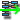

..
   Copyright (C) 2008-2015 EDF R&D

   This file is part of SALOME ADAO module.

   This library is free software; you can redistribute it and/or
   modify it under the terms of the GNU Lesser General Public
   License as published by the Free Software Foundation; either
   version 2.1 of the License, or (at your option) any later version.

   This library is distributed in the hope that it will be useful,
   but WITHOUT ANY WARRANTY; without even the implied warranty of
   MERCHANTABILITY or FITNESS FOR A PARTICULAR PURPOSE.  See the GNU
   Lesser General Public License for more details.

   You should have received a copy of the GNU Lesser General Public
   License along with this library; if not, write to the Free Software
   Foundation, Inc., 59 Temple Place, Suite 330, Boston, MA  02111-1307 USA

   See http://www.salome-platform.org/ or email : webmaster.salome@opencascade.com

   Author: Jean-Philippe Argaud, jean-philippe.argaud@edf.fr, EDF R&D

.. _section_examples:

================================================================================
**[DocU]** Tutorials on using the ADAO module
================================================================================

.. |eficas_new| image:: images/eficas_new.png
   :align: middle
   :scale: 50%

.. |eficas_saveas| image:: images/eficas_saveas.png
   :align: middle
   :scale: 50%

This section presents some examples on using the ADAO module in SALOME. The
first one shows how to build a simple data assimilation case defining explicitly
all the required input data through the GUI. The second one shows, on the same
case, how to define input data using external sources through scripts. We
describe here always Python scripts because they can be directly inserted in
YACS script nodes, but external files can use other languages.

The mathematical notations used afterward are explained in the section
:ref:`section_theory`.

Building an estimation case with explicit data definition
---------------------------------------------------------

This simple example is a demonstration one, and describes how to set a BLUE
estimation framework in order to get the *fully weighted least square estimated
state* of a system from an observation of the state and from an *a priori*
knowledge (or background) of this state. In other words, we look for the
weighted middle between the observation and the background vectors. All the
numerical values of this example are arbitrary.

Experimental setup
++++++++++++++++++

We choose to operate in a 3-dimensional space. 3D is chosen in order to restrict
the size of numerical object to explicitly enter by the user, but the problem is
not dependent of the dimension and can be set in dimension 10, 100, 1000... The
observation :math:`\mathbf{y}^o` is of value 1 in each direction, so::

    Yo = [1 1 1]

The background state :math:`\mathbf{x}^b`, which represent some *a priori*
knowledge or a mathematical regularization, is of value of 0 in each direction,
which is::

    Xb = [0 0 0]

Data assimilation requires information on errors covariances :math:`\mathbf{R}`
and :math:`\mathbf{B}`, respectively for observation and background variables.
We choose here to have uncorrelated errors (that is, diagonal matrices) and to
have the same variance of 1 for all variables (that is, identity matrices). We
set::

    B = R = [1 0 0 ; 0 1 0 ; 0 0 1]

Last, we need an observation operator :math:`\mathbf{H}` to convert the
background value in the space of observation values. Here, because the space
dimensions are the same, we can choose the identity as the observation
operator::

    H = [1 0 0 ; 0 1 0 ; 0 0 1]

With such choices, the "Best Linear Unbiased Estimator" (BLUE) will be the
average vector between :math:`\mathbf{y}^o` and :math:`\mathbf{x}^b`, named the
*analysis*, denoted by :math:`\mathbf{x}^a`, and its value is::

    Xa = [0.5 0.5 0.5]

As an extension of this example, one can change the variances represented by
:math:`\mathbf{B}` or :math:`\mathbf{R}` independently, and the analysis
:math:`\mathbf{x}^a` will move to :math:`\mathbf{y}^o` or to
:math:`\mathbf{x}^b`, in inverse proportion of the variances in
:math:`\mathbf{B}` and :math:`\mathbf{R}`. As an other extension, it is also
equivalent to search for the analysis thought a BLUE algorithm or a 3DVAR one.

Using the graphical interface (GUI) to build the ADAO case
++++++++++++++++++++++++++++++++++++++++++++++++++++++++++

First, you have to activate the ADAO module by choosing the appropriate module
button or menu of SALOME, and you will see:

  .. _adao_activate2:
  .. image:: images/adao_activate.png
    :align: center
    :width: 100%
  .. centered::
    **Activating the module ADAO in SALOME**

Choose the "*New*" button in this window. You will directly get the embedded
case editor interface for variables definition, along with the SALOME "*Object
browser*". You can then click on the "*New*" button |eficas_new| to create a new
ADAO case, and you will see:

  .. _adao_viewer:
  .. image:: images/adao_viewer.png
    :align: center
    :width: 100%
  .. centered::
    **The embedded editor for cases definition in module ADAO**

Then, fill in the variables to build the ADAO case by using the experimental set
up described above. All the technical information given above will be directly
inserted in the ADAO case definition, by using the *String* type for all the
variables. When the case definition is ready, save it to a "*JDC (\*.comm)*"
native file somewhere in your path. Remember that other files will be also
created near this first one, so it is better to make a specific directory for
your case, and to save the file inside. The name of the file will appear in the
"*Object browser*" window, under the "*ADAO*" menu. The final case definition
looks like this:

  .. _adao_jdcexample01:
  .. image:: images/adao_jdcexample01.png
    :align: center
    :width: 100%
  .. centered::
    **Definition of the experimental setup chosen for the ADAO case**

To go further, we need now to generate the YACS scheme from the ADAO case
definition. In order to do that, right click on the name of the file case in the
"*Object browser*" window, and choose the "*Export to YACS*" sub-menu (or the
"*Export to YACS*" button |eficas_yacs|) as below:

  .. _adao_exporttoyacs00:
  .. image:: images/adao_exporttoyacs.png
    :align: center
    :scale: 75%
  .. centered::
    **"Export to YACS" sub-menu to generate the YACS scheme from the ADAO case**

This command will generate the YACS scheme, activate YACS module in SALOME, and
open the new scheme in the GUI of the YACS module [#]_. After eventually
reordering the nodes by using the "*arrange local nodes*" sub-menu of the YACS
graphical view of the scheme, you get the following representation of the
generated ADAO scheme:

  .. _yacs_generatedscheme:
  .. image:: images/yacs_generatedscheme.png
    :align: center
    :width: 100%
  .. centered::
    **YACS generated scheme from the ADAO case**

After that point, all the modifications, executions and post-processing of the
data assimilation scheme will be done in the YACS module. In order to check the
result in a simple way, we create here a new YACS node by using the "*in-line
script node*" sub-menu of the YACS graphical view, and we name it
"*PostProcessing*".

This script node will retrieve the data assimilation analysis from the
"*algoResults*" output port of the computation bloc (which gives access to a
SALOME Python Object), and will print it on the standard output. 

To obtain this, the in-line script node need to have an input port of type
"*pyobj*", named "*results*" for example, that have to be linked graphically to
the "*algoResults*" output port of the computation bloc. Then, the code to fill
in the script node is::

    Xa = results.ADD.get("Analysis")[-1]

    print
    print "Analysis =",Xa
    print

The augmented YACS scheme can be saved (overwriting the generated scheme if the
"*Save*" command or button are used, or with a new name through the "*Save as*"
command). Ideally, the implementation of such post-processing procedure can be
done in YACS to test, and then entirely saved in one Python script that can be
integrated in the ADAO case by using the keyword "*UserPostAnalysis*".

Then, classically in YACS, the scheme have to be compiled for run, and then
executed. After completion, the printing on standard output is available in the
"*YACS Container Log*", obtained through the right click menu of the "*proc*"
window in the YACS scheme as shown below:

  .. _yacs_containerlog:
  .. image:: images/yacs_containerlog.png
    :align: center
    :width: 100%
  .. centered::
    **YACS menu for Container Log, and dialog window showing the log**

We verify that the result is correct by checking that the log dialog window
contains the following line::

    Analysis = [0.5, 0.5, 0.5]

as shown in the image above.

As a simple extension of this example, one can notice that the same problem
solved with a 3DVAR algorithm gives the same result. This algorithm can be
chosen at the ADAO case building step, before entering in YACS step. The
ADAO 3DVAR case will look completely similar to the BLUE algorithmic case, as
shown by the following figure:

  .. _adao_jdcexample02:
  .. image:: images/adao_jdcexample02.png
    :align: center
    :width: 100%
  .. centered::
    **Defining an ADAO 3DVAR case looks completely similar to a BLUE case**

There is only one command changing, with "*3DVAR*" value in the "*Algorithm*"
field instead of "*Blue*".

Building an estimation case with external data definition by scripts
--------------------------------------------------------------------

It is useful to get parts or all of the data from external definition, using
Python script files to provide access to the data. As an example, we build here
an ADAO case representing the same experimental setup as in the above example
`Building an estimation case with explicit data definition`_, but using data
from a single one external Python script file.

First, we write the following script file, using conventional names for the
required variables. Here, all the input variables are defined in the same
script, but the user can choose to split the file in several ones, or to mix
explicit data definition in the ADAO GUI and implicit data definition by
external files. The present script file looks like::

    import numpy
    #
    # Definition of the Background as a vector
    # ----------------------------------------
    Background = [0, 0, 0]
    #
    # Definition of the Observation as a vector
    # -----------------------------------------
    Observation = "1 1 1"
    #
    # Definition of the Background Error covariance as a matrix
    # ---------------------------------------------------------
    BackgroundError = numpy.array([[1., 0., 0.], [0., 1., 0.], [0., 0., 1.]])
    #
    # Definition of the Observation Error covariance as a matrix
    # ----------------------------------------------------------
    ObservationError = numpy.matrix("1 0 0 ; 0 1 0 ; 0 0 1")
    #
    # Definition of the Observation Operator as a matrix
    # --------------------------------------------------
    ObservationOperator = numpy.identity(3)

The names of the Python variables above are mandatory, in order to define the
right case variables, but the Python script can be bigger and define classes,
functions, file or database access, etc. with other names. Moreover, the above
script shows different ways to define arrays and matrices, using list, string
(as in Numpy or Octave), Numpy array type or Numpy matrix type, and Numpy
special functions. All of these syntax are valid.

After saving this script in a file (named here "*script.py*" for the example)
somewhere in your path, we use the graphical interface (GUI) to build the ADAO
case. The procedure to fill in the case is similar to the previous example
except that, instead of selecting the "*String*" option for the "*FROM*" keyword
of each variable, we select the "*Script*" one. This leads to a
"*SCRIPT_DATA/SCRIPT_FILE*" entry in the graphical tree, allowing to choose a
file as:

  .. _adao_scriptentry01:
  .. image:: images/adao_scriptentry01.png
    :align: center
    :width: 100%
  .. centered::
    **Defining an input value using an external script file**

Other steps and results are exactly the same as in the `Building an estimation
case with explicit data definition`_ previous example.

In fact, this script methodology is the easiest way to retrieve data from
in-line or previous calculations, from static files, from database or from
stream, all of them inside or outside of SALOME. It allows also to modify easily
some input data, for example for debug purpose or for repetitive execution
process, and it is the most versatile method in order to parametrize the input
data. **But be careful, script methodology is not a "safe" procedure, in the
sense that erroneous data, or errors in calculations, can be directly injected
into the YACS scheme execution. The user have to carefully verify the content of
his scripts.**

Adding parameters to control the data assimilation algorithm
------------------------------------------------------------

One can add some optional parameters to control the data assimilation algorithm
calculation. This is done by using optional parameters in the
"*AlgorithmParameters*" command of the ADAO case definition, which is a keyword of
the "*ASSIMILATION_STUDY*" general command. This keyword requires an explicit
definition of the values or a Python dictionary, containing some key/value
pairs. The list of possible optional parameters are given in the section
:ref:`section_reference` and its subsections.

This dictionary has to be defined, for example, in an external Python script
file, using the mandatory variable name "*AlgorithmParameters*" for the
dictionary. All the keys inside the dictionary are optional, they all have
default values, and can exist without being used. For example::

    AlgorithmParameters = {
        "Minimizer" : "CG", # Possible choice : "LBFGSB", "TNC", "CG", "BFGS"
        "MaximumNumberOfSteps" : 10,
        }

If no bounds at all are required on the control variables, then one can choose
the "*BFGS*" or "*CG*" minimization algorithm for all the variational data
assimilation or optimization algorithms. For constrained optimization, the
minimizer "*LBFGSB*" is often more robust, but the "*TNC*" is sometimes more
effective.

Then the script can be added to the ADAO case, in a file entry describing the
"*AlgorithmParameters*" keyword, as follows:

  .. _adao_scriptentry02:
  .. image:: images/adao_scriptentry02.png
    :align: center
    :width: 100%
  .. centered::
    **Adding parameters to control the algorithm and the outputs**

Other steps and results are exactly the same as in the `Building an estimation
case with explicit data definition`_ previous example. The dictionary can also
be directly given in the input field of string type associated for the keyword.

Building a complex case with external data definition by scripts
----------------------------------------------------------------

This more complex and complete example has to been considered as a framework for
user inputs treatment, that need to be tailored for each real application.
Nevertheless, the file skeletons are sufficiently general to have been used for
various applications in neutronic, fluid mechanics... Here, we will not focus on
the results, but more on the user control of inputs and outputs in an ADAO case.
As previously, all the numerical values of this example are arbitrary.

The objective is to setup the input and output definitions of a physical
estimation case by external python scripts, using a general non-linear operator,
adding control on parameters and so on... The complete framework scripts can be
found in the ADAO skeletons examples directory under the name
"*External_data_definition_by_scripts*".

Experimental setup
++++++++++++++++++

We continue to operate in a 3-dimensional space, in order to restrict
the size of numerical object shown in the scripts, but the problem is
not dependant of the dimension.

We choose a twin experiment context, using a known true state
:math:`\mathbf{x}^t` but of arbitrary value::

    Xt = [1 2 3]

The background state :math:`\mathbf{x}^b`, which represent some *a priori*
knowledge of the true state, is build as a normal random perturbation of 20% of
the true state :math:`\mathbf{x}^t` for each component, which is::

    Xb = Xt + normal(0, 20%*Xt)

To describe the background error covariances matrix :math:`\mathbf{B}`, we make
as previously the hypothesis of uncorrelated errors (that is, a diagonal matrix,
of size 3x3 because :math:`\mathbf{x}^b` is of lenght 3) and to have the same
variance of 0.1 for all variables. We get::

    B = 0.1 * diagonal( length(Xb) )

We suppose that there exist an observation operator :math:`\mathbf{H}`, which
can be non linear. In real calibration procedure or inverse problems, the
physical simulation codes are embedded in the observation operator. We need also
to know its gradient with respect to each calibrated variable, which is a rarely
known information with industrial codes. But we will see later how to obtain an
approximated gradient in this case.

Being in twin experiments, the observation :math:`\mathbf{y}^o` and its error
covariances matrix :math:`\mathbf{R}` are generated by using the true state
:math:`\mathbf{x}^t` and the observation operator :math:`\mathbf{H}`::

    Yo = H( Xt )

and, with an arbitrary standard deviation of 1% on each error component::

    R = 0.0001 * diagonal( lenght(Yo) )

All the information required for estimation by data assimilation are then
defined.

Skeletons of the scripts describing the setup
+++++++++++++++++++++++++++++++++++++++++++++

We give here the essential parts of each script used afterward to build the
ADAO case. Remember that using these scripts in real Python files requires to
correctly define the path to imported modules or codes (even if the module is in
the same directory that the importing Python file. We indicate the path
adjustment using the mention ``"# INSERT PHYSICAL SCRIPT PATH"``), the encoding
if necessary, etc. The indicated file names for the following scripts are
arbitrary. Examples of complete file scripts are available in the ADAO examples
standard directory.

We first define the true state :math:`\mathbf{x}^t` and some convenient matrix
building function, in a Python script file named
``Physical_data_and_covariance_matrices.py``::

    import numpy
    #
    def True_state():
        """
        Arbitrary values and names, as a tuple of two series of same length
        """
        return (numpy.array([1, 2, 3]), ['Para1', 'Para2', 'Para3'])
    #
    def Simple_Matrix( size, diagonal=None ):
        """
        Diagonal matrix, with either 1 or a given vector on the diagonal
        """
        if diagonal is not None:
            S = numpy.diag( diagonal )
        else:
            S = numpy.matrix(numpy.identity(int(size)))
        return S

We can then define the background state :math:`\mathbf{x}^b` as a random
perturbation of the true state, adding a *required ADAO variable* at the end of
the script the definition, in order to export the defined value. It is done in a
Python script file named ``Script_Background_xb.py``::

    from Physical_data_and_covariance_matrices import True_state
    import numpy
    #
    xt, names = True_state()
    #
    Standard_deviation = 0.2*xt # 20% for each variable
    #
    xb = xt + abs(numpy.random.normal(0.,Standard_deviation,size=(len(xt),)))
    #
    # Creating the required ADAO variable
    # -----------------------------------
    Background = list(xb)

In the same way, we define the background error covariance matrix
:math:`\mathbf{B}` as a diagonal matrix, of the same diagonal length as the
background of the true state, using the convenient function already defined. It
is done in a Python script file named ``Script_BackgroundError_B.py``::

    from Physical_data_and_covariance_matrices import True_state, Simple_Matrix
    #
    xt, names = True_state()
    #
    B = 0.1 * Simple_Matrix( size = len(xt) )
    #
    # Creating the required ADAO variable
    # -----------------------------------
    BackgroundError = B

To continue, we need the observation operator :math:`\mathbf{H}` as a function
of the state. It is here defined in an external file named
``"Physical_simulation_functions.py"``, which should contain one function
conveniently named here ``"DirectOperator"``. This function is user one,
representing as programming function the :math:`\mathbf{H}` operator. We suppose
this function is then given by the user. A simple skeleton is given here for
convenience::

    def DirectOperator( XX ):
        """ Direct non-linear simulation operator """
        #
        # --------------------------------------> EXAMPLE TO BE REMOVED
        if type(XX) is type(numpy.matrix([])):  # EXAMPLE TO BE REMOVED
            HX = XX.A1.tolist()                 # EXAMPLE TO BE REMOVED
        elif type(XX) is type(numpy.array([])): # EXAMPLE TO BE REMOVED
            HX = numpy.matrix(XX).A1.tolist()   # EXAMPLE TO BE REMOVED
        else:                                   # EXAMPLE TO BE REMOVED
            HX = XX                             # EXAMPLE TO BE REMOVED
        # --------------------------------------> EXAMPLE TO BE REMOVED
        #
        return numpy.array( HX )

We does not need the linear companion operators ``"TangentOperator"`` and
``"AdjointOperator"`` because they will be approximated using ADAO capabilities.

We insist on the fact that these non-linear operator ``"DirectOperator"``,
tangent operator ``"TangentOperator"`` and adjoint operator
``"AdjointOperator"`` come from the physical knowledge, include the reference
physical simulation code, and have to be carefully setup by the data
assimilation or optimization user. The simulation errors or missuses of the
operators can not be detected or corrected by the data assimilation and
optimization ADAO framework alone.

In this twin experiments framework, the observation :math:`\mathbf{y}^o` and its
error covariances matrix :math:`\mathbf{R}` can be generated. It is done in two
Python script files, the first one being named ``Script_Observation_yo.py``::

    from Physical_data_and_covariance_matrices import True_state
    from Physical_simulation_functions import DirectOperator
    #
    xt, noms = True_state()
    #
    yo = DirectOperator( xt )
    #
    # Creating the required ADAO variable
    # -----------------------------------
    Observation = list(yo)

and the second one named ``Script_ObservationError_R.py``::

    from Physical_data_and_covariance_matrices import True_state, Simple_Matrix
    from Physical_simulation_functions import DirectOperator
    #
    xt, names = True_state()
    #
    yo = DirectOperator( xt )
    #
    R  = 0.0001 * Simple_Matrix( size = len(yo) )
    #
    # Creating the required ADAO variable
    # -----------------------------------
    ObservationError = R

As in previous examples, it can be useful to define some parameters for the data
assimilation algorithm. For example, if we use the standard "*3DVAR*" algorithm,
the following parameters can be defined in a Python script file named
``Script_AlgorithmParameters.py``::

    # Creating the required ADAO variable
    # -----------------------------------
    AlgorithmParameters = {
        "Minimizer" : "TNC",         # Possible : "LBFGSB", "TNC", "CG", "BFGS"
        "MaximumNumberOfSteps" : 15, # Number of global iterative steps
        "Bounds" : [
            [ None, None ],          # Bound on the first parameter
            [ 0., 4. ],              # Bound on the second parameter
            [ 0., None ],            # Bound on the third parameter
            ],
    }

Finally, it is common to post-process the results, retrieving them after the
data assimilation phase in order to analyze, print or show them. It requires to
use a intermediary Python script file in order to extract these results at the
end of the a data assimilation or optimization process. The following example
Python script file, named ``Script_UserPostAnalysis.py``, illustrates the fact::

    from Physical_data_and_covariance_matrices import True_state
    import numpy
    #
    xt, names   = True_state()
    xa          = ADD.get("Analysis")[-1]
    x_series    = ADD.get("CurrentState")[:]
    J           = ADD.get("CostFunctionJ")[:]
    #
    # Verifying the results by printing
    # ---------------------------------
    print
    print "xt = %s"%xt
    print "xa = %s"%numpy.array(xa)
    print
    for i in range( len(x_series) ):
        print "Step %2i : J = %.5e  and  X = %s"%(i, J[i], x_series[i])
    print

At the end, we get a description of the whole case setup through a set of files
listed here:

#.      ``Physical_data_and_covariance_matrices.py``
#.      ``Physical_simulation_functions.py``
#.      ``Script_AlgorithmParameters.py``
#.      ``Script_BackgroundError_B.py``
#.      ``Script_Background_xb.py``
#.      ``Script_ObservationError_R.py``
#.      ``Script_Observation_yo.py``
#.      ``Script_UserPostAnalysis.py``

We insist here that all these scripts are written by the user and can not be
automatically tested by ADAO. So the user is required to verify the scripts (and
in particular their input/output) in order to limit the difficulty of debug. We
recall: **script methodology is not a "safe" procedure, in the sense that
erroneous data, or errors in calculations, can be directly injected into the
YACS scheme execution.**

Building the case with external data definition by scripts
++++++++++++++++++++++++++++++++++++++++++++++++++++++++++

All these scripts can then be used to define the ADAO case with external data
definition by Python script files. It is entirely similar to the method
described in the `Building an estimation case with external data definition by
scripts`_ previous section. For each variable to be defined, we select the
"*Script*" option of the "*FROM*" keyword, which leads to a
"*SCRIPT_DATA/SCRIPT_FILE*" entry in the tree. For the "*ObservationOperator*"
keyword, we choose the "*ScriptWithOneFunction*" form and keep the default
differential increment.

The other steps to build the ADAO case are exactly the same as in the `Building
an estimation case with explicit data definition`_ previous section.

Using the simple linear operator :math:`\mathbf{H}` from the Python script file
``Physical_simulation_functions.py`` in the ADAO examples standard directory,
the results will look like::

    xt = [1 2 3]
    xa = [ 1.000014    2.000458  3.000390]

    Step  0 : J = 1.81750e+03  and  X = [1.014011, 2.459175, 3.390462]
    Step  1 : J = 1.81750e+03  and  X = [1.014011, 2.459175, 3.390462]
    Step  2 : J = 1.79734e+01  and  X = [1.010771, 2.040342, 2.961378]
    Step  3 : J = 1.79734e+01  and  X = [1.010771, 2.040342, 2.961378]
    Step  4 : J = 1.81909e+00  and  X = [1.000826, 2.000352, 3.000487]
    Step  5 : J = 1.81909e+00  and  X = [1.000826, 2.000352, 3.000487]
    Step  6 : J = 1.81641e+00  and  X = [1.000247, 2.000651, 3.000156]
    Step  7 : J = 1.81641e+00  and  X = [1.000247, 2.000651, 3.000156]
    Step  8 : J = 1.81569e+00  and  X = [1.000015, 2.000432, 3.000364]
    Step  9 : J = 1.81569e+00  and  X = [1.000015, 2.000432, 3.000364]
    Step 10 : J = 1.81568e+00  and  X = [1.000013, 2.000458, 3.000390]
    ...

The state at the first step is the randomly generated background state
:math:`\mathbf{x}^b`. During calculation, these printings on standard output are
available in the "*YACS Container Log*" window, obtained through the right click
menu of the "*proc*" window in the YACS executed scheme.

.. [#] For more information on YACS, see the *YACS module* and its integrated help available from the main menu *Help* of the SALOME platform.
