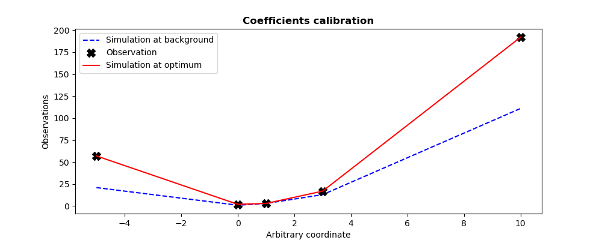
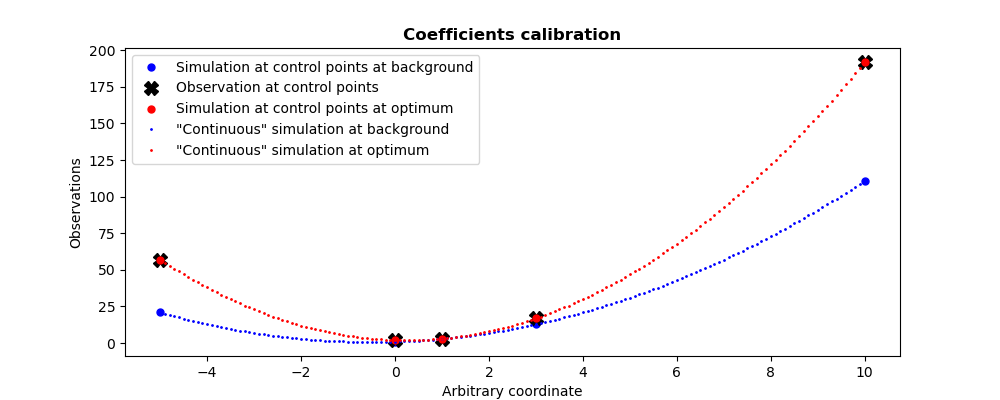
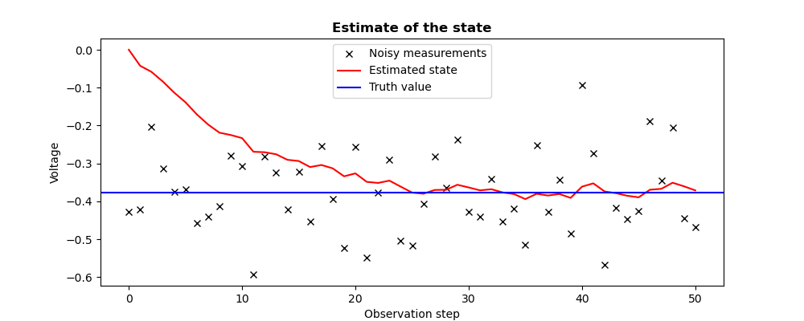
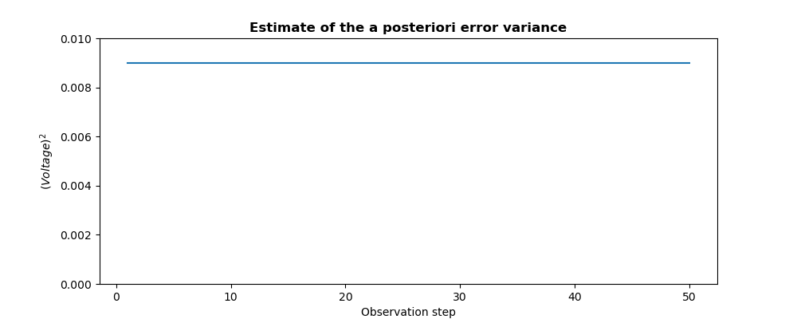
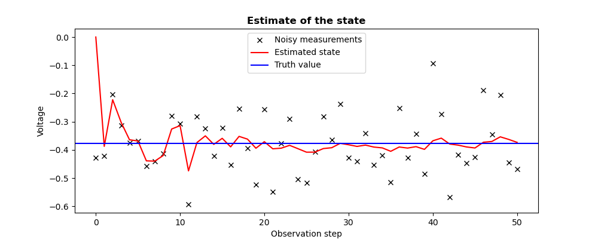
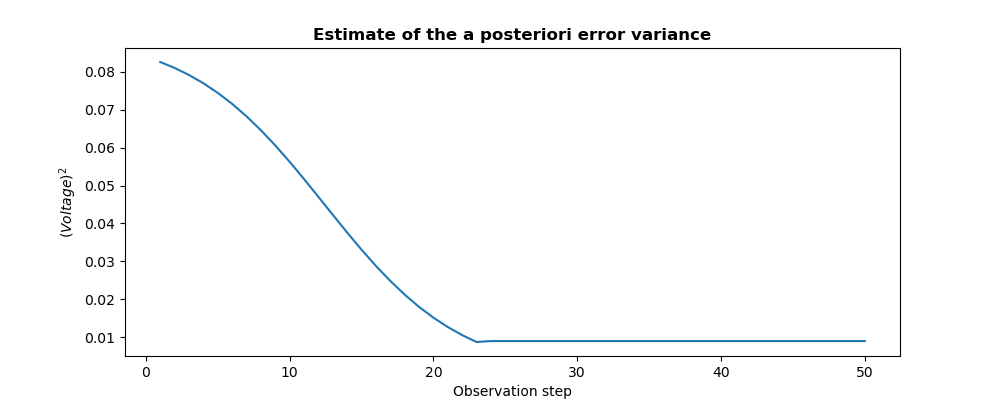

..
   Copyright (C) 2008-2025 EDF R&D

   This file is part of SALOME ADAO module.

   This library is free software; you can redistribute it and/or
   modify it under the terms of the GNU Lesser General Public
   License as published by the Free Software Foundation; either
   version 2.1 of the License, or (at your option) any later version.

   This library is distributed in the hope that it will be useful,
   but WITHOUT ANY WARRANTY; without even the implied warranty of
   MERCHANTABILITY or FITNESS FOR A PARTICULAR PURPOSE.  See the GNU
   Lesser General Public License for more details.

   You should have received a copy of the GNU Lesser General Public
   License along with this library; if not, write to the Free Software
   Foundation, Inc., 59 Temple Place, Suite 330, Boston, MA  02111-1307 USA

   See http://www.salome-platform.org/ or email : webmaster.salome@opencascade.com

   Author: Jean-Philippe Argaud, jean-philippe.argaud@edf.fr, EDF R&D

.. index:: single: 3DVAR
.. index:: single: 3D-Var
.. _section_ref_algorithm_3DVAR:

Calculation algorithm "*3DVAR*"
-------------------------------

.. ------------------------------------ ..
.. include:: snippets/Header2Algo01.rst

This algorithm performs a state estimation by variational minimization of the
classical :math:`J` function in static data assimilation:

.. math:: J(\mathbf{x})=(\mathbf{x}-\mathbf{x}^b)^T.\mathbf{B}^{-1}.(\mathbf{x}-\mathbf{x}^b)+(\mathbf{y}^o-H(\mathbf{x}))^T.\mathbf{R}^{-1}.(\mathbf{y}^o-H(\mathbf{x}))

which is usually designed as the "*3D-Var*" function (see for example
[Talagrand97]_). The terms "*3D-Var*", "*3D-VAR*" and "*3DVAR*" are equivalent.

There exists various variants of this algorithm. The following stable and
robust formulations are proposed here:

.. index::
    pair: Variant ; 3DVAR
    pair: Variant ; 3DVAR-VAN
    pair: Variant ; 3DVAR-Incr
    pair: Variant ; 3DVAR-PSAS
    pair: Variant ; OI
    pair: Variant ; Optimal Interpolation

- "3DVAR" (3D Variational analysis, see [Lorenc86]_, [LeDimet86]_, [Talagrand97]_), original classical algorithm, extremely robust, which operates in the model space,
- "3DVAR-VAN" (3D Variational Analysis with No inversion of B, see [Lorenc88]_), similar algorithm, which operates in the model space, avoiding inversion of the covariance matrix B (except in the case where there are bounds.),
- "3DVAR-Incr" (Incremental 3DVAR, see [Courtier94]_), cheaper algorithm than the previous ones, involving an approximation of non-linear operators,
- "3DVAR-PSAS" (Physical-space Statistical Analysis Scheme for 3DVAR, see [Courtier97]_, [Cohn98]_), algorithm sometimes cheaper because it operates in the observation space, involving an approximation of non-linear operators, not allowing to take into account bounds.

It is highly recommended to use the original "3DVAR". The "3DVAR" and
"3DVAR-Incr" algorithms (and not the others) explicitly allow the modification
of the initial point of their minimization, even if it is not recommended.

This mono-objective optimization algorithm is naturally written for a single
estimate, without any dynamic or iterative notion (there is no need in this
case for an incremental evolution operator, nor for an evolution error
covariance). In the traditional framework of temporal or iterative data
assimilation that ADAO deals with, it can also be used on a succession of
observations, placing the estimate in a recursive framework similar to a
:ref:`section_ref_algorithm_KalmanFilter`. A standard estimate is made at each
observation step on the state predicted by the incremental evolution model,
knowing that the state error covariance remains the background covariance
initially provided by the user. To be explicit, unlike Kalman-type filters, the
state error covariance is not updated.

An extension of 3DVAR, coupling a "3DVAR" method with a Kalman ensemble filter,
allows to improve the estimation of *a posteriori* error covariances. This
extension is obtained by using the "E3DVAR" variant of the filtering algorithm
:ref:`section_ref_algorithm_EnsembleKalmanFilter`.

Note that observation and evolution error statistics are assumed to be
Gaussian. So, in the particular case where the observation operator :math:`H`
is linear, this algorithm is strictly equivalent to optimal interpolation (OI).
What's more, it performs both minimum variance estimation (MV or "*Minimum
Variance* estimator") and maximum a posteriori estimation (MAP or "*Maximum A
Posteriori* estimator"), which coincide in this particular case.

.. ------------------------------------ ..
.. include:: snippets/Header2Algo12.rst

.. include:: snippets/FeaturePropNonLocalOptimization.rst

.. include:: snippets/FeaturePropDerivativeNeeded.rst

.. include:: snippets/FeaturePropParallelDerivativesOnly.rst

.. include:: snippets/FeaturePropConvergenceOnBoth.rst

.. ------------------------------------ ..
.. include:: snippets/Header2Algo02.rst

.. include:: snippets/Background.rst

.. include:: snippets/BackgroundError.rst

.. include:: snippets/Observation.rst

.. include:: snippets/ObservationError.rst

.. include:: snippets/ObservationOperator.rst

.. ------------------------------------ ..
.. include:: snippets/Header2Algo03AdOp.rst

.. include:: snippets/BoundsWithNone.rst

.. include:: snippets/CostDecrementTolerance.rst

.. include:: snippets/EstimationOf_Parameters.rst

.. include:: snippets/GradientNormTolerance.rst

.. include:: snippets/InitializationPoint.rst

.. include:: snippets/MaximumNumberOfIterations.rst

.. include:: snippets/Minimizer_xDVAR.rst

.. include:: snippets/NumberOfSamplesForQuantiles.rst

.. include:: snippets/ProjectedGradientTolerance.rst

.. include:: snippets/Quantiles.rst

.. include:: snippets/SetSeed.rst

.. include:: snippets/SimulationForQuantiles.rst

.. include:: snippets/StateBoundsForQuantilesWithNone.rst

StoreSupplementaryCalculations
  .. index:: single: StoreSupplementaryCalculations

  *List of names*. This list indicates the names of the supplementary
  variables, that can be available during or at the end of the algorithm, if
  they are initially required by the user. Their availability involves,
  potentially, costly calculations or memory consumptions. The default is then
  a void list, none of these variables being calculated and stored by default
  (excepted the unconditional variables). The possible names are in the
  following list (the detailed description of each named variable is given in
  the following part of this specific algorithmic documentation, in the
  sub-section "*Information and variables available at the end of the
  algorithm*"): [
  "Analysis",
  "APosterioriCorrelations",
  "APosterioriCovariance",
  "APosterioriStandardDeviations",
  "APosterioriVariances",
  "BMA",
  "CostFunctionJ",
  "CostFunctionJAtCurrentOptimum",
  "CostFunctionJb",
  "CostFunctionJbAtCurrentOptimum",
  "CostFunctionJo",
  "CostFunctionJoAtCurrentOptimum",
  "CurrentIterationNumber",
  "CurrentOptimum",
  "CurrentState",
  "CurrentStepNumber",
  "ForecastState",
  "IndexOfOptimum",
  "Innovation",
  "InnovationAtCurrentAnalysis",
  "InnovationAtCurrentState",
  "JacobianMatrixAtBackground",
  "JacobianMatrixAtOptimum",
  "KalmanGainAtOptimum",
  "MahalanobisConsistency",
  "OMA",
  "OMB",
  "SampledStateForQuantiles",
  "SigmaObs2",
  "SimulatedObservationAtBackground",
  "SimulatedObservationAtCurrentOptimum",
  "SimulatedObservationAtCurrentState",
  "SimulatedObservationAtOptimum",
  "SimulationQuantiles",
  ].

  Example :
  ``{"StoreSupplementaryCalculations":["CurrentState", "Residu"]}``

.. include:: snippets/Variant_3DVAR.rst

.. ------------------------------------ ..
.. include:: snippets/Header2Algo04.rst

.. include:: snippets/Analysis.rst

.. include:: snippets/CostFunctionJ.rst

.. include:: snippets/CostFunctionJb.rst

.. include:: snippets/CostFunctionJo.rst

.. ------------------------------------ ..
.. include:: snippets/Header2Algo05.rst

.. include:: snippets/Analysis.rst

.. include:: snippets/APosterioriCorrelations.rst

.. include:: snippets/APosterioriCovariance.rst

.. include:: snippets/APosterioriStandardDeviations.rst

.. include:: snippets/APosterioriVariances.rst

.. include:: snippets/BMA.rst

.. include:: snippets/CostFunctionJ.rst

.. include:: snippets/CostFunctionJAtCurrentOptimum.rst

.. include:: snippets/CostFunctionJb.rst

.. include:: snippets/CostFunctionJbAtCurrentOptimum.rst

.. include:: snippets/CostFunctionJo.rst

.. include:: snippets/CostFunctionJoAtCurrentOptimum.rst

.. include:: snippets/CurrentIterationNumber.rst

.. include:: snippets/CurrentOptimum.rst

.. include:: snippets/CurrentState.rst

.. include:: snippets/CurrentStepNumber.rst

.. include:: snippets/ForecastState.rst

.. include:: snippets/IndexOfOptimum.rst

.. include:: snippets/Innovation.rst

.. include:: snippets/InnovationAtCurrentAnalysis.rst

.. include:: snippets/InnovationAtCurrentState.rst

.. include:: snippets/JacobianMatrixAtBackground.rst

.. include:: snippets/JacobianMatrixAtOptimum.rst

.. include:: snippets/KalmanGainAtOptimum.rst

.. include:: snippets/MahalanobisConsistency.rst

.. include:: snippets/OMA.rst

.. include:: snippets/OMB.rst

.. include:: snippets/SampledStateForQuantiles.rst

.. include:: snippets/SigmaObs2.rst

.. include:: snippets/SimulatedObservationAtBackground.rst

.. include:: snippets/SimulatedObservationAtCurrentOptimum.rst

.. include:: snippets/SimulatedObservationAtCurrentState.rst

.. include:: snippets/SimulatedObservationAtOptimum.rst

.. include:: snippets/SimulationQuantiles.rst

.. ------------------------------------ ..
.. _section_ref_algorithm_3DVAR_examples:

.. include:: snippets/Header2Algo09.rst

.. --------- ..
.. include:: scripts/simple_3DVAR1.rst

.. literalinclude:: scripts/simple_3DVAR1.py

.. include:: snippets/Header2Algo10.rst

.. literalinclude:: scripts/simple_3DVAR1.res
    :language: none

.. include:: snippets/Header2Algo11.rst

.. _simple_3DVAR1:

.. include:: scripts/simple_3DVAR1Plus.rst

.. _simple_3DVAR1Plus:

.. --------- ..
.. include:: scripts/simple_3DVAR2.rst

.. literalinclude:: scripts/simple_3DVAR2.py

.. include:: snippets/Header2Algo10.rst

.. literalinclude:: scripts/simple_3DVAR2.res
    :language: none

.. include:: snippets/Header2Algo11.rst

.. _simple_3DVAR2_state:

.. simple_3DVAR2_variance:

.. --------- ..
.. include:: scripts/simple_3DVAR3.rst

.. literalinclude:: scripts/simple_3DVAR3.py

.. include:: snippets/Header2Algo10.rst

.. literalinclude:: scripts/simple_3DVAR3.res
    :language: none

.. include:: snippets/Header2Algo11.rst

.. _simple_3DVAR3_state:

.. _simple_3DVAR3_variance:

.. --------- ..
.. include:: scripts/simple_3DVAR4.rst

.. ------------------------------------ ..
.. include:: snippets/Header2Algo06.rst

- :ref:`section_ref_algorithm_Blue`
- :ref:`section_ref_algorithm_ExtendedBlue`
- :ref:`section_ref_algorithm_KalmanFilter`
- :ref:`section_ref_algorithm_LinearityTest`

.. ------------------------------------ ..
.. include:: snippets/Header2Algo07.rst

- [Byrd95]_
- [Cohn98]_
- [Courtier94]_
- [LeDimet86]_
- [Lorenc86]_
- [Lorenc88]_
- [Morales11]_
- [Talagrand97]_
- [Zhu97]_
