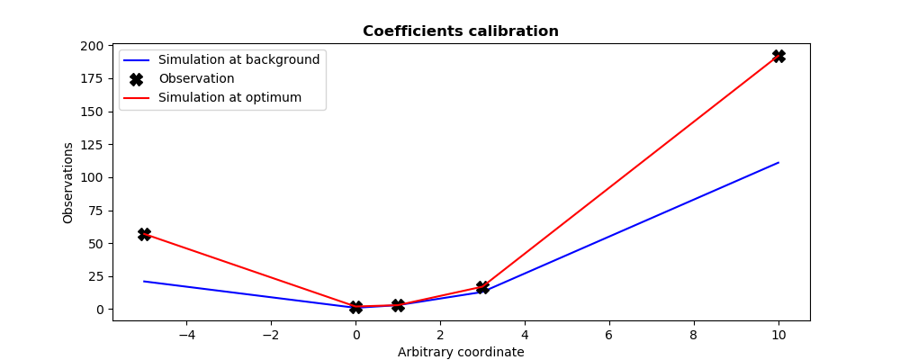

..
   Copyright (C) 2008-2023 EDF R&D

   This file is part of SALOME ADAO module.

   This library is free software; you can redistribute it and/or
   modify it under the terms of the GNU Lesser General Public
   License as published by the Free Software Foundation; either
   version 2.1 of the License, or (at your option) any later version.

   This library is distributed in the hope that it will be useful,
   but WITHOUT ANY WARRANTY; without even the implied warranty of
   MERCHANTABILITY or FITNESS FOR A PARTICULAR PURPOSE.  See the GNU
   Lesser General Public License for more details.

   You should have received a copy of the GNU Lesser General Public
   License along with this library; if not, write to the Free Software
   Foundation, Inc., 59 Temple Place, Suite 330, Boston, MA  02111-1307 USA

   See http://www.salome-platform.org/ or email : webmaster.salome@opencascade.com

   Author: Jean-Philippe Argaud, jean-philippe.argaud@edf.fr, EDF R&D

.. index:: single: DerivativeFreeOptimization
.. _section_ref_algorithm_DerivativeFreeOptimization:

Calculation algorithm "*DerivativeFreeOptimization*"
----------------------------------------------------

.. ------------------------------------ ..
.. include:: snippets/Header2Algo01.rst

This algorithm realizes an estimation of the state of a system by minimization
of a cost function :math:`J` without gradient. It is a method that does not use
the derivatives of the cost function. It falls in the same category than the
:ref:`section_ref_algorithm_ParticleSwarmOptimization`, the
:ref:`section_ref_algorithm_DifferentialEvolution` or the
:ref:`section_ref_algorithm_TabuSearch`.

This is a mono-objective optimization method allowing for global minimum search
of a general error function :math:`J` of type :math:`L^1`, :math:`L^2` or
:math:`L^{\infty}`, with or without weights. The default error function is the
augmented weighted least squares function, classically used in data
assimilation.

.. ------------------------------------ ..
.. include:: snippets/Header2Algo02.rst

.. include:: snippets/Background.rst

.. include:: snippets/BackgroundError.rst

.. include:: snippets/Observation.rst

.. include:: snippets/ObservationError.rst

.. include:: snippets/ObservationOperator.rst

.. ------------------------------------ ..
.. include:: snippets/Header2Algo03AdOp.rst

.. include:: snippets/Minimizer_DFO.rst

.. include:: snippets/BoundsWithNone.rst

.. include:: snippets/MaximumNumberOfIterations.rst

.. include:: snippets/MaximumNumberOfFunctionEvaluations.rst

.. include:: snippets/StateVariationTolerance.rst

.. include:: snippets/CostDecrementTolerance.rst

.. include:: snippets/QualityCriterion.rst

StoreSupplementaryCalculations
  .. index:: single: StoreSupplementaryCalculations

  *List of names*. This list indicates the names of the supplementary
  variables, that can be available during or at the end of the algorithm, if
  they are initially required by the user. Their avalability involves,
  potentially, costly calculations or memory consumptions. The default is then
  a void list, none of these variables being calculated and stored by default
  (excepted the unconditionnal variables). The possible names are in the
  following list (the detailed description of each named variable is given in
  the following part of this specific algorithmic documentation, in the
  sub-section "*Information and variables available at the end of the
  algorithm*"): [
  "Analysis",
  "BMA",
  "CostFunctionJ",
  "CostFunctionJb",
  "CostFunctionJo",
  "CostFunctionJAtCurrentOptimum",
  "CostFunctionJbAtCurrentOptimum",
  "CostFunctionJoAtCurrentOptimum",
  "CurrentIterationNumber",
  "CurrentOptimum",
  "CurrentState",
  "IndexOfOptimum",
  "Innovation",
  "InnovationAtCurrentState",
  "OMA",
  "OMB",
  "SimulatedObservationAtBackground",
  "SimulatedObservationAtCurrentOptimum",
  "SimulatedObservationAtCurrentState",
  "SimulatedObservationAtOptimum",
  ].

  Example :
  ``{"StoreSupplementaryCalculations":["CurrentState", "Residu"]}``

.. ------------------------------------ ..
.. include:: snippets/Header2Algo04.rst

.. include:: snippets/Analysis.rst

.. include:: snippets/CostFunctionJ.rst

.. include:: snippets/CostFunctionJb.rst

.. include:: snippets/CostFunctionJo.rst

.. include:: snippets/CurrentState.rst

.. ------------------------------------ ..
.. include:: snippets/Header2Algo05.rst

.. include:: snippets/Analysis.rst

.. include:: snippets/BMA.rst

.. include:: snippets/CostFunctionJ.rst

.. include:: snippets/CostFunctionJb.rst

.. include:: snippets/CostFunctionJo.rst

.. include:: snippets/CostFunctionJAtCurrentOptimum.rst

.. include:: snippets/CostFunctionJbAtCurrentOptimum.rst

.. include:: snippets/CostFunctionJoAtCurrentOptimum.rst

.. include:: snippets/CurrentIterationNumber.rst

.. include:: snippets/CurrentOptimum.rst

.. include:: snippets/CurrentState.rst

.. include:: snippets/IndexOfOptimum.rst

.. include:: snippets/Innovation.rst

.. include:: snippets/InnovationAtCurrentState.rst

.. include:: snippets/OMA.rst

.. include:: snippets/OMB.rst

.. include:: snippets/SimulatedObservationAtBackground.rst

.. include:: snippets/SimulatedObservationAtCurrentOptimum.rst

.. include:: snippets/SimulatedObservationAtCurrentState.rst

.. include:: snippets/SimulatedObservationAtOptimum.rst

.. ------------------------------------ ..
.. _section_ref_algorithm_DerivativeFreeOptimization_examples:

.. include:: snippets/Header2Algo09.rst

.. include:: scripts/simple_DerivativeFreeOptimization.rst

.. literalinclude:: scripts/simple_DerivativeFreeOptimization.py

.. include:: snippets/Header2Algo10.rst

.. literalinclude:: scripts/simple_DerivativeFreeOptimization.res
    :language: none

.. include:: snippets/Header2Algo11.rst

.. _simple_DerivativeFreeOptimization:

.. ------------------------------------ ..
.. include:: snippets/Header2Algo06.rst

- :ref:`section_ref_algorithm_ParticleSwarmOptimization`
- :ref:`section_ref_algorithm_DifferentialEvolution`
- :ref:`section_ref_algorithm_TabuSearch`

.. ------------------------------------ ..
.. include:: snippets/Header2Algo07.rst

- [Johnson08]_
- [Nelder65]_
- [Powell64]_
- [Powell94]_
- [Powell98]_
- [Powell04]_
- [Powell07]_
- [Powell09]_
- [Rowan90]_
