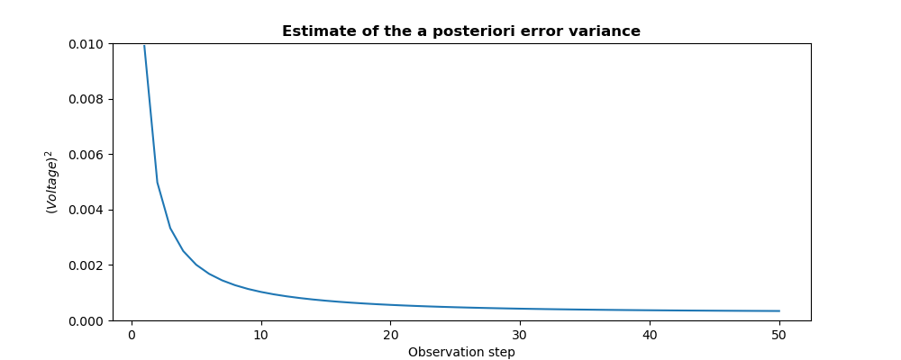
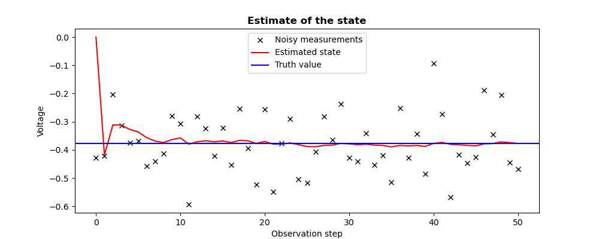

..
   Copyright (C) 2008-2024 EDF R&D

   This file is part of SALOME ADAO module.

   This library is free software; you can redistribute it and/or
   modify it under the terms of the GNU Lesser General Public
   License as published by the Free Software Foundation; either
   version 2.1 of the License, or (at your option) any later version.

   This library is distributed in the hope that it will be useful,
   but WITHOUT ANY WARRANTY; without even the implied warranty of
   MERCHANTABILITY or FITNESS FOR A PARTICULAR PURPOSE.  See the GNU
   Lesser General Public License for more details.

   You should have received a copy of the GNU Lesser General Public
   License along with this library; if not, write to the Free Software
   Foundation, Inc., 59 Temple Place, Suite 330, Boston, MA  02111-1307 USA

   See http://www.salome-platform.org/ or email : webmaster.salome@opencascade.com

   Author: Jean-Philippe Argaud, jean-philippe.argaud@edf.fr, EDF R&D

.. index:: single: KalmanFilter
.. _section_ref_algorithm_KalmanFilter:

Calculation algorithm "*KalmanFilter*"
--------------------------------------

.. ------------------------------------ ..
.. include:: snippets/Header2Algo01.rst

This algorithm realizes an estimation of the state of a dynamic system by a
Kalman Filter. In discrete form, it is an iterative (or recursive) estimator of
the current state using the previous state and the current observations. The
time (or pseudo-time) between two steps is the time between successive
observations. Each iteration step is composed of two successive phases,
classically called "*prediction*" and "*correction*". The prediction step uses
an incremental evolution operator to establish an estimate of the current state
from the state estimated at the previous step. The correction (or *update*)
step uses the current observations to improve the estimate by correcting the
predicted state.

It is theoretically reserved for observation and incremental evolution
operators cases which are linear, even if it sometimes works in "slightly"
non-linear cases. One can verify the linearity of the operators with the help
of a :ref:`section_ref_algorithm_LinearityTest`.

Conceptually, we can represent the temporal pattern of action of the evolution
and observation operators in this algorithm in the following way, with **x**
the state, **P** the state error covariance, *t* the discrete iterative time :

  .. _schema_temporel_KF:
  .. figure:: images/schema_temporel_KF.png
    :align: center
    :width: 100%

    **Timeline of steps in Kalman filter data assimilation**

In this scheme, the analysis **(x,P)** is obtained by means of the
"*correction*" by observing the "*prediction*" of the previous state. We notice
that there is no analysis performed at the initial time step (numbered 0 in the
time indexing) because there is no forecast at this time (the background is
stored as a pseudo analysis at the initial time step). If the observations are
provided in series by the user, the first one is therefore not used.

This filter can also be used to estimate (jointly or solely) parameters and not
the state, in which case neither the time nor the evolution have any meaning.
The iteration steps are then linked to the insertion of a new observation in
the recursive estimation. One should consult the section
:ref:`section_theory_dynamic` for the implementation concepts.

In case of non-linearity of the operators, even slightly marked, it will be
preferred a :ref:`section_ref_algorithm_ExtendedKalmanFilter`, or a
:ref:`section_ref_algorithm_UnscentedKalmanFilter` and a
:ref:`section_ref_algorithm_UnscentedKalmanFilter` that are more powerful. One
can verify the linearity of the operators with the help of a
:ref:`section_ref_algorithm_LinearityTest`.

.. ------------------------------------ ..
.. include:: snippets/Header2Algo12.rst

.. include:: snippets/FeaturePropLocalOptimization.rst

.. include:: snippets/FeaturePropDerivativeNeeded.rst

.. include:: snippets/FeaturePropParallelDerivativesOnly.rst

.. include:: snippets/FeaturePropConvergenceOnStatic.rst

.. ------------------------------------ ..
.. include:: snippets/Header2Algo02.rst

.. include:: snippets/Background.rst

.. include:: snippets/BackgroundError.rst

.. include:: snippets/EvolutionError.rst

.. include:: snippets/EvolutionModel.rst

.. include:: snippets/Observation.rst

.. include:: snippets/ObservationError.rst

.. include:: snippets/ObservationOperator.rst

.. ------------------------------------ ..
.. include:: snippets/Header2Algo03AdOp.rst

.. include:: snippets/EstimationOf_State.rst

StoreSupplementaryCalculations
  .. index:: single: StoreSupplementaryCalculations

  *List of names*. This list indicates the names of the supplementary
  variables, that can be available during or at the end of the algorithm, if
  they are initially required by the user. Their availability involves,
  potentially, costly calculations or memory consumptions. The default is then
  a void list, none of these variables being calculated and stored by default
  (excepted the unconditional variables). The possible names are in the
  following list (the detailed description of each named variable is given in
  the following part of this specific algorithmic documentation, in the
  sub-section "*Information and variables available at the end of the
  algorithm*"): [
  "Analysis",
  "APosterioriCorrelations",
  "APosterioriCovariance",
  "APosterioriStandardDeviations",
  "APosterioriVariances",
  "BMA",
  "CostFunctionJ",
  "CostFunctionJAtCurrentOptimum",
  "CostFunctionJb",
  "CostFunctionJbAtCurrentOptimum",
  "CostFunctionJo",
  "CostFunctionJoAtCurrentOptimum",
  "CurrentOptimum",
  "CurrentState",
  "CurrentStepNumber",
  "ForecastCovariance",
  "ForecastState",
  "IndexOfOptimum",
  "InnovationAtCurrentAnalysis",
  "InnovationAtCurrentState",
  "SimulatedObservationAtCurrentAnalysis",
  "SimulatedObservationAtCurrentOptimum",
  "SimulatedObservationAtCurrentState",
  ].

  Example :
  ``{"StoreSupplementaryCalculations":["CurrentState", "Residu"]}``

.. ------------------------------------ ..
.. include:: snippets/Header2Algo04.rst

.. include:: snippets/Analysis.rst

.. ------------------------------------ ..
.. include:: snippets/Header2Algo05.rst

.. include:: snippets/Analysis.rst

.. include:: snippets/APosterioriCorrelations.rst

.. include:: snippets/APosterioriCovariance.rst

.. include:: snippets/APosterioriStandardDeviations.rst

.. include:: snippets/APosterioriVariances.rst

.. include:: snippets/BMA.rst

.. include:: snippets/CostFunctionJ.rst

.. include:: snippets/CostFunctionJAtCurrentOptimum.rst

.. include:: snippets/CostFunctionJb.rst

.. include:: snippets/CostFunctionJbAtCurrentOptimum.rst

.. include:: snippets/CostFunctionJo.rst

.. include:: snippets/CostFunctionJoAtCurrentOptimum.rst

.. include:: snippets/CurrentOptimum.rst

.. include:: snippets/CurrentState.rst

.. include:: snippets/CurrentStepNumber.rst

.. include:: snippets/ForecastCovariance.rst

.. include:: snippets/ForecastState.rst

.. include:: snippets/IndexOfOptimum.rst

.. include:: snippets/InnovationAtCurrentAnalysis.rst

.. include:: snippets/InnovationAtCurrentState.rst

.. include:: snippets/SimulatedObservationAtCurrentAnalysis.rst

.. include:: snippets/SimulatedObservationAtCurrentOptimum.rst

.. include:: snippets/SimulatedObservationAtCurrentState.rst

.. ------------------------------------ ..
.. _section_ref_algorithm_KalmanFilter_examples:

.. include:: snippets/Header2Algo09.rst

.. --------- ..
.. include:: scripts/simple_KalmanFilter1.rst

.. literalinclude:: scripts/simple_KalmanFilter1.py

.. include:: snippets/Header2Algo10.rst

.. literalinclude:: scripts/simple_KalmanFilter1.res
    :language: none

.. include:: snippets/Header2Algo11.rst

.. _simple_KalmanFilter1_state:
.. image:: scripts/simple_KalmanFilter1_state.png
  :align: center
  :width: 90%

.. _simple_KalmanFilter1_variance:

.. --------- ..
.. include:: scripts/simple_KalmanFilter2.rst

.. literalinclude:: scripts/simple_KalmanFilter2.py

.. include:: snippets/Header2Algo10.rst

.. literalinclude:: scripts/simple_KalmanFilter2.res
    :language: none

.. include:: snippets/Header2Algo11.rst

.. _simple_KalmanFilter2_state:

.. _simple_KalmanFilter2_variance:
.. image:: scripts/simple_KalmanFilter2_variance.png
  :align: center
  :width: 90%

.. ------------------------------------ ..
.. include:: snippets/Header2Algo06.rst

- :ref:`section_ref_algorithm_ExtendedKalmanFilter`
- :ref:`section_ref_algorithm_EnsembleKalmanFilter`
- :ref:`section_ref_algorithm_UnscentedKalmanFilter`

.. ------------------------------------ ..
.. include:: snippets/Header2Algo07.rst

- [Welch06]_
- [WikipediaKF]_
