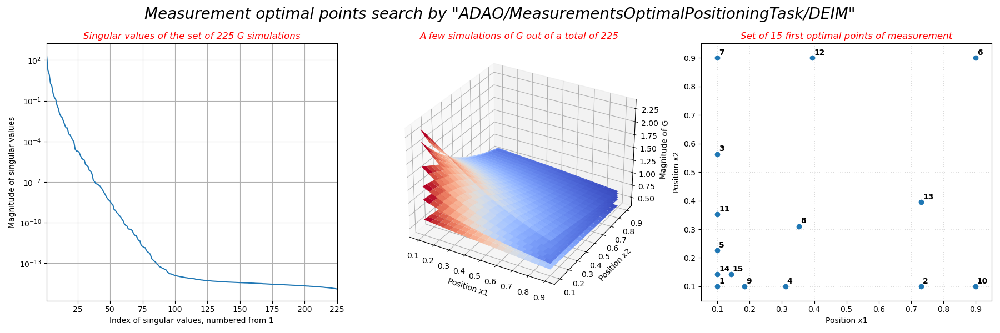

..
   Copyright (C) 2008-2024 EDF R&D

   This file is part of SALOME ADAO module.

   This library is free software; you can redistribute it and/or
   modify it under the terms of the GNU Lesser General Public
   License as published by the Free Software Foundation; either
   version 2.1 of the License, or (at your option) any later version.

   This library is distributed in the hope that it will be useful,
   but WITHOUT ANY WARRANTY; without even the implied warranty of
   MERCHANTABILITY or FITNESS FOR A PARTICULAR PURPOSE.  See the GNU
   Lesser General Public License for more details.

   You should have received a copy of the GNU Lesser General Public
   License along with this library; if not, write to the Free Software
   Foundation, Inc., 59 Temple Place, Suite 330, Boston, MA  02111-1307 USA

   See http://www.salome-platform.org/ or email : webmaster.salome@opencascade.com

   Author: Jean-Philippe Argaud, jean-philippe.argaud@edf.fr, EDF R&D

.. index:: single: MeasurementsOptimalPositioningTask
.. index:: single: Optimal positioning of measurements
.. index:: single: Measurement locations
.. index:: single: Measurements (Optimal positioning)
.. index:: single: Ensemble of simulations
.. index:: single: Ensemble of snapshots
.. index:: single: Simulations (Ensemble)
.. index:: single: Snapshots (Ensemble)
.. index:: single: Reduced Order Model
.. index:: single: ROM
.. _section_ref_algorithm_MeasurementsOptimalPositioningTask:

Task algorithm "*MeasurementsOptimalPositioningTask*"
-----------------------------------------------------

.. ------------------------------------ ..
.. include:: snippets/Header2Algo00.rst

.. ------------------------------------ ..
.. include:: snippets/Header2Algo01.rst

This algorithm provides optimal positioning of measurements of an
:math:`\mathbf{y}` physical field, in order to get the best possible
interpolation. These optimal measurement positions are determined in an
iterative greedy way, from a pre-existing set of state vectors
:math:`\mathbf{y}` (usually called "snapshots*" in reduced basis methodology)
or obtained by simulating the physical field(s) of interest during the course
of the algorithm. Each of these state vectors is usually (but not necessarily)
the result :math:`\mathbf{y}` of a simulation using the operator :math:`H` that
returns the complete field(s) for a given set of parameters :math:`\mathbf{x}`,
or of an explicit observation of the complete field(s) :math:`\mathbf{y}`.

To determine the optimum positioning of measurements, an Empirical
Interpolation Method (EIM [Barrault04]_) or Discrete Empirical Interpolation
Method (DEIM [Chaturantabut10]_) is used, which establishes a reduced model of
type Reduced Order Model (ROM), with (variant "*lcEIM*" or "*lcDEIM*") or
without (variant "*EIM*" or "*DEIM*") positioning constraints. For performance,
we recommend using the variant "*lcEIM*" or "*EIM*" when the dimension of the
full fields space is large.

There are two ways to use this algorithm:

#. In its simplest use, if the set of physical state :math:`\mathbf{y}` vectors
   is pre-existing, it is only necessary to provide it as an ordered collection
   by the algorithm option "*EnsembleOfSnapshots*". This is the default
   situation, for example, if the set of states has been generated by an
   :ref:`section_ref_algorithm_EnsembleOfSimulationGenerationTask`.
#. If the set of physical state :math:`\mathbf{y}` vectors is to be obtained by
   explicit simulations during the course of the algorithm, then one must
   provide both the simulation operator of the complete field, here identified
   with the observation operator :math:`H` of the complete field, and the
   design of experiment of the space of parametric states :math:`\mathbf{x}`.

If the design of experiments is supplied, the sampling of the states
:math:`\mathbf{x}` can be given as in the
:ref:`section_ref_algorithm_EnsembleOfSimulationGenerationTask`, explicitly or
under form of hypercubes, explicit or sampled according to classic
distributions, or using Latin hypercube sampling (LHS) or Sobol sequences. The
computations are optimized according to the computer resources available and
the options requested by the user. You can refer to the
:ref:`section_ref_sampling_requirements` for an illustration of sampling.
Beware of the size of the hypercube (and then to the number of computations)
that can be reached, it can grow quickly to be quite large. The memory required
is then the product of the size of an individual :math:`\mathbf{y}` state and
the size of the hypercube.

  .. _mop_determination:
  .. image:: images/mop_determination.png
    :align: center
    :width: 95%
  .. centered::
    **General scheme for using the algorithm**

It is possible to exclude a priori potential positions for measurement
positioning, using the analysis variant "*lcEIM*" or "*lcDEIM*" for a
constrained positioning search.

.. ------------------------------------ ..
.. include:: snippets/Header2Algo12.rst

.. include:: snippets/FeaturePropDerivativeFree.rst

.. include:: snippets/FeaturePropParallelAlgorithm.rst

.. ------------------------------------ ..
.. include:: snippets/Header2Algo02.rst

*None*

.. ------------------------------------ ..
.. include:: snippets/Header2Algo03Task.rst

.. include:: snippets/EnsembleOfSnapshots.rst

.. include:: snippets/ExcludeLocations.rst

.. include:: snippets/ErrorNorm.rst

.. include:: snippets/ErrorNormTolerance.rst

.. include:: snippets/MaximumNumberOfLocations.rst

.. include:: snippets/NameOfLocations.rst

.. include:: snippets/ReduceMemoryUse.rst

.. include:: snippets/SampleAsExplicitHyperCube.rst

.. include:: snippets/SampleAsIndependantRandomVariables.rst

.. include:: snippets/SampleAsMinMaxLatinHyperCube.rst

.. include:: snippets/SampleAsMinMaxSobolSequence.rst

.. include:: snippets/SampleAsMinMaxStepHyperCube.rst

.. include:: snippets/SampleAsnUplet.rst

.. include:: snippets/SetDebug.rst

.. include:: snippets/SetSeed.rst

StoreSupplementaryCalculations
  .. index:: single: StoreSupplementaryCalculations

  *List of names*. This list indicates the names of the supplementary
  variables, that can be available during or at the end of the algorithm, if
  they are initially required by the user. Their availability involves,
  potentially, costly calculations or memory consumptions. The default is then
  a void list, none of these variables being calculated and stored by default
  (excepted the unconditional variables). The possible names are in the
  following list (the detailed description of each named variable is given in
  the following part of this specific algorithmic documentation, in the
  sub-section "*Information and variables available at the end of the
  algorithm*"): [
  "EnsembleOfSimulations",
  "EnsembleOfStates",
  "ExcludedPoints",
  "OptimalPoints",
  "ReducedBasis",
  "ReducedBasisMus",
  "Residus",
  "SingularValues",
  ].

  Example :
  ``{"StoreSupplementaryCalculations":["CurrentState", "Residu"]}``

.. include:: snippets/Variant_MOP.rst

.. ------------------------------------ ..
.. include:: snippets/Header2Algo04.rst

.. include:: snippets/OptimalPoints.rst

.. ------------------------------------ ..
.. include:: snippets/Header2Algo05.rst

.. include:: snippets/EnsembleOfSimulations.rst

.. include:: snippets/EnsembleOfStates.rst

.. include:: snippets/ExcludedPoints.rst

.. include:: snippets/OptimalPoints.rst

.. include:: snippets/ReducedBasis.rst

.. include:: snippets/ReducedBasisMus.rst

.. include:: snippets/Residus.rst

.. include:: snippets/SingularValues.rst

.. ------------------------------------ ..
.. _section_ref_algorithm_MeasurementsOptimalPositioningTask_examples:

.. include:: snippets/Header2Algo09.rst

.. --------- ..
.. include:: scripts/simple_MeasurementsOptimalPositioningTask1.rst

.. literalinclude:: scripts/simple_MeasurementsOptimalPositioningTask1.py

.. include:: snippets/Header2Algo10.rst

.. literalinclude:: scripts/simple_MeasurementsOptimalPositioningTask1.res
    :language: none

.. --------- ..
.. include:: scripts/simple_MeasurementsOptimalPositioningTask2.rst

.. literalinclude:: scripts/simple_MeasurementsOptimalPositioningTask2.py

.. include:: snippets/Header2Algo10.rst

.. literalinclude:: scripts/simple_MeasurementsOptimalPositioningTask2.res
    :language: none

.. --------- ..
.. include:: scripts/simple_MeasurementsOptimalPositioningTask3.rst

.. literalinclude:: scripts/simple_MeasurementsOptimalPositioningTask3.py

.. include:: snippets/Header2Algo10.rst

.. literalinclude:: scripts/simple_MeasurementsOptimalPositioningTask3.res
    :language: none

.. include:: snippets/Header2Algo11.rst

.. _simple_MeasurementsOptimalPositioningTask3:

.. ------------------------------------ ..
.. include:: snippets/Header2Algo06.rst

- :ref:`section_ref_algorithm_FunctionTest`
- :ref:`section_ref_algorithm_ParallelFunctionTest`
- :ref:`section_ref_algorithm_EnsembleOfSimulationGenerationTask`

.. ------------------------------------ ..
.. include:: snippets/Header2Algo07.rst

- [Barrault04]_
- [Chaturantabut10]_
- [Gong18]_
- [Quarteroni16]_
