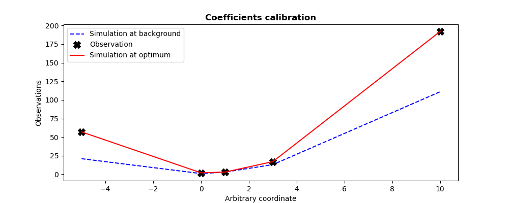

..
   Copyright (C) 2008-2025 EDF R&D

   This file is part of SALOME ADAO module.

   This library is free software; you can redistribute it and/or
   modify it under the terms of the GNU Lesser General Public
   License as published by the Free Software Foundation; either
   version 2.1 of the License, or (at your option) any later version.

   This library is distributed in the hope that it will be useful,
   but WITHOUT ANY WARRANTY; without even the implied warranty of
   MERCHANTABILITY or FITNESS FOR A PARTICULAR PURPOSE.  See the GNU
   Lesser General Public License for more details.

   You should have received a copy of the GNU Lesser General Public
   License along with this library; if not, write to the Free Software
   Foundation, Inc., 59 Temple Place, Suite 330, Boston, MA  02111-1307 USA

   See http://www.salome-platform.org/ or email : webmaster.salome@opencascade.com

   Author: Jean-Philippe Argaud, jean-philippe.argaud@edf.fr, EDF R&D

.. index:: single: ParameterCalibrationTask
.. index:: single: Parameter calibration
.. index:: single: Parameter adjustment
.. _section_ref_algorithm_ParameterCalibrationTask:

Task algorithm "*ParameterCalibrationTask*"
-------------------------------------------

.. ------------------------------------ ..
.. include:: snippets/Header2Algo01.rst

This algorithm can be used to establish the calibration (or adjustment) of
model parameters, based on observations or measurements and an *a priori* idea
of these parameters.

It provides easy access to the most useful methods for such calibration. It is
not intended to replace the other algorithms of data assimilation or
optimization described elsewhere, but to accelerate the use of algorithms that
are the most simple and the more efficient for parameter calibration. It also
enables, when necessary, to initiate a calibration with the most classical
methods, then very simply, by changing algorithm, to switch to more advanced
specific methods or to those better adapted to the particular characteristics
of the problems to be treated.

There are 4 main groups of methods which can be used to simply calibrate model
parameters. The general conditions of choice are indicated here, with details
available in each algorithm-specific section of the documentation.

3DVAR type variational optimization: variant "3DVARGradientOptimization"
    The "3DVAR" gradient method is very often the most efficient, both because
    of the low number of calculations required and the high accuracy achieved.
    It requires good regularity of the model to be adjusted in relation to its
    parameters, good accuracy of the available simulations, and good separation
    of any possible equivalent minima. That said, when applied correctly, it is
    the most economical method in terms of model evaluations, and the most
    accurate for this number of evaluations. This is particularly true when the
    number of parameters to be optimized increases, a number to which the
    method is very un-sensitive. Last but not least, the method is easy to set
    up on a particular model, and requires little fine-tuning in order to
    assess its performance. For details and precise association of options,
    please refer to the specific documentation for a
    :ref:`section_ref_algorithm_3DVAR`.

BLUE type semi-linear estimation: variant "ExtendedBlueOptimization"
    This is an "ExtendedBlue" estimation method, of the BLUE type which
    includes a non-linear evaluation of the model to be calibrated. The
    advantage of this method is that it's a non-iterative estimate, and
    therefore very economical in terms of number of evaluations. What's more,
    there are very few parameters to set when using this method. Nevertheless,
    it is usually less accurate and less robust to errors arising from the
    non-linear nature of the model used. For details and the precise
    association of options, please refer to the specific documentation for a
    :ref:`section_ref_algorithm_ExtendedBlue`.

Derivative free optimization: variant "DerivativeFreeOptimization"
    It's an optimization method that doesn't use model derivation, but proceeds
    by simplex or other types of approximation. The advantage of this method is
    that it does not impose any particular behavior on the model in relation to
    its parameters. However, it often requires a large number of model
    evaluations to build an efficient approximation internally. Moreover, it is
    very sensitive to the number of parameters to be optimized, and is only
    suitable for low-dimensional models. The number of evaluations required is
    often several orders of magnitude greater than with other methods. Last but
    not least, parameter tuning is tricky on a particular model to be
    calibrated. For details and the precise association of options, please
    refer to the specific documentation for a
    :ref:`section_ref_algorithm_DerivativeFreeOptimization`.

Particle swarm optimization, canonical: variant "CanonicalParticuleSwarmOptimization"
    This is a meta-heuristic optimization method, which uses a set (called a
    "swarm") of model evaluations to map the state space and find the best one.
    The advantage of this method is that it is very insensitive to the number
    of parameters to be optimized, and seeks the global optimal state if
    possible, bearing in mind that parameter tuning is tricky on a particular
    model to calibrate. It is often one or two orders of magnitude more
    expensive than a variational method. For details and the precise
    association of options, please refer to the specific documentation for a
    :ref:`section_ref_algorithm_ParticleSwarmOptimization`.

Particle swarm optimization, accelerated: variant "VariationalParticuleSwarmOptimization"
    This is a meta-heuristic optimization method enhanced by local search
    variational acceleration. If it can be applied, it ideally enables the
    global meta-heuristic swarm search to be combined with a local variational
    acceleration to overcome the difficulty of local swarm convergence. This
    method is more economical than the previous one in terms of the number of
    evaluations of the model to be calibrated, but it is rather tricky to tune
    to the given model to be calibrated. For details and the precise
    association of options, please refer to the specific documentation for a
    :ref:`section_ref_algorithm_ParticleSwarmOptimization`.

It is therefore recommended to keep the default variational optimization method
"3DVARGradientOptimization" for the best possible performance, which offers
also the easiest adjustment of the optimization parameters with respect to the
model to calibrate.

.. ------------------------------------ ..
.. include:: snippets/Header2Algo12.rst

.. include:: snippets/FeaturePropParallelAlgorithm.rst

.. ------------------------------------ ..
.. include:: snippets/Header2Algo02.rst

.. include:: snippets/Background.rst

.. include:: snippets/BackgroundError.rst

.. include:: snippets/EvolutionError.rst

.. include:: snippets/EvolutionModel.rst

.. include:: snippets/Observation.rst

.. include:: snippets/ObservationError.rst

.. include:: snippets/ObservationOperator.rst

.. ------------------------------------ ..
.. include:: snippets/Header2Algo03Task.rst

It should be noted that all the options available for this task are described
here, but that only some are active for a particular variant. The precise
documentation of each variant is therefore also useful for the correct use of
each of the options presented here.

.. include:: snippets/BoundsWithNone.rst

.. include:: snippets/CognitiveAcceleration.rst

.. include:: snippets/CognitiveAccelerationControl.rst

.. include:: snippets/CostDecrementTolerance.rst

.. include:: snippets/DistributionByComponents.rst

.. include:: snippets/GlobalCostReductionTolerance.rst

.. include:: snippets/GradientNormTolerance.rst

.. include:: snippets/HybridCostDecrementTolerance.rst

.. include:: snippets/HybridMaximumNumberOfIterations.rst

.. include:: snippets/HybridNumberOfLocalHunters.rst

.. include:: snippets/HybridNumberOfWarmupIterations.rst

.. include:: snippets/InertiaWeight.rst

.. include:: snippets/InitializationPoint.rst

.. include:: snippets/MaximumNumberOfFunctionEvaluations.rst

.. include:: snippets/MaximumNumberOfIterations.rst

.. include:: snippets/Minimizer_PCT.rst

.. include:: snippets/NumberOfInsects.rst

.. include:: snippets/NumberOfSamplesForQuantiles.rst

.. include:: snippets/ProjectedGradientTolerance.rst

.. include:: snippets/QualityCriterion.rst

.. include:: snippets/Quantiles.rst

.. include:: snippets/SetSeed.rst

.. include:: snippets/SimulationForQuantiles.rst

.. include:: snippets/SocialAcceleration.rst

.. include:: snippets/SocialAccelerationControl.rst

.. include:: snippets/StateBoundsForQuantilesWithNone.rst

.. include:: snippets/StateVariationTolerance.rst

StoreSupplementaryCalculations
  .. index:: single: StoreSupplementaryCalculations

  *List of names*. This list indicates the names of the supplementary
  variables, that can be available during or at the end of the algorithm, if
  they are initially required by the user. Their availability involves,
  potentially, costly calculations or memory consumptions. The default is then
  a void list, none of these variables being calculated and stored by default
  (excepted the unconditional variables). The possible names are in the
  following list (the detailed description of each named variable is given in
  the following part of this specific algorithmic documentation, in the
  sub-section "*Information and variables available at the end of the
  algorithm*"): [
  "Analysis",
  "APosterioriCorrelations",
  "APosterioriCovariance",
  "APosterioriStandardDeviations",
  "APosterioriVariances",
  "BMA",
  "CostFunctionJ",
  "CostFunctionJAtCurrentOptimum",
  "CostFunctionJb",
  "CostFunctionJbAtCurrentOptimum",
  "CostFunctionJo",
  "CostFunctionJoAtCurrentOptimum",
  "CurrentIterationNumber",
  "CurrentOptimum",
  "CurrentState",
  "CurrentStepNumber",
  "EnsembleOfSimulations",
  "EnsembleOfStates",
  "ForecastState",
  "IndexOfOptimum",
  "Innovation",
  "InnovationAtCurrentAnalysis",
  "InnovationAtCurrentState",
  "JacobianMatrixAtBackground",
  "JacobianMatrixAtOptimum",
  "KalmanGainAtOptimum",
  "MahalanobisConsistency",
  "OMA",
  "OMB",
  "SampledStateForQuantiles",
  "SigmaObs2",
  "SimulatedObservationAtBackground",
  "SimulatedObservationAtCurrentOptimum",
  "SimulatedObservationAtCurrentState",
  "SimulatedObservationAtOptimum",
  "SimulationQuantiles",
  ].

  Example :
  ``{"StoreSupplementaryCalculations":["CurrentState", "Residu"]}``

.. include:: snippets/SwarmInitialization.rst

.. include:: snippets/SwarmTopology.rst

.. include:: snippets/VelocityClampingFactor.rst

.. include:: snippets/Variant_PCT.rst

.. ------------------------------------ ..
.. include:: snippets/Header2Algo04.rst

.. include:: snippets/Analysis.rst

.. include:: snippets/CostFunctionJ.rst

.. include:: snippets/CostFunctionJb.rst

.. include:: snippets/CostFunctionJo.rst

.. include:: snippets/CurrentState.rst

.. ------------------------------------ ..
.. include:: snippets/Header2Algo05.rst

.. include:: snippets/Analysis.rst

.. include:: snippets/APosterioriCorrelations.rst

.. include:: snippets/APosterioriCovariance.rst

.. include:: snippets/APosterioriStandardDeviations.rst

.. include:: snippets/APosterioriVariances.rst

.. include:: snippets/BMA.rst

.. include:: snippets/CostFunctionJ.rst

.. include:: snippets/CostFunctionJAtCurrentOptimum.rst

.. include:: snippets/CostFunctionJb.rst

.. include:: snippets/CostFunctionJbAtCurrentOptimum.rst

.. include:: snippets/CostFunctionJo.rst

.. include:: snippets/CostFunctionJoAtCurrentOptimum.rst

.. include:: snippets/CurrentIterationNumber.rst

.. include:: snippets/CurrentOptimum.rst

.. include:: snippets/CurrentState.rst

.. include:: snippets/CurrentStepNumber.rst

.. include:: snippets/EnsembleOfSimulations.rst

.. include:: snippets/EnsembleOfStates.rst

.. include:: snippets/ForecastState.rst

.. include:: snippets/IndexOfOptimum.rst

.. include:: snippets/Innovation.rst

.. include:: snippets/InnovationAtCurrentAnalysis.rst

.. include:: snippets/InnovationAtCurrentState.rst

.. include:: snippets/JacobianMatrixAtBackground.rst

.. include:: snippets/JacobianMatrixAtOptimum.rst

.. include:: snippets/KalmanGainAtOptimum.rst

.. include:: snippets/MahalanobisConsistency.rst

.. include:: snippets/OMA.rst

.. include:: snippets/OMB.rst

.. include:: snippets/SampledStateForQuantiles.rst

.. include:: snippets/SigmaObs2.rst

.. include:: snippets/SimulatedObservationAtBackground.rst

.. include:: snippets/SimulatedObservationAtCurrentOptimum.rst

.. include:: snippets/SimulatedObservationAtCurrentState.rst

.. include:: snippets/SimulatedObservationAtOptimum.rst

.. include:: snippets/SimulationQuantiles.rst

.. ------------------------------------ ..
.. _section_ref_algorithm_ParameterCalibrationTask_examples:

.. include:: snippets/Header2Algo09.rst

.. --------- ..
.. include:: scripts/simple_ParameterCalibrationTask1.rst

.. literalinclude:: scripts/simple_ParameterCalibrationTask1.py

.. include:: snippets/Header2Algo10.rst

.. literalinclude:: scripts/simple_ParameterCalibrationTask1.res
    :language: none

.. include:: snippets/Header2Algo11.rst

.. _simple_ParameterCalibrationTask1:

.. --------- ..
.. include:: scripts/simple_ParameterCalibrationTask2.rst

.. literalinclude:: scripts/simple_ParameterCalibrationTask2.py

.. include:: snippets/Header2Algo10.rst

.. literalinclude:: scripts/simple_ParameterCalibrationTask2.res
    :language: none

.. include:: snippets/Header2Algo11.rst

.. _simple_ParameterCalibrationTask2:

.. ------------------------------------ ..
.. include:: snippets/Header2Algo06.rst

- :ref:`section_ref_algorithm_3DVAR`
- :ref:`section_ref_algorithm_ExtendedBlue`
- :ref:`section_ref_algorithm_DerivativeFreeOptimization`
- :ref:`section_ref_algorithm_ParticleSwarmOptimization`
