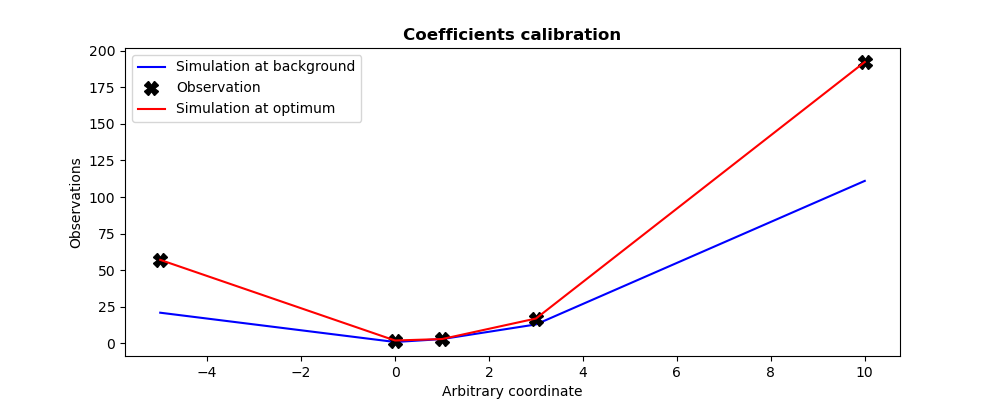

..
   Copyright (C) 2008-2024 EDF R&D

   This file is part of SALOME ADAO module.

   This library is free software; you can redistribute it and/or
   modify it under the terms of the GNU Lesser General Public
   License as published by the Free Software Foundation; either
   version 2.1 of the License, or (at your option) any later version.

   This library is distributed in the hope that it will be useful,
   but WITHOUT ANY WARRANTY; without even the implied warranty of
   MERCHANTABILITY or FITNESS FOR A PARTICULAR PURPOSE.  See the GNU
   Lesser General Public License for more details.

   You should have received a copy of the GNU Lesser General Public
   License along with this library; if not, write to the Free Software
   Foundation, Inc., 59 Temple Place, Suite 330, Boston, MA  02111-1307 USA

   See http://www.salome-platform.org/ or email : webmaster.salome@opencascade.com

   Author: Jean-Philippe Argaud, jean-philippe.argaud@edf.fr, EDF R&D

.. index:: single: ParticleSwarmOptimization
.. index:: single: Particle Swarm (Optimization)
.. _section_ref_algorithm_ParticleSwarmOptimization:

Calculation algorithm "*ParticleSwarmOptimization*"
---------------------------------------------------

.. ------------------------------------ ..
.. include:: snippets/Header2Algo01.rst

This algorithm realizes an estimation of the state of a system by minimization
without gradient of a cost function :math:`J` by using an evolutionary strategy
of particle swarm. It is a method that does not use the derivatives of the cost
function. It falls in the same category than the
:ref:`section_ref_algorithm_DerivativeFreeOptimization`, the
:ref:`section_ref_algorithm_DifferentialEvolution` or the
:ref:`section_ref_algorithm_TabuSearch`.

This is a mono-objective optimization method, allowing for global minimum
search of a general error function :math:`J` of type :math:`L^1`, :math:`L^2`
or :math:`L^{\infty}`, with or without weights, as described in the section for
:ref:`section_theory_optimization`. The default error function is the augmented
weighted least squares function, classically used in data assimilation.

It is based on the evolution of a population (called a "swarm") of states (each
state is called a "particle" or an "insect"). There exists various variants of
this algorithm. The following stable and robust formulations are proposed here:

.. index::
    pair: Variant ; CanonicalPSO
    pair: Variant ; OGCR
    pair: Variant ; SPSO-2011
    pair: Variant ; AIS PSO
    pair: Variant ; SIS PSO
    pair: Variant ; PSIS PSO
    pair: Variant ; APSO
    pair: Variant ; SPSO-2011-SIS
    pair: Variant ; SPSO-2011-PSIS

- "CanonicalPSO" (Canonical Particle Swarm Optimization, see
  [ZambranoBigiarini13]_), classical algorithm called "canonical" of particle
  swarm, robust and defining a reference for particle swarm algorithms,
- "OGCR" (Simple Particle Swarm Optimization), simplified algorithm of
  particle swarm with no bounds on insects or velocities, not recommended
  because less robust, but sometimes a lot more efficient,
- "SPSO-2011" (Standard Particle Swarm Optimization 2011, voir
  [ZambranoBigiarini13]_), 2011 reference algorithm of particle swarm, robust,
  efficient and defined as a reference for particle swarm algorithms. This
  algorithm is sometimes called ":math:`\omega`-PSO" or "Inertia PSO" because
  it incorporates a so-called inertia contribution, or also called "AIS" (for
  "Asynchronous Iteration Strategy") or "APSO" (for "Advanced Particle Swarm
  Optimization") because it incorporates evolutionary updating of the best
  elements, leading to intrinsically improved convergence of the algorithm.
- "SPSO-2011-SIS" (Standard Particle Swarm Optimisation 2011 with Synchronous
  Iteration Strategy), very similar to the 2011 reference algorithm, and with
  a synchronous particle update, called "SIS",
- "SPSO-2011-PSIS" (Standard Particle Swarm Optimisation 2011 with Parallel
  Synchronous Iteration Strategy), similar to the "SPSO-2011-SIS" algorithm
  with synchronous updating and parallelization, known as "PSIS", of the
  particles.

The following are a few practical suggestions for the effective use of these
algorithms:

- The recommended variant of this algorithm is the "SPSO-2011" even if the
  "CanonicalPSO" algorithm remains by default the more robust one. If the state
  evaluation can be carried out in parallel, the "SPSO-2011-PSIS" algorithm can
  be used, even if its convergence is sometimes a little less efficient.
- The number of particles or insects usually recommended varies between 40 and
  100 depending on the algorithm, more or less independently of the dimension
  of the state space. Usually, the best performances are obtained for
  populations of 70 to 500 particles. Even if the default value for this
  elementary parameter comes from extended knowledge on these algorithms, it is
  recommended to adapt it to the difficulty of the given problems.
- The recommended number of generations for population evolution is often
  around 50, but it can easily vary between 25 and 500.
- The maximum number of evaluations of the simulation function should usually
  be limited to between a few thousand and a few tens of thousands of times the
  dimension of the state space.
- The error functional usually decreases by levels (thus with a zero
  progression of the value of the functional at each generation when we stay in
  the level), making it *not recommended* to stop on the criterion of decrease
  of the cost function. It is normally wiser to adapt the number of iterations
  or generations to accelerate the convergence of the algorithms.
- If the problem is constrained, it is necessary to define the bounds of the
  variables (by the variable "*Bounds*"). If the problem is totally
  unconstrained, it is essential to define increment bounds (by the variable
  "*BoxBounds*") to delimit the optimal search in a useful way. Similarly, if
  the problem is partially constrained, it is recommended (but not required) to
  define increment bounds. In case these increment bounds are not defined, the
  variable bounds will be used as increment bounds.

These suggestions are to be used as experimental indications, not as
requirements, because they are to be appreciated or adapted according to the
physics of each problem that is treated.

The count of the number of evaluations of the function to be simulated during
this algorithm is deterministic, namely the "*number of iterations or
generations*" multiplied by the "*number of individuals in the population*".
With the default values, it takes between `40x50=2000` and `100*50=5000`
evaluations. It is for this reason that this algorithm is usually interesting
when the dimension of the state space is large, or when the non-linearities of
the simulation make the evaluation of the gradient of the functional by
numerical approximation complicated or invalid. But it is also necessary that
the calculation of the function to be simulated is not too costly to avoid a
prohibitive optimization time length.

.. ------------------------------------ ..
.. include:: snippets/Header2Algo12.rst

.. include:: snippets/FeaturePropNonLocalOptimization.rst

.. include:: snippets/FeaturePropDerivativeFree.rst

.. include:: snippets/FeaturePropParallelAlgorithm.rst

.. ------------------------------------ ..
.. include:: snippets/Header2Algo02.rst

.. include:: snippets/Background.rst

.. include:: snippets/BackgroundError.rst

.. include:: snippets/Observation.rst

.. include:: snippets/ObservationError.rst

.. include:: snippets/ObservationOperator.rst

.. ------------------------------------ ..
.. include:: snippets/Header2Algo03AdOp.rst

.. include:: snippets/BoundsWithNone.rst

.. include:: snippets/BoxBounds.rst

.. include:: snippets/CognitiveAcceleration.rst

.. include:: snippets/InertiaWeight.rst

.. include:: snippets/InitializationPoint.rst

.. include:: snippets/MaximumNumberOfFunctionEvaluations.rst

.. include:: snippets/MaximumNumberOfIterations_50.rst

.. include:: snippets/NumberOfInsects.rst

.. include:: snippets/QualityCriterion.rst

.. include:: snippets/SetSeed.rst

.. include:: snippets/SocialAcceleration.rst

StoreSupplementaryCalculations
  .. index:: single: StoreSupplementaryCalculations

  *List of names*. This list indicates the names of the supplementary
  variables, that can be available during or at the end of the algorithm, if
  they are initially required by the user. Their availability involves,
  potentially, costly calculations or memory consumptions. The default is then
  a void list, none of these variables being calculated and stored by default
  (excepted the unconditional variables). The possible names are in the
  following list (the detailed description of each named variable is given in
  the following part of this specific algorithmic documentation, in the
  sub-section "*Information and variables available at the end of the
  algorithm*"): [
  "Analysis",
  "BMA",
  "CostFunctionJ",
  "CostFunctionJb",
  "CostFunctionJo",
  "CurrentIterationNumber",
  "CurrentState",
  "Innovation",
  "InternalCostFunctionJ",
  "InternalCostFunctionJb",
  "InternalCostFunctionJo",
  "InternalStates",
  "OMA",
  "OMB",
  "SimulatedObservationAtBackground",
  "SimulatedObservationAtCurrentState",
  "SimulatedObservationAtOptimum",
  ].

  Example :
  ``{"StoreSupplementaryCalculations":["CurrentState", "Residu"]}``

.. include:: snippets/SwarmTopology.rst

.. include:: snippets/Variant_PSO.rst

.. include:: snippets/VelocityClampingFactor.rst

.. ------------------------------------ ..
.. include:: snippets/Header2Algo04.rst

.. include:: snippets/Analysis.rst

.. include:: snippets/CostFunctionJ.rst

.. include:: snippets/CostFunctionJb.rst

.. include:: snippets/CostFunctionJo.rst

.. ------------------------------------ ..
.. include:: snippets/Header2Algo05.rst

.. include:: snippets/Analysis.rst

.. include:: snippets/BMA.rst

.. include:: snippets/CostFunctionJ.rst

.. include:: snippets/CostFunctionJb.rst

.. include:: snippets/CostFunctionJo.rst

.. include:: snippets/CurrentIterationNumber.rst

.. include:: snippets/CurrentState.rst

.. include:: snippets/Innovation.rst

.. include:: snippets/InternalCostFunctionJ.rst

.. include:: snippets/InternalCostFunctionJb.rst

.. include:: snippets/InternalCostFunctionJo.rst

.. include:: snippets/InternalStates.rst

.. include:: snippets/OMA.rst

.. include:: snippets/OMB.rst

.. include:: snippets/SimulatedObservationAtBackground.rst

.. include:: snippets/SimulatedObservationAtCurrentState.rst

.. include:: snippets/SimulatedObservationAtOptimum.rst

.. ------------------------------------ ..
.. _section_ref_algorithm_ParticleSwarmOptimization_examples:

.. include:: snippets/Header2Algo09.rst

.. include:: scripts/simple_ParticleSwarmOptimization1.rst

.. literalinclude:: scripts/simple_ParticleSwarmOptimization1.py

.. include:: snippets/Header2Algo10.rst

.. literalinclude:: scripts/simple_ParticleSwarmOptimization1.res
    :language: none

.. include:: snippets/Header2Algo11.rst

.. _simple_ParticleSwarmOptimization1:

.. ------------------------------------ ..
.. include:: snippets/Header2Algo06.rst

- :ref:`section_ref_algorithm_DerivativeFreeOptimization`
- :ref:`section_ref_algorithm_DifferentialEvolution`
- :ref:`section_ref_algorithm_TabuSearch`

.. ------------------------------------ ..
.. include:: snippets/Header2Algo07.rst

- [WikipediaPSO]_
- [ZambranoBigiarini13]_
