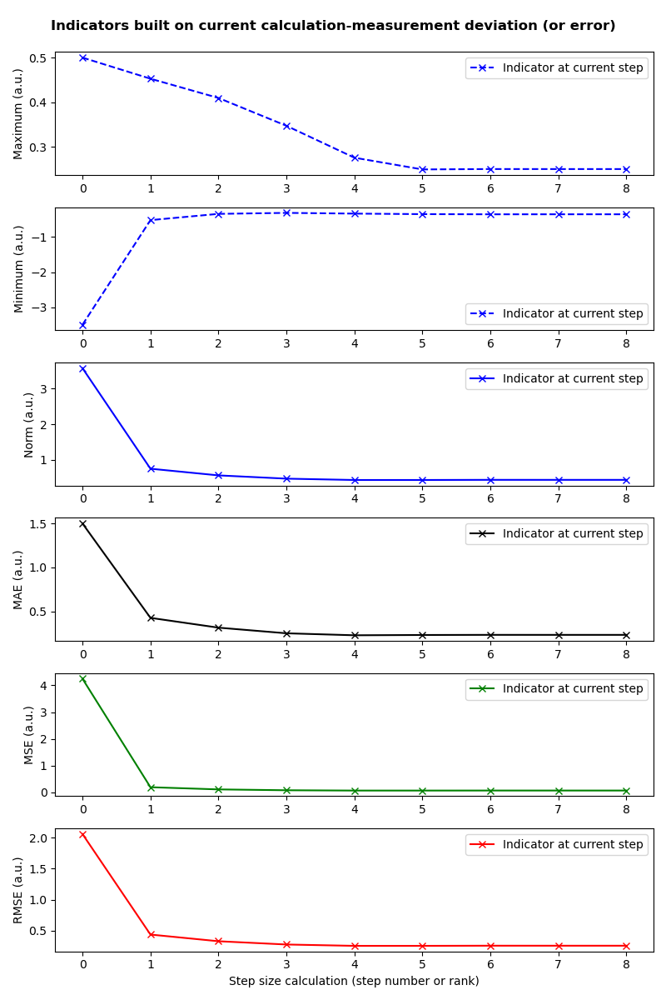

..
   Copyright (C) 2008-2024 EDF R&D

   This file is part of SALOME ADAO module.

   This library is free software; you can redistribute it and/or
   modify it under the terms of the GNU Lesser General Public
   License as published by the Free Software Foundation; either
   version 2.1 of the License, or (at your option) any later version.

   This library is distributed in the hope that it will be useful,
   but WITHOUT ANY WARRANTY; without even the implied warranty of
   MERCHANTABILITY or FITNESS FOR A PARTICULAR PURPOSE.  See the GNU
   Lesser General Public License for more details.

   You should have received a copy of the GNU Lesser General Public
   License along with this library; if not, write to the Free Software
   Foundation, Inc., 59 Temple Place, Suite 330, Boston, MA  02111-1307 USA

   See http://www.salome-platform.org/ or email : webmaster.salome@opencascade.com

   Author: Jean-Philippe Argaud, jean-philippe.argaud@edf.fr, EDF R&D

.. index:: single: TUI
.. index:: single: API/TUI
.. index:: single: adaoBuilder
.. _section_tui:

================================================================================
**[DocR]** Textual User Interface for ADAO (TUI/API)
================================================================================

This section presents advanced usage of the ADAO module using its text
programming interface (API/TUI). This interface gives user ability to create a
calculation object in a similar way than the case building obtained through the
graphical interface (GUI). A scripted form of a case built in the GUI can be
obtained directly using the TUI export button |eficas_totui| integrated in the
interface, but more complicated or integrated cases can be build only using TUI
approach. When one wants to elaborate directly the TUI calculation case, it is
recommended to extensively use all the ADAO module documentation, and to go
back if necessary to the graphical interface (GUI), to get all the elements
allowing to correctly set the commands. The general used notions and terms are
defined in :ref:`section_theory`. As in the graphical interface, we point out
that the TUI approach is intended to create and manage a single calculation
case.

.. _subsection_tui_creating:

Creation of ADAO TUI calculation case and examples
--------------------------------------------------

.. _subsection_tui_example:

A simple setup example of an ADAO TUI calculation case
++++++++++++++++++++++++++++++++++++++++++++++++++++++

To introduce the TUI interface, lets begin by a simple but complete example of
ADAO calculation case. All the data are explicitly defined inside the script in
order to make the reading easier. The whole set of commands is the following
one:

.. literalinclude:: scripts/tui_example_01.py
    :language: python

The result of running these commands in SALOME (either as a SALOME "*shell*"
command, in the SALOME Python command window of the interface, or by the script
execution entry of the menu) is the following:

.. literalinclude:: scripts/tui_example_01.res
    :language: none

Detailed setup of an ADAO TUI calculation case
+++++++++++++++++++++++++++++++++++++++++++++++

More details are given here on the successive steps of the setup of an ADAO TUI
calculation case. The commands themselves are detailed just after in the
:ref:`subsection_tui_commands`. We keep the indication ``[...]`` of preceding
or following lines to emphasize that these commands can be inserted in the
middle of a complete stream of Python scripting for a real study.

The creation and initialization of a study are done using the following
commands, the ``case`` object name of the ADAO TUI calculation case being let
free to the user choice:

.. code-block:: python

    [...]
    from numpy import array
    from adao import adaoBuilder
    case = adaoBuilder.New()
    [...]

It is recommended to import by default the ``numpy`` module or some of its
embedded constructors such as the ``array`` one, to make easier its upcoming
use in the commands.

Thereafter, the case has to be build by preparing and storing the data that
define the study. The commands order does not matter, it is sufficient that all
the concepts, required by the algorithm used, are present. The user can refer
to the :ref:`section_reference` and its sub-parts to get details about commands
by algorithm. Here, we define successively the chosen data assimilation or
optimization algorithm and its parameters, then the *a priori* state
:math:`\mathbf{x}^b` (named ``Background``) and its errors covariance
:math:`\mathbf{B}` (named ``BackgroundError``), and after that, the observation
:math:`\mathbf{y}^o` (named ``Observation``) and its errors  covariance
:math:`\mathbf{R}` (named ``ObservationError``):

.. code-block:: python

    [...]
    case.set( 'AlgorithmParameters', Algorithm='3DVAR' )
    #
    case.set( 'Background',          Vector=[0, 1, 2] )
    case.set( 'BackgroundError',     ScalarSparseMatrix=1.0 )
    #
    case.set( 'Observation',         Vector=array([0.5, 1.5, 2.5]) )
    case.set( 'ObservationError',    DiagonalSparseMatrix='1 1 1' )
    [...]

As a remark, vector or matrix inputs can be given as objects of type ``str``,
``list`` or ``tuple`` of Python, or of type ``array`` or ``matrix`` of Numpy.
For these last two cases, one has only to import Numpy module before.

After that, one has to define the operators :math:`H` of observation and
possibly :math:`M` of evolution. In all cases, linear or non-linear, they can
be defined as functions. In the simple case of a linear operator, one can also
define it using the matrix that corresponds to the linear operator. In the most
simple present case of a linear operator, we use the following syntax for an
operator from :math:`\mathbf{R}^3` into itself:

.. code-block:: python

    [...]
    case.set( 'ObservationOperator', Matrix = "1 0 0;0 2 0;0 0 3")
    [...]

In the most frequent case of a non-linear operator of :math:`\mathbf{R}^n` into
:math:`\mathbf{R}^p`, it has to be previously available as a Python function,
known in the current name space, which takes a Numpy vector (or an ordered
list) of size :math:`n` as input and which returns as output a Numpy vector
of size :math:`p`. When the non-linear operator is the only one to be defined
by the keyword "*OneFunction*", its adjoint is directly established by
numerical calculations and it can be parametrized by the keyword
"*Parameters*". The following example shows a ``simulation`` function (which
realizes here the same linear operator than above) and record it in the ADAO
case:

.. code-block:: python

    [...]
    import numpy
    def simulation(x):
        "Simulation function H to perform Y=H(X)"
        import numpy
        __x = numpy.ravel(x)
        __H = numpy.diag([1.,2.,3.])
        return numpy.dot(__H, __x)
    #
    case.set( 'ObservationOperator',
        OneFunction = simulation,
        Parameters  = {"DifferentialIncrement":0.01},
        )
    [...]

To obtain intermediary or final results of the case, one can add some
"*observer*", that link a script to execute with an intermediate or final
calculation variable. The reader can go the description of the way of
:ref:`section_advanced_observer`, and to the :ref:`section_reference` in order
to know what are the observable quantities. This link between an "*observer*"
and an observable quantity is done in a similar way than the calculation data
definition:

.. code-block:: python

    [...]
    case.set( 'Observer', Variable="Analysis", Template="ValuePrinter" )
    [...]

Finally, when all the required information are available in the ADAO
calculation case named ``case``, it can be executed in a very simple way in the
environment of the Python interpreter:

.. code-block:: python

    [...]
    case.execute()
    [...]

At the end, we get a very compact script previously proposed in
:ref:`subsection_tui_example`.

Using more complex calculation data or information
++++++++++++++++++++++++++++++++++++++++++++++++++

Such an interface being written in Python, it is possible to use all the power
of the language to enter more complex data than explicit declaration.

The registering of input data supports various variable types, but in addition,
these inputs can come from variables currently available in the name space of
the script. It is then easy to use previously calculated variables or obtained
by importing "user" scripts. If for example the observations are available as a
list in an external Python file named ``observations.py`` under the name
``someTable``, the registering of the observations in the ADAO TUI calculation
case can be done by the following operations:

.. code-block:: python

    [...]
    from observations import someTable
    case.set( 'Observation', Vector=someTable )
    [...]

The first line imports the ``someTable`` variable from the external file, and
the second one register directly this table as the "*Observation*" data.

The simplicity of this recording demonstrates the ease of obtaining
computational data from external sources, files or computing flows achievable
in Python. As usual, it is recommended to the user to check its data before
saving them in the ADAO TUI calculation case to avoid errors complicated to
correct.

Obtain and use the results of calculation in a richer way
+++++++++++++++++++++++++++++++++++++++++++++++++++++++++

Similarly, it is possible to obtain and process the results of calculation in a
richer way, following up on post-processing after the TUI calculation.

The variables of calculation results, or the internal variables coming from
optimization or data assimilation, are available through the ``get`` method of
the ADAO TUI calculation case, which send back an object of list type of the
required variable. The reader can go to the :ref:`section_ref_output_variables`
for a detailed description on this subject.

For instance, we give some script lines that allow to get the number of
iterations of the optimization and the optimal value, and its size:

.. code-block:: python

    [...]
    print("")
    print("    Number of iterations : %i"%len(case.get("CostFunctionJ")))
    Xa = case.get("Analysis")
    print("    Optimal analysis     : %s"%(Xa[-1],))
    print("    Size of the analysis : %i"%len(Xa[-1]))
    print("")
    [...]

These lines can be very simply added to the initial example of ADAO TUI
calculation case given in :ref:`subsection_tui_example`.

As well as for data entry, the simplicity of results achievement makes it easy
to consider post-processing chains in SALOME, to use for example visualization
with MatPlotLib or PARAVIS [PARAVIS]_, mesh adaptation with HOMARD [HOMARD]_, or
for other calculations.

.. _subsection_tui_commands:

Set of available commands in text user interface TUI
----------------------------------------------------

In the TUI interface of ADAO module, we follow usual Python conventions and
recommendations to make the distinction between public objects, and private or
reserved ones because of implementation details. In practice, every object or
function name beginning with at least one "**_**" sign is private in the usual
programming sense ("*private*"). Nevertheless, the absence of such a sign at
the beginning of a name does not designate it as public. In general, in Python,
and unlike other languages, you can access private objects or functions. This
can sometimes be useful, but such use in your codes will lead to crashes
without warning in future versions. It is strongly recommended not to do so.

To clarify and facilitate the use of the module for scripting, **this section
therefore defines the application programming interface (API) for textual user
interface (TUI) by a comprehensive and restricted manner**. Use in scripts of
ADAO objects or functions other than those defined here is strongly
discouraged, as this will likely lead to crashes without warning in future
versions.

Equivalent syntax calls for commands
++++++++++++++++++++++++++++++++++++

The definition of data during the ADAO TUI calculation case creation supports
**two completely equivalent syntaxes**. One can:

- either use the ``set`` command and as the first argument the concept ``XXXXX``
  on which to apply the command whose arguments follow,
- or use the command ``setXXXXX`` containing the arguments of the command to
  apply.

To illustrate this equivalence, we take the example of two commands that lead
to the same result::

    case.set( 'Background', Vector=[0, 1, 2] )

and::

    case.setBackground( Vector=[0, 1, 2] )

The choice of one or the other syntaxes is freely left to the user, according
to its context of use. In the following, for clarity, we define the controls
according to the second syntax.

Creating a calculation case in TUI text interface
+++++++++++++++++++++++++++++++++++++++++++++++++

The creation and the initialization of a calculation case in TUI text interface
are done by importing the interface module "*adaoBuilder*" and by by invoking
its method "*New()*" as illustrated in the following lines (the ``case`` object
name being let free to the user choice):

.. code-block:: python

    [...]
    from numpy import array
    from adao import adaoBuilder
    case = adaoBuilder.New()
    [...]

It is recommended by default to always import the ``numpy`` module (or some of
its embedded constructors such as the ``array`` one) to make easier its
upcoming use in the commands.

Defining the calculation data
+++++++++++++++++++++++++++++

The following commands are used to define the data of an ADAO TUI calculation
case. The pseudo-type of the arguments is similar and consistent with those of
the inputs in GUI interface, as described in section of
:ref:`section_reference_entry` and in particular by the
:ref:`section_ref_entry_types`. The verification of the adequacy of variables
is done either on their definition, or at runtime.

.. index:: single: Stored

In each command, the boolean keyword "*Stored*" indicates whether you
optionally want to store the quantity defined, for disposal during calculation
or at the output. The default is not to store, and it is recommended to keep
this default. Indeed, for a TUI calculation case, the quantity given in entries
are often available in the current name space of the case.

The available commands are:

.. index:: single: set

**set** (*Concept,...*)
    This command allows to have an equivalent syntax for all the commands of
    these section. Its first argument is the name of the concept to be defined
    (for example "*Background*" or "*ObservationOperator*"), on which the
    following arguments, which are the same as in the individual previous
    commands, are applied. When using this command, it is required to name the
    arguments (for example "*Vector=...*").

.. index:: single: Background
.. index:: single: setBackground

**setBackground** (*Vector, VectorSerie, Script, DataFile, ColNames, ColMajor, Stored*)
    This command allows to set the background :math:`\mathbf{x}^b`. Depending
    on the algorithm, it can be defined as a simple vector by "*Vector*", or as
    a vector list by "*VectorSerie*". If it is defined by a script in the
    "*Script*" keyword, the vector is of type "*Vector*" (by default) or
    "*VectorSerie*" according to whether one of these variables is positioned
    to "*True*". If there is a data file given by "*DataFile*" (selecting, in
    rows by default or in lines as chosen by "*ColMajor*", all the variables by
    default or those from the list "*ColNames*"), the vector is of type
    "*Vector*".

.. index:: single: BackgroundError
.. index:: single: setBackgroundError

**setBackgroundError** (*Matrix, ScalarSparseMatrix, DiagonalSparseMatrix, Script, Stored*)
    This command allows to set the matrix :math:`\mathbf{B}` of background
    error covariance. The matrix may be completely defined by the "*Matrix*"
    keyword, or in a sparse way, by a diagonal matrix whose unique variance is
    given on the diagonal by "*ScalarSparseMatrix*", or by a diagonal matrix
    which one gives the vector of variances located on the diagonal by
    "*DiagonalSparseMatrix*". If it is defined by a script in "*Script*", the
    matrix is of type "*Matrix*" (by default), "*ScalarSparseMatrix*" or
    "*DiagonalSparseMatrix*" according to whether one of these variables is
    positioned to "*True*".

.. index:: single: CheckingPoint
.. index:: single: setCheckingPoint

**setCheckingPoint** (*Vector, VectorSerie, Script, DataFile, ColNames, ColMajor, Stored*)
    This command allows to set a current point :math:`\mathbf{x}` used in a
    checking algorithm. Depending on the algorithm, it can be defined as a
    simple vector by "*Vector*", or as a vector list by "*VectorSerie*". If it
    is defined by a script in the "*Script*" keyword, the vector is of type
    "*Vector*" (by default) or "*VectorSerie*" according to whether one of
    these variables is positioned to "*True*". If there is a data file given by
    "*DataFile*" (selecting, in rows by default or in lines as chosen by
    "*ColMajor*", all the variables by default or those from the list
    "*ColNames*"), the vector is of type "*Vector*".

.. index:: single: ControlModel
.. index:: single: setControlModel
.. index:: single: ExtraArguments

**setControlModel** (*Matrix, OneFunction, ThreeFunctions, Parameters, Script, ExtraArguments, Stored*)
    This command allows to set the control operator :math:`O`, which represents
    an external linear input control of the evolution or observation operator.
    One can refer to the :ref:`section_ref_operator_control`. Its value is
    defined as an object of type function or of type "*Matrix*". For the
    function case, various functional forms may be used, as described in the
    :ref:`section_ref_operator_requirements`, and entered by "*OneFunction*" or
    "*ThreeFunctions*" keywords.  If it is defined by a script in the
    "*Script*" keyword, the operator is of type "*Matrix*", "*OneFunction*" or
    "*ThreeFunctions*" according to whether one of these variables is
    positioned to "*True*". The control parameters of the adjoint numerical
    approximation, in the "*OneFunction*"case, can be given by a dictionary
    through the "*Parameters*" keyword. Potential entries of this dictionary
    are "*DifferentialIncrement*", "*CenteredFiniteDifference*" (similar to the
    one of graphical interface). If the operator requires some complementary
    fixed arguments, they can be given through the variable "*ExtraArguments*"
    as a named parameters dictionary.

.. index:: single: ControlInput
.. index:: single: setControlInput

**setControlInput** (*Vector, VectorSerie, Script, DataFile, ColNames, ColMajor, Stored*)
    This command allows to set the control vector :math:`\mathbf{u}`. Depending
    on the algorithm, it can be defined as a simple vector by "*Vector*", or as
    a vector list by "*VectorSerie*". If it is defined by a script in the
    "*Script*" keyword, the vector is of type "*Vector*" (by default) or
    "*VectorSerie*" according to whether one of these variables is positioned
    to "*True*". If there is a data file given by "*DataFile*" (selecting, in
    rows by default or in lines as chosen by "*ColMajor*", all the variables by
    default or those from the list "*ColNames*"), the vector is of type
    "*Vector*".

.. index:: single: EvolutionError
.. index:: single: setEvolutionError

**setEvolutionError** (*Matrix, ScalarSparseMatrix, DiagonalSparseMatrix, Script, Stored*)
    This command allows to set the matrix :math:`\mathbf{Q}` of evolution error
    covariance. The matrix may be completely defined by the "*Matrix*" keyword,
    or in a sparse way, by a diagonal matrix whose unique variance is given on
    the diagonal by "*ScalarSparseMatrix*", or by a diagonal matrix which one
    gives the vector of variances located on the diagonal by
    "*DiagonalSparseMatrix*". If it is defined by a script in "*Script*", the
    matrix is of type "*Matrix*" (by default), "*ScalarSparseMatrix*" or
    "*DiagonalSparseMatrix*" according to whether one of these variables is
    positioned to "*True*".

.. index:: single: EvolutionModel
.. index:: single: setEvolutionModel
.. index:: single: ExtraArguments

**setEvolutionModel** (*Matrix, OneFunction, ThreeFunctions, Parameters, Script, ExtraArguments, Stored*)
    This command allows to set the evolution operator :math:`M`, which
    describes an elementary evolution step. Its value is defined as an object
    of type function or of type "*Matrix*". For the function case, various
    functional forms may be used, as described in the
    :ref:`section_ref_operator_requirements`, and entered by "*OneFunction*" or
    "*ThreeFunctions*" keywords.  If it is defined by a script in the
    "*Script*" keyword, the operator is of type "*Matrix*", "*OneFunction*" or
    "*ThreeFunctions*" according to whether one of these variables is
    positioned to "*True*". The control parameters of the adjoint numerical
    approximation, in the "*OneFunction*" case, can be given by a dictionary
    through the "*Parameters*" keyword. Potential entries of this dictionary
    are "*DifferentialIncrement*", "*CenteredFiniteDifference*",
    "*EnableWiseParallelism*", "*NumberOfProcesses*" (similar to the one of
    graphical interface). If the operator requires some complementary fixed
    arguments in addition to the state :math:`\mathbf{x}`, they can be given
    through the variable "*ExtraArguments*" as a named parameters dictionary.

.. index:: single: Observation
.. index:: single: setObservation

**setObservation** (*Vector, VectorSerie, Script, DataFile, ColNames, ColMajor, Stored*)
    This command allows to set the observation vector :math:`\mathbf{y}^o`.
    Depending on the algorithm, it can be defined as a simple vector by
    "*Vector*", or as a vector list by "*VectorSerie*". If it is defined by a
    script in the "*Script*" keyword, the vector is of type "*Vector*" (by
    default) or "*VectorSerie*" according to whether one of these variables is
    positioned to "*True*". If there is a data file given by "*DataFile*"
    (selecting, in rows by default or in lines as chosen by "*ColMajor*", all
    the variables by default or those from the list "*ColNames*"), the vector
    is of type "*Vector*".

.. index:: single: ObservationError
.. index:: single: setObservationError

**setObservationError** (*Matrix, ScalarSparseMatrix, DiagonalSparseMatrix, Script, Stored*)
    This command allows to set the matrix :math:`\mathbf{R}` of observation
    error covariance. The matrix may be completely defined by the "*Matrix*"
    keyword, or in a sparse way, by a diagonal matrix whose unique variance is
    given on the diagonal by "*ScalarSparseMatrix*", or by a diagonal matrix
    which one gives the vector of variances located on the diagonal by
    "*DiagonalSparseMatrix*". If it is defined by a script in "*Script*", the
    matrix is of type "*Matrix*" (by default), "*ScalarSparseMatrix*" or
    "*DiagonalSparseMatrix*" according to whether one of these variables is
    positioned to "*True*".

.. index:: single: ObservationOperator
.. index:: single: setObservationOperator
.. index:: single: ExtraArguments

**setObservationOperator** (*Matrix, OneFunction, ThreeFunctions, AppliedInXb, Parameters, Script, ExtraArguments, Stored*)
    This command allows to set the evolution operator :math:`H`, which
    transforms the input parameters :math:`\mathbf{x}` in results
    :math:`\mathbf{y}` that are compared to observations :math:`\mathbf{y}^o`.
    Its value is defined as an object of type function or of type "*Matrix*".
    For the function case, various functional forms may be used, as described
    in the :ref:`section_ref_operator_requirements`, and entered by
    "*OneFunction*" or "*ThreeFunctions*" keywords.  If it is defined by a
    script in the "*Script*" keyword, the operator is of type "*Matrix*",
    "*OneFunction*" or "*ThreeFunctions*" according to whether one of these
    variables is positioned to "*True*". When the :math:`H` operator evaluated
    in :math:`\mathbf{x}^b` is available, it can be given using "*AppliedInXb*"
    and will be considered as a vector. The control parameters of the adjoint
    numerical approximation, in the "*OneFunction*"case, can be given by a
    dictionary through the "*Parameters*" keyword. Potential entries of this
    dictionary are "*DifferentialIncrement*", "*CenteredFiniteDifference*",
    "*EnableWiseParallelism*", "*NumberOfProcesses*" (similar to the one of
    graphical interface). If the operator requires some complementary fixed
    arguments in addition to the state :math:`\mathbf{x}`, they can be given
    through the variable "*ExtraArguments*" as a named parameters dictionary.

Setting the calculation, outputs, etc.
++++++++++++++++++++++++++++++++++++++

.. index:: single: AlgorithmParameters
.. index:: single: setAlgorithmParameters

**setAlgorithmParameters** (*Algorithm, Parameters, Script*)
    This command allows to choose the calculation or the verification algorithm
    by the argument "*Algorithm*" in the form of an algorithm name (it is
    useful to refer to the :ref:`section_reference_assimilation` and to the
    :ref:`section_reference_checking`) and to define the calculation parameters
    by the argument "*Parameters*". In the case of a definition by "*Script*",
    the file must contain the two variables "*Algorithm*" and "*Parameters*"
    (or "*AlgorithmParameters*" equivalently).

.. index:: single: setName

**setName** (*String*)
    This command allows to set a short title for the calculation case.

.. index:: single: setDirectory

**setDirectory** (*String*)
    This command allows to set the execution standard directory.

.. index:: single: setDebug

**setDebug** ()
    This command enables the detailed information mode when running.

.. index:: single: setNoDebug

**setNoDebug** ()
    This command disables the detailed information mode when running.

.. index:: single: Observer
.. index:: single: Observer Template
.. index:: single: setObserver
.. index:: single: setObserver Template

**setObserver** (*Variable, Template, String, Script, Info*)
    This command allows to set an *observer* on the current or final
    calculation variable. Reference should be made to the description of the
    ':ref:`section_ref_observers_requirements` for their list and content, and
    to the :ref:`section_reference` to know what are the observable quantities.
    One defines as "*String*" the *observer* body, using a string including if
    necessary line breaks. It is recommended to use the patterns available by
    the argument "*Template*". In the case of a definition as "*Script*", the
    file must contain only the body of the function, as  described in the
    :ref:`section_ref_observers_requirements`. The "*Info*" variable contains
    an information string or can be void.

.. index:: single: UserPostAnalysis
.. index:: single: UserPostAnalysis Template
.. index:: single: setUserPostAnalysis
.. index:: single: setUserPostAnalysis Template

**setUserPostAnalysis** (*Template, String, Script*)
    This command allows to define the treatment of parameters or results after
    the calculation algorithm has been performed. Its value is defined either
    as a predefined pattern name, or as a script file name, or as a string.
    This allows to produce directly post-processing code in an ADAO case. It is
    possible to use patterns available by argument "*Template*" (which can be
    "*AnalysisPrinter*", "*AnalysisSaver*" and "*AnalysisPrinterAndSaver*"). In
    the case of a definition by "*Script*", the specified file must contain
    only the commands that could have been put after the execution of the
    calculation.  We refer to the description of
    :ref:`section_ref_userpostanalysis_requirements` for the list of templates
    and their format. Important note: this processing is only performed when
    the case is executed in TUI or exported to YACS.

Perform the calculation
+++++++++++++++++++++++

.. index:: single: execute
.. index:: single: Executor
.. index:: single: SaveCaseInFile
.. index:: single: nextStep

**execute** (*Executor, SaveCaseInFile, nextStep*)
    This command launches the complete calculation in the execution environment
    chosen by the keyword *Executor*, which is defined by default with respect
    of the launching environment. This environment can be the current Python
    interpreter, without interaction with YACS (using the value "*Python*"), or
    the one of YACS (using the value "*YACS*" [YACS]_). If a file is given in
    the keyword *SaveCaseInFile*, it will be used to save the associated
    version of commands file for the given execution environment. The boolean
    keyword "*nextStep*" indicates whether the run starts from the result of
    the previous run without storing it (value "*True*") or not (value
    "*False*", by default). During the execution, the usual outputs (standard
    and error) are the one of the chosen environment. If necessary (and if
    possible), the ADAO algorithms internal parallelism, the parallelism of
    YACS, and the internal parallelism of the simulation code(s) used, are
    available.

Get the calculation results separately
++++++++++++++++++++++++++++++++++++++

.. index:: single: get

**get** (*Concept*)
    This command explicitly extract the variables available at the output of
    calculation case for use in the rest of the scripting, such as
    visualization. Its argument the name of a variable "*Concept*" and returns
    back the quantity as a list (even if there is only one specimen) of this
    base variable. For a list of variables and use them, the user has to refer
    to an :ref:`subsection_r_o_v_Inventaire` and more generally to the
    :ref:`section_ref_output_variables` and to the individual documentations of
    the algorithms.

Saving, loading or converting calculation case commands
+++++++++++++++++++++++++++++++++++++++++++++++++++++++

The saving or loading of a calculation case deals with quantities and actions
that are linked by the previous commands, excepted case external operations
(such as, for example, post-processing that can be developed after the
calculation case). The registered or loaded commands remain fully compatible
with these Python external case operations.

.. index:: single: load
.. index:: single: FileName
.. index:: single: Content
.. index:: single: Object
.. index:: single: Formater

**load** (*FileName, Content, Object, Formater*)
    This command allows to read or load a calculation case, from a file named
    "*FileName*" or a content in memory by "*Content*" or "*Object*". The
    "*Formater*" keyword can indicate "*TUI*" for commands of textual
    application programming interface (default), and "*COM*" for commands of
    COMM type coming from EFICAS interface for ADAO.

.. index:: single: dump

**dump** (*FileName, Formater*)
    This command allows to save, in a file named "*FileName*", the commands of
    the current calculation case. The "*Formater*" keyword can indicate "*TUI*"
    for commands of textual application programming interface (default), and
    "*YACS*" for commands of type YACS.

.. index:: single: convert
.. index:: single: FileNameFrom
.. index:: single: ContentFrom
.. index:: single: ObjectFrom
.. index:: single: FormaterFrom
.. index:: single: FileNameTo
.. index:: single: FormaterTo

**convert** (*FileNameFrom, ContentFrom, ObjectFrom, FormaterFrom, FileNameTo, FormaterTo*)
    This command allows to convert directly from a known format to an another
    one the commands establishing the current calculation case. Some formats
    are only available as input or as output.

Getting information about the case, the calculation or the system
+++++++++++++++++++++++++++++++++++++++++++++++++++++++++++++++++

There are various ways to obtain global information relating to the calculation
case, the run or the system on which a case is run.

*print* (*case*)
    It's easy to obtain **aggregate information on the study case** as defined
    by the user, by using Python's "*print*" command directly on the case, at
    any stage during its construction. For example:

    .. literalinclude:: scripts/tui_example_07.py
        :language: python

    which result is here:

    .. literalinclude:: scripts/tui_example_07.res
        :language: none

.. index:: single: callinfo

**callinfo** ()
    A **synthesized information on the number of calls to operator
    calculations** can be dynamically obtained with the "*callinfo()*" command.
    These operator calculations are those defined by the user in an ADAO case,
    for the observation and evolution operators. It is used after the case
    calculation has been executed, bearing in mind that the result of this
    command is simply empty when no calculation has been performed:
    ::

        from adao import adaoBuilder
        case = adaoBuilder.New()
        ...
        case.execute()
        print(case.callinfo())

.. index:: single: sysinfo

**sysinfo** ()
    **Synthetic system information** can be obtained with the "*sysinfo()*"
    command, present in every ADAO calculation case. It dynamically returns
    system information and details of Python modules useful for ADAO. It is
    used as follows:
    ::

        from adao import adaoBuilder
        case = adaoBuilder.New()
        print(case.sysinfo())

.. _subsection_tui_advanced:

More advanced examples of ADAO TUI calculation case
---------------------------------------------------

We propose here more comprehensive examples of ADAO TUI calculation, by giving
the purpose of the example and a set of commands that can achieve this goal.

.. _subsection_tui_advanced_ex11:

Independent holding of the results of a calculation case
++++++++++++++++++++++++++++++++++++++++++++++++++++++++

The objective is to perform in TUI the setting of data for an ADAO calculation
case, its execution, and then the retrieving of the results to follow on a
independent holding of these results (this last step not being described here,
because it depends on the user).

The hypothesis of the user case are the following ones. It is assumed:

#. that we want to adjust 3 parameters ``alpha``, ``beta`` and ``gamma`` in a bounded domain,
#. that we dispose of observations named ``observations``,
#. that the user have a Python function of physical simulation named ``simulation``, previously (well) tested, which transforms the 3 parameters in results similar to the observations,
#. that the independent holding, that the user want to elaborate, is represented here by the simple printing of the initial state, of the optimal state, of the simulation in that point, of the intermediate state and of the number of optimization iteration.

In order to try in a simple way this example of TUI calculation case, we set
ourselves in a twin experiments case (for information, see the approach
:ref:`section_methodology_twin`). For that, we choose for example the following
entries, perfectly arbitrary, by building the observations by simulation. Then
we solve the adjustment problem through the command set execution that follows.
Finally, the whole problem is set and solved by the following script:

.. literalinclude:: scripts/tui_example_11.py
    :language: python

The command set execution gives the following results:

.. literalinclude:: scripts/tui_example_11.res
    :language: none

As it should be in twin experiments, when we trust mainly in observations, it
is found that we get correctly the parameters that were used to artificially
build the observations.

.. _subsection_tui_advanced_ex12:

Some common numerical indicators : norm, RMS, MSE et RMSE...
++++++++++++++++++++++++++++++++++++++++++++++++++++++++++++

The numerical quantities obtained from an ADAO calculation are often vectors
(such as the analysis :math:`\mathbf{x}^a`) or matrices (such as the analysis
covariance :math:`\mathbf{A}`). They are requested by the user through the
standard "*StoreSupplementaryCalculations*" variable of the ADAO case
algorithm. These quantities are available at each step of an iterative
algorithm, and therefore take the form of a series of vectors, or a series of
matrices.

These objects support special methods for computing commonly used indicators.
The methods are named by the name of the indicator followed by "*s*" to note
that they apply to a series of elementary objects, and that they themselves
return a series of values.

Note: some indicators are intended to qualify, for example, a "*value
increment*", a "*value deviation*" or a "*value difference*", rather than a
"*value*" itself. However, there is no computational impossibility to compute
indicators for any given quantity, so it's up to the user to check that the
indicator he is requesting is being used as intended.

.. index:: single: means

**means** ()
    Average of the quantity values, available at each step.

.. index:: single: stds

**stds** ()
    Standard deviation of the quantity values, available at each step.

.. index:: single: sums

**sums** ()
    Sum of the quantity values, available at each step.

.. index:: single: mins

**mins** ()
    Minimum of the quantity values, available at each step.

.. index:: single: maxs

**maxs** ()
    Maximum of the quantity values, available at each step.

.. index:: single: norms

**norms** (*_ord=None*)
    Norm of the quantity, available at each step (*_ord*: see
    *numpy.linalg.norm*).

.. index:: single: traces

**traces** (*offset=0*)
    Trace of the quantity, available at each step (*offset*: see
    *numpy.trace*).

.. index:: single: maes
.. index:: single: Mean Absolute Error (MAE)

**maes** (*predictor=None*)
    Mean absolute error (**MAE**). This indicator is computed as the average of
    the absolute deviations of the quantity from the predictor, and is
    available at each step. If the predictor is not specified, this indicator
    theoretically applies only to an increment or a difference.

.. index:: single: mses
.. index:: single: msds
.. index:: single: Mean-Square Error (MSE)
.. index:: single: Mean-Square Deviation (MSD)

**mses** (*predictor=None*) ou **msds** (*predictor=None*)
    Mean square error (**MSE**) or mean-square deviation* (**MSD**). This
    indicator is computed as the root-mean-square deviation of the quantity
    from the predictor, and is available at each step. If the predictor is not
    specified, this indicator theoretically applies only to an increment or
    difference.

.. index:: single: rmses
.. index:: single: rmsds
.. index:: single: Root-Mean-Square Error (RMSE)
.. index:: single: Root-Mean-Square Deviation (RMSD)
.. index:: single: Root-Mean-Square (RMS)

**rmses** (*predictor=None*) or **rmsds** (*predictor=None*)
    Root-mean-square error (**RMSE**) or root-mean-square deviation (**RMSD**).
    This indicator is calculated as the root mean square of the deviations of
    the quantity from the predictor, and is available at each step. If the
    predictor is not specified, this indicator theoretically applies only to an
    increment or a difference. In the latter case, it is a **RMS** of the
    quantity.

As a simple example, we can use the calculation example presented above:

.. literalinclude:: scripts/tui_example_12.py
    :language: python

Execution of the command set gives the following results, which illustrate the
series structure of the indicators, associated with the series of values of the
incremental quantity "*InnovationAtCurrentState*" required:

.. literalinclude:: scripts/tui_example_12.res
    :language: none

In graphical form, the indicators are displayed over all the steps:

.. _tui_example_12:

.. [HOMARD] For more information on HOMARD, see the *HOMARD module* and its integrated help available from the main menu *Help* of the SALOME platform.

.. [PARAVIS] For more information on PARAVIS, see the *PARAVIS module* and its integrated help available from the main menu *Help* of the SALOME platform.

.. [YACS] For more information on YACS, see the *YACS module* and its integrated help available from the main menu *Help* of the SALOME platform.
