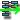

..
   Copyright (C) 2008-2017 EDF R&D

   This file is part of SALOME ADAO module.

   This library is free software; you can redistribute it and/or
   modify it under the terms of the GNU Lesser General Public
   License as published by the Free Software Foundation; either
   version 2.1 of the License, or (at your option) any later version.

   This library is distributed in the hope that it will be useful,
   but WITHOUT ANY WARRANTY; without even the implied warranty of
   MERCHANTABILITY or FITNESS FOR A PARTICULAR PURPOSE.  See the GNU
   Lesser General Public License for more details.

   You should have received a copy of the GNU Lesser General Public
   License along with this library; if not, write to the Free Software
   Foundation, Inc., 59 Temple Place, Suite 330, Boston, MA  02111-1307 USA

   See http://www.salome-platform.org/ or email : webmaster.salome@opencascade.com

   Author: Jean-Philippe Argaud, jean-philippe.argaud@edf.fr, EDF R&D

.. _section_using:

================================================================================
**[DocU]** Using the ADAO module
================================================================================

.. |eficas_new| image:: images/eficas_new.png
   :align: middle
   :scale: 50%
.. |eficas_save| image:: images/eficas_save.png
   :align: middle
   :scale: 50%
.. |eficas_saveas| image:: images/eficas_saveas.png
   :align: middle
   :scale: 50%

.. |yacs_compile| image:: images/yacs_compile.png
   :align: middle
   :scale: 50%

This section presents the usage of the ADAO module in SALOME platform. Here we
describe the general progression to establish an ADAO case, the details being
given in the following chapters. It is completed by the detailed description of
all the commands and keywords in the section :ref:`section_reference`, by
advanced usage procedures in the section :ref:`section_advanced`, and by
examples in the section :ref:`section_examples`.

Logical procedure to build an ADAO case
---------------------------------------

The construction of an ADAO case follows a simple approach to define the set of
input data, and then generates a complete executable block diagram used in YACS
[#]_. Many variations exist for the definition of input data, but the logical
sequence remains unchanged.

First of all, the user is considered to know its personal input data needed to
set up the data assimilation study. These data can already be available in
SALOME or not.

**Basically, the procedure of using ADAO involves the following steps:**

#.  **Activate the ADAO module and use the editor GUI,**
#.  **Build and/or modify the ADAO case, and save it,**
#.  **Export the ADAO case as a YACS scheme,**
#.  **Supplement and modify the YACS scheme, and save it,**
#.  **Execute the YACS case and obtain the results.**

Each step will be detailed in the next section.

.. _section_u_step1:

STEP 1: Activate the ADAO module and use the editor GUI
-------------------------------------------------------

As always for a module, it has to be activated by choosing the appropriate
module button (or the menu) in the toolbar of SALOME. If there is no SALOME
study loaded, a popup appears, allowing to choose between creating a new study,
or opening an already existing one:

  .. _adao_activate1:
  .. image:: images/adao_activate.png
    :align: center
  .. centered::
    **Activating the module ADAO in SALOME**

Choosing the "*New*" button, an embedded case editor [#]_ will be opened, along
with the standard "*Object browser*". You can then click on the "*New*" button
|eficas_new| (or choose the "*New*" entry in the "*ADAO*" main menu) to create a
new ADAO case, and you will see:

  .. _adao_viewer:
  .. image:: images/adao_viewer.png
    :align: center
    :width: 100%
  .. centered::
    **The embedded editor for cases definition in module ADAO**

.. _section_u_step2:

STEP 2: Build and modify the ADAO case, and save it
---------------------------------------------------

To build a case using the embedded editor, you have to go through a series of
sub-steps, by selecting, at each sub-step, a keyword and then filling in its
value. It is noted that it is in this step that is needed, among other things,
to define the call to the simulation code used in observation or evolution
operators describing the problem [#]_.

The structured editor indicates hierarchical types, values or keywords allowed.
Incomplete or incorrect keywords are identified by a visual error red flag.
Possible values are indicated for keywords defined with a limited list of
values, and adapted entries are given for the other keywords. Some help messages
are contextually provided in the editor reserved places.

A new case is set up with the minimal list of commands. All the mandatory
commands or keywords are already present, none of them can be suppressed.
Optional keywords can be added by choosing them in a list of suggestions of
allowed ones for the main command, for example the "*ASSIMILATION_STUDY*"
command. As an example, one can add parameters in the "*AlgorithmParameters*"
keyword, as described in the last part of the section :ref:`section_examples`.

At the end, when all fields or keywords have been correctly defined, each line
of the commands tree must have a green flag. This indicates that the whole case
is valid and completed (and can be saved).

  .. _adao_jdcexample00:
  .. image:: images/adao_jdcexample01.png
    :align: center
    :scale: 75%
  .. centered::
    **Example of a valid ADAO case**

Finally, you have to save your ADAO case by pushing the "*Save*" button
|eficas_save|, or the "*Save as*" button |eficas_saveas|, or by choosing the
"*Save/Save as*" entry in the "*ADAO*" menu. You will be prompted for a location
in your file tree and a name, that will be completed by a "*.comm*" extension
used for the embedded case editor. This will generate a pair of files describing
the ADAO case, with the same base name, the first one being completed by a
"*.comm*" extension and the second one by a "*.py*" extension [#]_.

.. _section_u_step3:

STEP 3: Export the ADAO case as a YACS scheme
---------------------------------------------

When the ADAO case is completed, you have to export it as a YACS scheme in order
to execute the data assimilation calculation. This can be easily done by using
the "*Export to YACS*" button |eficas_yacs|, or equivalently choose the "*Export
to YACS*" entry in the "*ADAO*" main menu, or in the contextual case menu in the
SALOME object browser.

  .. _adao_exporttoyacs01:
  .. image:: images/adao_exporttoyacs.png
    :align: center
    :scale: 75%
  .. centered::
    **"Export to YACS" sub-menu to generate the YACS scheme from the ADAO case**

This will lead to automatically generate a YACS scheme, and open the YACS module
on this scheme. The YACS file, associated with the scheme, will be stored in the
same directory and with the same base name as the ADAO saved case, only changing
its extension to "*.xml*". Be careful, *if the XML file name already exist, the
file will be overwritten without prompting for replacing the XML file*.

.. _section_u_step4:

STEP 4: Supplement and modify the YACS scheme, and save it
----------------------------------------------------------

.. index:: single: Analysis

When the YACS scheme is generated and opened in SALOME through the YACS module
GUI, you can modify or supplement the scheme like any standard YACS scheme.
Nodes or blocs can be added, copied or modified to elaborate complex analysis,
or to insert data assimilation or optimization capabilities into more complex
YACS calculation schemes. It is recommended to save the modified scheme with a
new name, in order to preserve the XML file in the case you re-export the ADAO
case to YACS.

The main supplement needed in the YACS scheme is a post-processing step. The
evaluation of the results has to be done in the physical context of the
simulation used by the data assimilation procedure. The post-processing can be
provided through the "*UserPostAnalysis*" ADAO keyword as a script or a string,
by templates, or can be build as YACS nodes. These two ways of building the
post-processing can use all the SALOME possibilities. See the part describing
:ref:`section_ref_output_variables`, or the help for each algorithm, for the
full description of these elements.

In practice, the YACS scheme has an "*algoResults*" output port of the
computation bloc, which gives access to a structured object named hereafter
"*ADD*" for example, containing all the calculation results. These results can
be obtained by retrieving the named variables stored along the calculation. The
main information is the "*Analysis*" one, that can be obtained by the python
command (for example in an in-line script node or a script provided through the
"*UserPostAnalysis*" keyword)::

    Analysis = ADD.get("Analysis")[:]

"*Analysis*" is a complex object, similar to a list of values calculated at each
step of data assimilation calculation. In order to get and print the optimal
data assimilation state evaluation, in a script provided through the
"*UserPostAnalysis*" keyword, one can use::

    Xa = ADD.get("Analysis")[-1]
    print "Optimal state:", Xa
    print

This ``Xa`` variable is a vector of values, that represents the solution of the
data assimilation or optimization evaluation problem, noted as
:math:`\mathbf{x}^a` in the section :ref:`section_theory`.

Such method can be used to print results, or to convert these ones to
structures that can be used in the native or external SALOME post-processing. A
simple example is given in the section :ref:`section_examples`.

.. _section_u_step5:

STEP 5: Execute the YACS case and obtain the results
----------------------------------------------------

The YACS scheme is now complete and can be executed. Parametrization and
execution of this YACS case is fully compliant with the standard way to deal
with a YACS scheme, as described in the *YACS module User's Guide*.

To recall the simplest way to proceed, the YACS scheme has to be compiled using
the button |yacs_compile|, or the equivalent YACS menu entry, to prepare the
scheme to run. Then the compiled scheme can be started, executed step by step or
using breakpoints, etc.

The standard output will be pushed into the "*YACS Container Log*", obtained
through the right click menu of the "*proc*" window in the YACS GUI. The errors
are shown either in the "*YACS Container Log*", or at the command line in the
terminal window (if SALOME has been launched by its explicit command, and not by
a menu or a desktop icon). As an example, the output of the above simple case is
of the following form::

   Entering in the assimilation study
   Name is set to........: Test
   Algorithm is set to...: Blue
   Launching the analyse

   Optimal state: [0.5, 0.5, 0.5]

shown in the "*YACS Container Log*".

The execution can also be done using a Shell script, as described in the section
:ref:`section_advanced`.

.. [#] For more information on YACS, see the *YACS module* and its integrated help available from the main menu *Help* of the SALOME platform.

.. [#] For more information on the embedded case editor, see the *EFICAS module* and its integrated help available from the main menu *Help* of the SALOME platform.

.. [#] The use of physical simulation code in the data assimilation elementary operators is illustrated or described in the following main parts.

.. [#] This intermediary python file can also be used as described in the section :ref:`section_advanced`.
