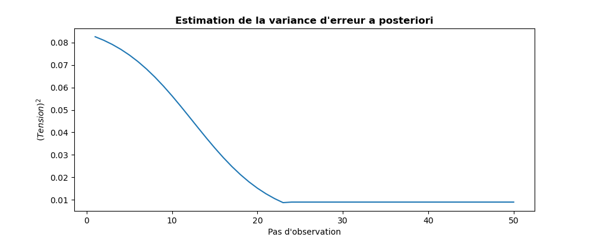

..
   Copyright (C) 2008-2023 EDF R&D

   This file is part of SALOME ADAO module.

   This library is free software; you can redistribute it and/or
   modify it under the terms of the GNU Lesser General Public
   License as published by the Free Software Foundation; either
   version 2.1 of the License, or (at your option) any later version.

   This library is distributed in the hope that it will be useful,
   but WITHOUT ANY WARRANTY; without even the implied warranty of
   MERCHANTABILITY or FITNESS FOR A PARTICULAR PURPOSE.  See the GNU
   Lesser General Public License for more details.

   You should have received a copy of the GNU Lesser General Public
   License along with this library; if not, write to the Free Software
   Foundation, Inc., 59 Temple Place, Suite 330, Boston, MA  02111-1307 USA

   See http://www.salome-platform.org/ or email : webmaster.salome@opencascade.com

   Author: Jean-Philippe Argaud, jean-philippe.argaud@edf.fr, EDF R&D

.. index:: single: 3DVAR
.. index:: single: 3D-Var
.. _section_ref_algorithm_3DVAR:

Algorithme de calcul "*3DVAR*"
------------------------------

.. ------------------------------------ ..
.. include:: snippets/Header2Algo01.rst

Cet algorithme réalise une estimation d'état par minimisation variationnelle de
la fonctionnelle :math:`J` d'écart classique en assimilation de données
statique:

.. math:: J(\mathbf{x})=(\mathbf{x}-\mathbf{x}^b)^T.\mathbf{B}^{-1}.(\mathbf{x}-\mathbf{x}^b)+(\mathbf{y}^o-H(\mathbf{x}))^T.\mathbf{R}^{-1}.(\mathbf{y}^o-H(\mathbf{x}))

qui est usuellement désignée comme la fonctionnelle "*3D-Var*" (voir par
exemple [Talagrand97]_). Les dénominations "*3D-Var*", "*3D-VAR*" et "*3DVAR*"
sont équivalentes.

Il existe diverses variantes de cet algorithme. On propose ici les formulations
stables et robustes suivantes :

.. index::
    pair: Variant ; 3DVAR
    pair: Variant ; 3DVAR-VAN
    pair: Variant ; 3DVAR-Incr
    pair: Variant ; 3DVAR-PSAS

- "3DVAR" (3D Variational analysis, voir [Lorenc86]_, [LeDimet86]_, [Talagrand97]_), algorithme classique d'origine, extrêmement robuste, opérant dans l'espace du modèle,
- "3DVAR-VAN" (3D Variational Analysis with No inversion of B, voir [Lorenc88]_), algorithme similaire, opérant dans l'espace du modèle, permettant d'éviter l'inversion de la matrice de covariance B (sauf dans le cas où il y des bornes),
- "3DVAR-Incr" (Incremental 3DVAR, voir [Courtier94]_), algorithme plus économique que les précédents, impliquant une approximation des opérateurs non-linéaires,
- "3DVAR-PSAS" (Physical-space Statistical Analysis Scheme for 3DVAR, voir [Courtier97]_, [Cohn98]_), algorithme parfois plus économique car opérant dans l'espace des observations, impliquant une approximation des opérateurs non-linéaires, ne permettant pas la prise en compte de bornes.

On recommande fortement d'utiliser le "3DVAR" d'origine. Les algorithmes
"3DVAR" et "3DVAR-Incr" (et pas les autres) permettent explicitement la
modification du point initial de leur minimisation, même si ce n'est pas
recommandé.

Cet algorithme d'optimisation mono-objectif est naturellement écrit pour une
estimation unique, sans notion dynamique ou itérative (il n'y a donc pas besoin
dans ce cas d'opérateur d'évolution incrémentale, ni de covariance d'erreurs
d'évolution). Dans ADAO, il peut aussi être utilisé sur une succession
d'observations, plaçant alors l'estimation dans un cadre récursif similaire à
un :ref:`section_ref_algorithm_KalmanFilter`. Une estimation standard
"*3D-VAR*" est effectuée à chaque pas d'observation sur l'état prévu par le
modèle d'évolution incrémentale, sachant que la covariance d'erreur d'état
reste la covariance d'ébauche initialement fournie par l'utilisateur. Pour être
explicite, contrairement aux filtres de type Kalman, la covariance d'erreurs
sur les états n'est pas remise à jour.

Une extension du 3DVAR, couplant en parallèle une méthode 3DVAR avec un filtre
de Kalman d'ensemble, permet d'améliorer l'estimation des covariances d'erreurs
*a posteriori*. On atteint cette extension en utilisant le variant "E3DVAR" de
l'algorithme de filtrage :ref:`section_ref_algorithm_EnsembleKalmanFilter`.

.. ------------------------------------ ..
.. include:: snippets/Header2Algo02.rst

.. include:: snippets/Background.rst

.. include:: snippets/BackgroundError.rst

.. include:: snippets/Observation.rst

.. include:: snippets/ObservationError.rst

.. include:: snippets/ObservationOperator.rst

.. ------------------------------------ ..
.. include:: snippets/Header2Algo03AdOp.rst

.. include:: snippets/BoundsWithNone.rst

.. include:: snippets/CostDecrementTolerance.rst

.. include:: snippets/EstimationOf_Parameters.rst

.. include:: snippets/GradientNormTolerance.rst

.. include:: snippets/InitializationPoint.rst

.. include:: snippets/MaximumNumberOfIterations.rst

.. include:: snippets/Minimizer_xDVAR.rst

.. include:: snippets/NumberOfSamplesForQuantiles.rst

.. include:: snippets/ProjectedGradientTolerance.rst

.. include:: snippets/Quantiles.rst

.. include:: snippets/SetSeed.rst

.. include:: snippets/SimulationForQuantiles.rst

.. include:: snippets/StateBoundsForQuantilesWithNone.rst

StoreSupplementaryCalculations
  .. index:: single: StoreSupplementaryCalculations

  *Liste de noms*. Cette liste indique les noms des variables supplémentaires,
  qui peuvent être disponibles au cours du déroulement ou à la fin de
  l'algorithme, si elles sont initialement demandées par l'utilisateur. Leur
  disponibilité implique, potentiellement, des calculs ou du stockage coûteux.
  La valeur par défaut est donc une liste vide, aucune de ces variables n'étant
  calculée et stockée par défaut (sauf les variables inconditionnelles). Les
  noms possibles pour les variables supplémentaires sont dans la liste suivante
  (la description détaillée de chaque variable nommée est donnée dans la suite
  de cette documentation par algorithme spécifique, dans la sous-partie
  "*Informations et variables disponibles à la fin de l'algorithme*") : [
  "Analysis",
  "APosterioriCorrelations",
  "APosterioriCovariance",
  "APosterioriStandardDeviations",
  "APosterioriVariances",
  "BMA",
  "CostFunctionJ",
  "CostFunctionJAtCurrentOptimum",
  "CostFunctionJb",
  "CostFunctionJbAtCurrentOptimum",
  "CostFunctionJo",
  "CostFunctionJoAtCurrentOptimum",
  "CurrentIterationNumber",
  "CurrentOptimum",
  "CurrentState",
  "CurrentStepNumber",
  "ForecastState",
  "IndexOfOptimum",
  "Innovation",
  "InnovationAtCurrentAnalysis",
  "InnovationAtCurrentState",
  "JacobianMatrixAtBackground",
  "JacobianMatrixAtOptimum",
  "KalmanGainAtOptimum",
  "MahalanobisConsistency",
  "OMA",
  "OMB",
  "SampledStateForQuantiles",
  "SigmaObs2",
  "SimulatedObservationAtBackground",
  "SimulatedObservationAtCurrentOptimum",
  "SimulatedObservationAtCurrentState",
  "SimulatedObservationAtOptimum",
  "SimulationQuantiles",
  ].

  Exemple :
  ``{"StoreSupplementaryCalculations":["CurrentState", "Residu"]}``

.. include:: snippets/Variant_3DVAR.rst

.. ------------------------------------ ..
.. include:: snippets/Header2Algo04.rst

.. include:: snippets/Analysis.rst

.. include:: snippets/CostFunctionJ.rst

.. include:: snippets/CostFunctionJb.rst

.. include:: snippets/CostFunctionJo.rst

.. ------------------------------------ ..
.. include:: snippets/Header2Algo05.rst

.. include:: snippets/Analysis.rst

.. include:: snippets/APosterioriCorrelations.rst

.. include:: snippets/APosterioriCovariance.rst

.. include:: snippets/APosterioriStandardDeviations.rst

.. include:: snippets/APosterioriVariances.rst

.. include:: snippets/BMA.rst

.. include:: snippets/CostFunctionJ.rst

.. include:: snippets/CostFunctionJAtCurrentOptimum.rst

.. include:: snippets/CostFunctionJb.rst

.. include:: snippets/CostFunctionJbAtCurrentOptimum.rst

.. include:: snippets/CostFunctionJo.rst

.. include:: snippets/CostFunctionJoAtCurrentOptimum.rst

.. include:: snippets/CurrentIterationNumber.rst

.. include:: snippets/CurrentOptimum.rst

.. include:: snippets/CurrentState.rst

.. include:: snippets/CurrentStepNumber.rst

.. include:: snippets/ForecastState.rst

.. include:: snippets/IndexOfOptimum.rst

.. include:: snippets/Innovation.rst

.. include:: snippets/InnovationAtCurrentAnalysis.rst

.. include:: snippets/InnovationAtCurrentState.rst

.. include:: snippets/JacobianMatrixAtBackground.rst

.. include:: snippets/JacobianMatrixAtOptimum.rst

.. include:: snippets/KalmanGainAtOptimum.rst

.. include:: snippets/MahalanobisConsistency.rst

.. include:: snippets/OMA.rst

.. include:: snippets/OMB.rst

.. include:: snippets/SampledStateForQuantiles.rst

.. include:: snippets/SigmaObs2.rst

.. include:: snippets/SimulatedObservationAtBackground.rst

.. include:: snippets/SimulatedObservationAtCurrentOptimum.rst

.. include:: snippets/SimulatedObservationAtCurrentState.rst

.. include:: snippets/SimulatedObservationAtOptimum.rst

.. include:: snippets/SimulationQuantiles.rst

.. ------------------------------------ ..
.. _section_ref_algorithm_3DVAR_examples:

.. include:: snippets/Header2Algo09.rst

.. --------- ..
.. include:: scripts/simple_3DVAR1.rst

.. literalinclude:: scripts/simple_3DVAR1.py

.. include:: snippets/Header2Algo10.rst

.. literalinclude:: scripts/simple_3DVAR1.res
    :language: none

.. include:: snippets/Header2Algo11.rst

.. _simple_3DVAR1:
.. image:: scripts/simple_3DVAR1.png
  :align: center
  :width: 90%

.. include:: scripts/simple_3DVAR1Plus.rst

.. _simple_3DVAR1Plus:

.. --------- ..
.. include:: scripts/simple_3DVAR2.rst

.. literalinclude:: scripts/simple_3DVAR2.py

.. include:: snippets/Header2Algo10.rst

.. literalinclude:: scripts/simple_3DVAR2.res
    :language: none

.. include:: snippets/Header2Algo11.rst

.. _simple_3DVAR2_state:

.. simple_3DVAR2_variance:

.. --------- ..
.. include:: scripts/simple_3DVAR3.rst

.. literalinclude:: scripts/simple_3DVAR3.py

.. include:: snippets/Header2Algo10.rst

.. literalinclude:: scripts/simple_3DVAR3.res
    :language: none

.. include:: snippets/Header2Algo11.rst

.. _simple_3DVAR3_state:
.. image:: scripts/simple_3DVAR3_state.png
  :align: center
  :width: 90%

.. _simple_3DVAR3_variance:

.. ------------------------------------ ..
.. include:: snippets/Header2Algo06.rst

- :ref:`section_ref_algorithm_Blue`
- :ref:`section_ref_algorithm_ExtendedBlue`
- :ref:`section_ref_algorithm_KalmanFilter`
- :ref:`section_ref_algorithm_LinearityTest`

.. ------------------------------------ ..
.. include:: snippets/Header2Algo07.rst

- [Byrd95]_
- [Cohn98]_
- [Courtier94]_
- [LeDimet86]_
- [Lorenc86]_
- [Lorenc88]_
- [Morales11]_
- [Talagrand97]_
- [Zhu97]_
