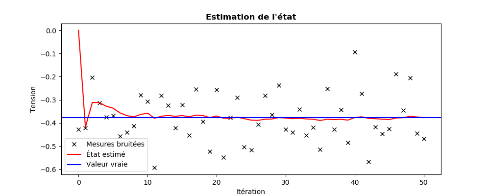
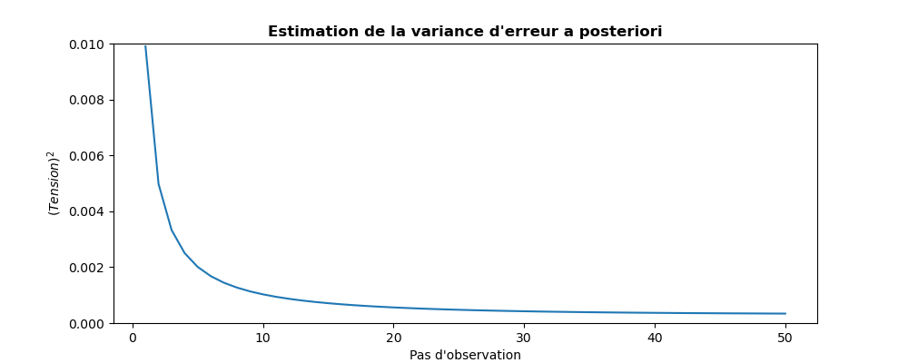
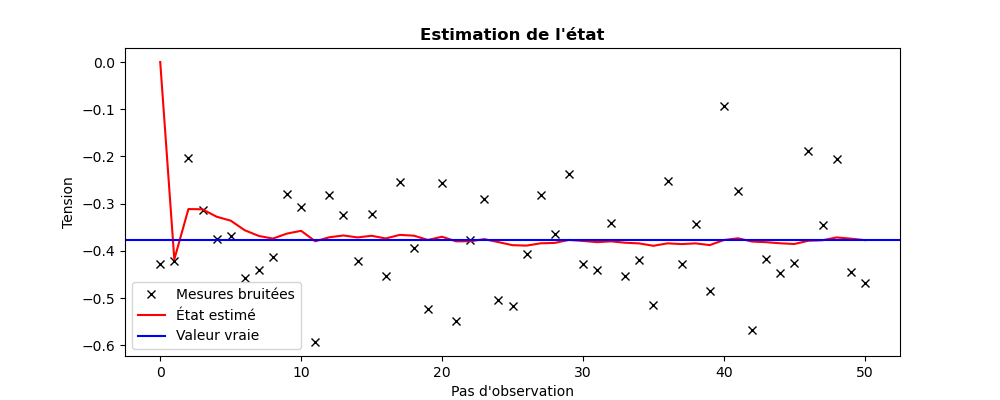

..
   Copyright (C) 2008-2023 EDF R&D

   This file is part of SALOME ADAO module.

   This library is free software; you can redistribute it and/or
   modify it under the terms of the GNU Lesser General Public
   License as published by the Free Software Foundation; either
   version 2.1 of the License, or (at your option) any later version.

   This library is distributed in the hope that it will be useful,
   but WITHOUT ANY WARRANTY; without even the implied warranty of
   MERCHANTABILITY or FITNESS FOR A PARTICULAR PURPOSE.  See the GNU
   Lesser General Public License for more details.

   You should have received a copy of the GNU Lesser General Public
   License along with this library; if not, write to the Free Software
   Foundation, Inc., 59 Temple Place, Suite 330, Boston, MA  02111-1307 USA

   See http://www.salome-platform.org/ or email : webmaster.salome@opencascade.com

   Author: Jean-Philippe Argaud, jean-philippe.argaud@edf.fr, EDF R&D

.. index:: single: KalmanFilter
.. _section_ref_algorithm_KalmanFilter:

Algorithme de calcul "*KalmanFilter*"
-------------------------------------

.. ------------------------------------ ..
.. include:: snippets/Header2Algo01.rst

Cet algorithme réalise une estimation de l'état d'un système dynamique par un
filtre de Kalman. Sous forme discrète, c'est un estimateur itératif (ou
récursif) de l'état courant à l'aide de l'état précédent et des observations
actuelles. Le temps (ou pseudo-temps) entre deux pas est celui qui sépare les
observations successives. Chaque pas d'itération est composé de deux étapes
successives dites classiquement de "*prédiction*" puis de "*correction*".
L'étape de prédiction utilise un opérateur d'évolution incrémentale pour
établir une estimation de l'état courant à partir de l'état estimé au pas
précédent. L'étape de correction (ou de *mise à jour*) utilise les observations
courantes pour améliorer l'estimation en corrigeant l'état prédit.

Il est théoriquement réservé aux cas d'opérateurs d'observation et d'évolution
incrémentale (processus) linéaires, même s'il fonctionne parfois dans les cas
"faiblement" non-linéaire. On peut vérifier la linéarité de l'opérateur
d'observation à l'aide d'un :ref:`section_ref_algorithm_LinearityTest`.

Conceptuellement, on peut représenter le schéma temporel d'action des
opérateurs d'évolution et d'observation dans cet algorithme de la manière
suivante, avec **x** l'état, **P** la covariance d'erreur d'état, *t* le temps
itératif discret :

  .. _schema_temporel_KF:
  .. image:: images/schema_temporel_KF.png
    :align: center
    :width: 100%
  .. centered::
    **Schéma temporel des étapes en assimilation de données par filtre de Kalman**

Dans ce schéma, l'analyse **(x,P)** est obtenue à travers la "*correction*" par
l'observation de la "*prévision*" de l'état précédent. On remarque qu'il n'y a
pas d'analyse effectuée au pas de temps initial (numéroté 0 dans l'indexage
temporel) car il n'y a pas de prévision à cet instant (l'ébauche est stockée
comme pseudo-analyse au pas initial). Si les observations sont fournies en
série par l'utilisateur, la première n'est donc pas utilisée.

Ce filtre peut aussi être utilisé pour estimer (conjointement ou uniquement)
des paramètres et non pas l'état, auquel cas ni le temps ni l'évolution n'ont
plus de signification. Les pas d'itération sont alors liés à l'insertion d'une
nouvelle observation dans l'estimation récursive. On consultera la section
:ref:`section_theory_dynamique` pour les concepts de mise en oeuvre.

En cas de non-linéarité des opérateurs, même peu marquée, on lui préférera un
:ref:`section_ref_algorithm_ExtendedKalmanFilter`, ou un
:ref:`section_ref_algorithm_EnsembleKalmanFilter` et un
:ref:`section_ref_algorithm_UnscentedKalmanFilter` qui sont plus stables,
supportent des bornes sur l'état, etc. On peut vérifier la linéarité des
opérateurs à l'aide d'un :ref:`section_ref_algorithm_LinearityTest`.

.. ------------------------------------ ..
.. include:: snippets/Header2Algo02.rst

.. include:: snippets/Background.rst

.. include:: snippets/BackgroundError.rst

.. include:: snippets/EvolutionError.rst

.. include:: snippets/EvolutionModel.rst

.. include:: snippets/Observation.rst

.. include:: snippets/ObservationError.rst

.. include:: snippets/ObservationOperator.rst

.. ------------------------------------ ..
.. include:: snippets/Header2Algo03AdOp.rst

.. include:: snippets/EstimationOf_State.rst

StoreSupplementaryCalculations
  .. index:: single: StoreSupplementaryCalculations

  *Liste de noms*. Cette liste indique les noms des variables supplémentaires,
  qui peuvent être disponibles au cours du déroulement ou à la fin de
  l'algorithme, si elles sont initialement demandées par l'utilisateur. Leur
  disponibilité implique, potentiellement, des calculs ou du stockage coûteux.
  La valeur par défaut est donc une liste vide, aucune de ces variables n'étant
  calculée et stockée par défaut (sauf les variables inconditionnelles). Les
  noms possibles pour les variables supplémentaires sont dans la liste suivante
  (la description détaillée de chaque variable nommée est donnée dans la suite
  de cette documentation par algorithme spécifique, dans la sous-partie
  "*Informations et variables disponibles à la fin de l'algorithme*") : [
  "Analysis",
  "APosterioriCorrelations",
  "APosterioriCovariance",
  "APosterioriStandardDeviations",
  "APosterioriVariances",
  "BMA",
  "CostFunctionJ",
  "CostFunctionJAtCurrentOptimum",
  "CostFunctionJb",
  "CostFunctionJbAtCurrentOptimum",
  "CostFunctionJo",
  "CostFunctionJoAtCurrentOptimum",
  "CurrentOptimum",
  "CurrentState",
  "CurrentStepNumber",
  "ForecastCovariance",
  "ForecastState",
  "IndexOfOptimum",
  "InnovationAtCurrentAnalysis",
  "InnovationAtCurrentState",
  "SimulatedObservationAtCurrentAnalysis",
  "SimulatedObservationAtCurrentOptimum",
  "SimulatedObservationAtCurrentState",
  ].

  Exemple :
  ``{"StoreSupplementaryCalculations":["BMA", "CurrentState"]}``

.. ------------------------------------ ..
.. include:: snippets/Header2Algo04.rst

.. include:: snippets/Analysis.rst

.. ------------------------------------ ..
.. include:: snippets/Header2Algo05.rst

.. include:: snippets/Analysis.rst

.. include:: snippets/APosterioriCorrelations.rst

.. include:: snippets/APosterioriCovariance.rst

.. include:: snippets/APosterioriStandardDeviations.rst

.. include:: snippets/APosterioriVariances.rst

.. include:: snippets/BMA.rst

.. include:: snippets/CostFunctionJ.rst

.. include:: snippets/CostFunctionJAtCurrentOptimum.rst

.. include:: snippets/CostFunctionJb.rst

.. include:: snippets/CostFunctionJbAtCurrentOptimum.rst

.. include:: snippets/CostFunctionJo.rst

.. include:: snippets/CostFunctionJoAtCurrentOptimum.rst

.. include:: snippets/CurrentOptimum.rst

.. include:: snippets/CurrentState.rst

.. include:: snippets/CurrentStepNumber.rst

.. include:: snippets/ForecastCovariance.rst

.. include:: snippets/ForecastState.rst

.. include:: snippets/IndexOfOptimum.rst

.. include:: snippets/InnovationAtCurrentAnalysis.rst

.. include:: snippets/InnovationAtCurrentState.rst

.. include:: snippets/SimulatedObservationAtCurrentAnalysis.rst

.. include:: snippets/SimulatedObservationAtCurrentOptimum.rst

.. include:: snippets/SimulatedObservationAtCurrentState.rst

.. ------------------------------------ ..
.. _section_ref_algorithm_KalmanFilter_examples:
.. include:: snippets/Header2Algo09.rst

.. include:: scripts/simple_KalmanFilter1.rst

.. literalinclude:: scripts/simple_KalmanFilter1.py

.. include:: snippets/Header2Algo10.rst

.. literalinclude:: scripts/simple_KalmanFilter1.res
    :language: none

.. include:: snippets/Header2Algo11.rst

.. _simple_KalmanFilter1_state:

.. _simple_KalmanFilter1_variance:

.. include:: scripts/simple_KalmanFilter2.rst

.. literalinclude:: scripts/simple_KalmanFilter2.py

.. include:: snippets/Header2Algo10.rst

.. literalinclude:: scripts/simple_KalmanFilter2.res
    :language: none

.. include:: snippets/Header2Algo11.rst

.. _simple_KalmanFilter2_state:

.. _simple_KalmanFilter2_variance:

.. ------------------------------------ ..
.. include:: snippets/Header2Algo06.rst

- :ref:`section_ref_algorithm_ExtendedKalmanFilter`
- :ref:`section_ref_algorithm_EnsembleKalmanFilter`
- :ref:`section_ref_algorithm_UnscentedKalmanFilter`

.. ------------------------------------ ..
.. include:: snippets/Header2Algo07.rst

- [Welch06]_
- [WikipediaKF]_
