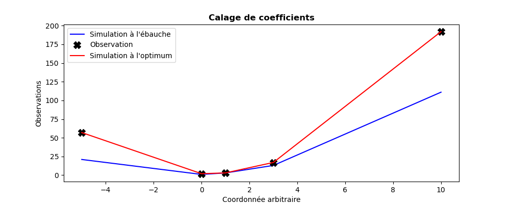

..
   Copyright (C) 2008-2025 EDF R&D

   This file is part of SALOME ADAO module.

   This library is free software; you can redistribute it and/or
   modify it under the terms of the GNU Lesser General Public
   License as published by the Free Software Foundation; either
   version 2.1 of the License, or (at your option) any later version.

   This library is distributed in the hope that it will be useful,
   but WITHOUT ANY WARRANTY; without even the implied warranty of
   MERCHANTABILITY or FITNESS FOR A PARTICULAR PURPOSE.  See the GNU
   Lesser General Public License for more details.

   You should have received a copy of the GNU Lesser General Public
   License along with this library; if not, write to the Free Software
   Foundation, Inc., 59 Temple Place, Suite 330, Boston, MA  02111-1307 USA

   See http://www.salome-platform.org/ or email : webmaster.salome@opencascade.com

   Author: Jean-Philippe Argaud, jean-philippe.argaud@edf.fr, EDF R&D

.. index:: single: NonLinearLeastSquares
.. _section_ref_algorithm_NonLinearLeastSquares:

Algorithme de calcul "*NonLinearLeastSquares*"
----------------------------------------------

.. ------------------------------------ ..
.. include:: snippets/Header2Algo01.rst

Cet algorithme réalise une estimation d'état par minimisation variationnelle de
la fonctionnelle :math:`J` d'écart classique de "Moindres Carrés" pondérés:

.. math:: J(\mathbf{x})=(\mathbf{y}^o-\mathbf{H}.\mathbf{x})^T.\mathbf{R}^{-1}.(\mathbf{y}^o-\mathbf{H}.\mathbf{x})

Il est similaire à un :ref:`section_ref_algorithm_3DVAR` privé de sa partie
ébauche. L'ébauche, requise dans l'interface, ne sert que de point initial pour
la minimisation variationnelle.

Cet algorithme d'optimisation mono-objectif est naturellement écrit pour une
estimation unique, sans notion dynamique ou itérative (il n'y a donc pas besoin
dans ce cas d'opérateur d'évolution incrémentale, ni de covariance d'erreurs
d'évolution). Dans ADAO, il peut aussi être utilisé sur une succession
d'observations, plaçant alors l'estimation dans un cadre récursif en partie
similaire à un filtre de Kalman. Une estimation standard est effectuée à chaque
pas d'observation sur l'état prévu par le modèle d'évolution incrémentale.

Dans tous les cas, il est recommandé de lui préférer un
:ref:`section_ref_algorithm_3DVAR` pour sa stabilité comme pour son
comportement lors de l'optimisation.

.. ------------------------------------ ..
.. include:: snippets/Header2Algo12.rst

.. include:: snippets/FeaturePropLocalOptimization.rst

.. include:: snippets/FeaturePropDerivativeNeeded.rst

.. include:: snippets/FeaturePropParallelDerivativesOnly.rst

.. include:: snippets/FeaturePropConvergenceOnBoth.rst

.. ------------------------------------ ..
.. include:: snippets/Header2Algo02.rst

.. include:: snippets/Background.rst

.. include:: snippets/EvolutionError.rst

.. include:: snippets/EvolutionModel.rst

.. include:: snippets/Observation.rst

.. include:: snippets/ObservationError.rst

.. include:: snippets/ObservationOperator.rst

.. ------------------------------------ ..
.. include:: snippets/Header2Algo03AdOp.rst

.. include:: snippets/BoundsWithNone.rst

.. include:: snippets/CostDecrementTolerance.rst

.. include:: snippets/EstimationOf_Parameters.rst

.. include:: snippets/GradientNormTolerance.rst

.. include:: snippets/InitializationPoint.rst

.. include:: snippets/MaximumNumberOfIterations.rst

.. include:: snippets/Minimizer_xDVAR.rst

.. include:: snippets/ProjectedGradientTolerance.rst

StoreSupplementaryCalculations
  .. index:: single: StoreSupplementaryCalculations

  *Liste de noms*. Cette liste indique les noms des variables supplémentaires,
  qui peuvent être disponibles au cours du déroulement ou à la fin de
  l'algorithme, si elles sont initialement demandées par l'utilisateur. Leur
  disponibilité implique, potentiellement, des calculs ou du stockage coûteux.
  La valeur par défaut est donc une liste vide, aucune de ces variables n'étant
  calculée et stockée par défaut (sauf les variables inconditionnelles). Les
  noms possibles pour les variables supplémentaires sont dans la liste suivante
  (la description détaillée de chaque variable nommée est donnée dans la suite
  de cette documentation par algorithme spécifique, dans la sous-partie
  "*Informations et variables disponibles à la fin de l'algorithme*") : [
  "Analysis",
  "BMA",
  "CostFunctionJ",
  "CostFunctionJAtCurrentOptimum",
  "CostFunctionJb",
  "CostFunctionJbAtCurrentOptimum",
  "CostFunctionJo",
  "CostFunctionJoAtCurrentOptimum",
  "CurrentIterationNumber",
  "CurrentOptimum",
  "CurrentState",
  "CurrentStepNumber",
  "EnsembleOfSimulations",
  "EnsembleOfStates",
  "ForecastState",
  "IndexOfOptimum",
  "Innovation",
  "InnovationAtCurrentAnalysis",
  "InnovationAtCurrentState",
  "OMA",
  "OMB",
  "SimulatedObservationAtBackground",
  "SimulatedObservationAtCurrentOptimum",
  "SimulatedObservationAtCurrentState",
  "SimulatedObservationAtOptimum",
  ].

  Exemple :
  ``{"StoreSupplementaryCalculations":["CurrentState", "Residu"]}``

*Astuce pour cet algorithme :*

    Comme la commande *"BackgroundError"* est requise pour TOUS les algorithmes
    de calcul dans l'interface graphique EFICAS d'ADAO, vous devez fournir une
    valeur, malgré le fait que cette commande ne soit pas nécessaire pour cet
    algorithme, et n'est donc pas utilisée. La manière la plus simple est de
    donner "1" comme un STRING.

.. ------------------------------------ ..
.. include:: snippets/Header2Algo04.rst

.. include:: snippets/Analysis.rst

.. include:: snippets/CostFunctionJ.rst

.. include:: snippets/CostFunctionJb.rst

.. include:: snippets/CostFunctionJo.rst

.. ------------------------------------ ..
.. include:: snippets/Header2Algo05.rst

.. include:: snippets/Analysis.rst

.. include:: snippets/BMA.rst

.. include:: snippets/CostFunctionJ.rst

.. include:: snippets/CostFunctionJAtCurrentOptimum.rst

.. include:: snippets/CostFunctionJb.rst

.. include:: snippets/CostFunctionJbAtCurrentOptimum.rst

.. include:: snippets/CostFunctionJo.rst

.. include:: snippets/CostFunctionJoAtCurrentOptimum.rst

.. include:: snippets/CurrentIterationNumber.rst

.. include:: snippets/CurrentOptimum.rst

.. include:: snippets/CurrentState.rst

.. include:: snippets/CurrentStepNumber.rst

.. include:: snippets/EnsembleOfSimulations.rst

.. include:: snippets/EnsembleOfStates.rst

.. include:: snippets/ForecastState.rst

.. include:: snippets/IndexOfOptimum.rst

.. include:: snippets/Innovation.rst

.. include:: snippets/InnovationAtCurrentAnalysis.rst

.. include:: snippets/InnovationAtCurrentState.rst

.. include:: snippets/OMA.rst

.. include:: snippets/OMB.rst

.. include:: snippets/SimulatedObservationAtBackground.rst

.. include:: snippets/SimulatedObservationAtCurrentOptimum.rst

.. include:: snippets/SimulatedObservationAtCurrentState.rst

.. include:: snippets/SimulatedObservationAtOptimum.rst

.. ------------------------------------ ..
.. _section_ref_algorithm_NonLinearLeastSquares_examples:

.. include:: snippets/Header2Algo09.rst

.. include:: scripts/simple_NonLinearLeastSquares.rst

.. literalinclude:: scripts/simple_NonLinearLeastSquares.py

.. include:: snippets/Header2Algo10.rst

.. literalinclude:: scripts/simple_NonLinearLeastSquares.res
    :language: none

.. include:: snippets/Header2Algo11.rst

.. _simple_NonLinearLeastSquares:

.. ------------------------------------ ..
.. include:: snippets/Header2Algo06.rst

- :ref:`section_ref_algorithm_LinearLeastSquares`
- :ref:`section_ref_algorithm_3DVAR`
- :ref:`section_ref_algorithm_LinearityTest`

.. ------------------------------------ ..
.. include:: snippets/Header2Algo07.rst

- [Byrd95]_
- [Morales11]_
- [Zhu97]_
