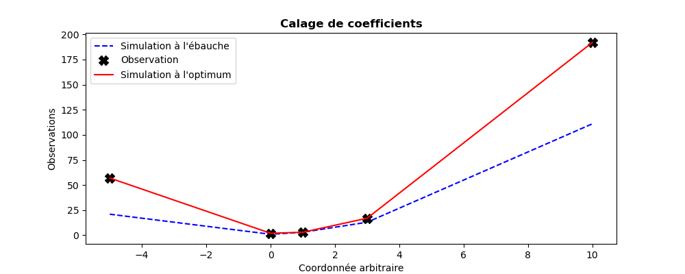

..
   Copyright (C) 2008-2025 EDF R&D

   This file is part of SALOME ADAO module.

   This library is free software; you can redistribute it and/or
   modify it under the terms of the GNU Lesser General Public
   License as published by the Free Software Foundation; either
   version 2.1 of the License, or (at your option) any later version.

   This library is distributed in the hope that it will be useful,
   but WITHOUT ANY WARRANTY; without even the implied warranty of
   MERCHANTABILITY or FITNESS FOR A PARTICULAR PURPOSE.  See the GNU
   Lesser General Public License for more details.

   You should have received a copy of the GNU Lesser General Public
   License along with this library; if not, write to the Free Software
   Foundation, Inc., 59 Temple Place, Suite 330, Boston, MA  02111-1307 USA

   See http://www.salome-platform.org/ or email : webmaster.salome@opencascade.com

   Author: Jean-Philippe Argaud, jean-philippe.argaud@edf.fr, EDF R&D

.. index:: single: ParameterCalibrationTask
.. index:: single: Calage de paramètres
.. index:: single: Recalage de paramètres
.. _section_ref_algorithm_ParameterCalibrationTask:

Algorithme de tâche "*ParameterCalibrationTask*"
------------------------------------------------

.. ------------------------------------ ..
.. include:: snippets/Header2Algo00.rst

.. ------------------------------------ ..
.. include:: snippets/Header2Algo01.rst

Cet algorithme permet d'établir le calage (ou le recalage) de paramètres d'un
modèle, à partir d'observations ou de mesures et d'une idée *a priori* de ces
paramètres.

Il permet d'agréger l'accès aux méthodes les plus utiles pour réaliser un tel
calage. Il permet aussi, lorsque c'est nécessaire, d'initier un recalage avec
les méthodes les plus classique, puis très simplement, en changeant
d'algorithme, de passer à des méthodes spécifiques plus avancées ou plus
adaptées aux particularités des problèmes à traiter.

Il y a principalement 4 classes de méthodes qui permettent de réaliser
simplement un recalage de paramètres de modèle. On indique ici les conditions
générale de choix, dont les détails sont disponibles dans chaque partie
spécifique de la documentation par algorithme.

Optimisation variationnelle de type 3DVAR : variante "3DVARGradientOptimization"
    C'est une méthode de type gradient "3DVAR", qui est très souvent la plus
    efficace à la fois en raison du faible nombre de calculs requis et de la
    grande précision obtenue. Elle nécessite à la fois une bonne régularité du
    modèle à recaler par rapport à ses paramètres, une bonne précision des
    simulations disponibles, et une bonne séparation d'éventuels minima
    équivalents. Cela étant, lorsqu'elle d'applique correctement, c'est la
    méthode la plus économique en évaluations du modèle et la plus précise pour
    ce nombre d'évaluations. C'est en particulier vrai lorsque le nombre de
    paramètres à optimiser augmente, nombre auquel la méthode est très peu
    sensible. Enfin, les réglages de la méthode sur un modèle particulier sont
    aisés et peu nécessaires pour disposer de sa performance. Pour les détails
    et l'association précise des options, on peut se reporter à la
    documentation spécifique pour un :ref:`section_ref_algorithm_3DVAR`.

Estimation semi-linéaire de type BLUE : variante "ExtendedBlueOptimization"
    C'est une méthode d'estimation "ExtendedBlue", de type BLUE qui inclue une
    évaluation non-linéaire du modèle à recaler. L'intérêt de cette méthode est
    d'être une estimation non itérative, donc très économique en nombre
    d'évaluations. De plus, il y a très peu de paramètres à régler pour
    utiliser cette méthode. Néanmoins, elle est usuellement moins précise et
    moins robuste aux erreurs provenant de l'aspect non linéaire du modèle
    utilisé. Pour les détails et l'association précise des options, on peut se
    reporter à la documentation spécifique pour un
    :ref:`section_ref_algorithm_ExtendedBlue`.

Optimisation sans dérivées : variante "DerivativeFreeOptimization"
    C'est une méthode d'optimisation qui n'utilise pas de dérivation du modèle
    à recaler, et qui procède par approximation de type simplexe ou autres.
    L'intérêt de cette méthode est de n'imposer aucun comportement particulier
    du modèle par rapport à ses paramètres. Mais elle nécessite souvent un
    nombre important d'évaluations du modèle pour construire en interne une
    approximation efficiente. De plus, elle est très sensible au nombre de
    paramètres à optimiser, et ne convient qu'en faible dimension. Le nombre
    d'évaluations nécessaire est souvent supérieur de plusieurs ordres de
    grandeurs aux autres méthodes. Enfin, le réglage des paramètres est délicat
    sur un modèle particulier à recaler. Pour les détails et l'association
    précise des options, on peut se reporter à la documentation spécifique pour
    un :ref:`section_ref_algorithm_DerivativeFreeOptimization`.

Optimisation par essaim particulaire, canonique : variante "CanonicalParticuleSwarmOptimization"
    C'est une méthode d'optimisation de type méta-heuristique, qui utilise un
    ensemble (nommé "essaim") d'évaluations du modèle à recaler pour
    cartographier l'espace des états et trouver le meilleur. L'intérêt de cette
    méthode est d'être très peu sensible au nombre de paramètres à optimiser,
    et de rechercher si possible l'état optimal global, sachant que le réglage
    des paramètres est délicat sur un modèle particulier à recaler. Elle est
    souvent plus coûteuse d'un ou deux ordres de grandeur qu'une méthode
    variationnelle. Pour les détails et l'association précise des options, on
    peut se reporter à la documentation spécifique pour un
    :ref:`section_ref_algorithm_ParticleSwarmOptimization`.

Optimisation par essaim particulaire, accélérée : variante "VariationalParticuleSwarmOptimization"
    C'est une méthode d'optimisation de type méta-heuristique complétée par une
    accélération de recherche locale de type variationnelle. Dans le cas où il
    est possible de l'appliquer, cela permet idéalement de disposer de la
    recherche globale de la méta-heuristique par essaim avec une accélération
    locale de type variationnel pour pallier à la difficulté de convergence
    locale de l'essaim. Cette méthode est plus économique que la précédente en
    nombre d'évaluations du modèle à recaler, mais elle est assez délicate à
    régler sur un modèle donné à recaler. Pour les détails et l'association
    précise des options, on peut se reporter à la documentation spécifique pour
    un :ref:`section_ref_algorithm_ParticleSwarmOptimization`.

On conseille donc de conserver la méthode d'optimisation variationnelle par
défaut "3DVARGradientOptimization" pour disposer de la meilleure performance
possible, qui présente aussi le plus de facilité de réglage des paramètres de
l'optimisation vis-à-vis du modèle à recaler.

.. ------------------------------------ ..
.. include:: snippets/Header2Algo12.rst

.. include:: snippets/FeaturePropParallelAlgorithm.rst

.. ------------------------------------ ..
.. include:: snippets/Header2Algo02.rst

.. include:: snippets/Background.rst

.. include:: snippets/BackgroundError.rst

.. include:: snippets/EvolutionError.rst

.. include:: snippets/EvolutionModel.rst

.. include:: snippets/Observation.rst

.. include:: snippets/ObservationError.rst

.. include:: snippets/ObservationOperator.rst

.. ------------------------------------ ..
.. include:: snippets/Header2Algo03Task.rst

On note que l'ensemble des options disponibles de cette tâche sont décrites
ici, mais que seules certaines sont actives pour un variant particulier. La
documentation précise de chaque variant est donc aussi utile pour le bon usage
de chacune des options ici présente.

.. include:: snippets/BoundsWithNone.rst

.. include:: snippets/CognitiveAcceleration.rst

.. include:: snippets/CognitiveAccelerationControl.rst

.. include:: snippets/CostDecrementTolerance.rst

.. include:: snippets/DistributionByComponents.rst

.. include:: snippets/GlobalCostReductionTolerance.rst

.. include:: snippets/GradientNormTolerance.rst

.. include:: snippets/HybridCostDecrementTolerance.rst

.. include:: snippets/HybridMaximumNumberOfIterations.rst

.. include:: snippets/HybridNumberOfLocalHunters.rst

.. include:: snippets/HybridNumberOfWarmupIterations.rst

.. include:: snippets/InertiaWeight.rst

.. include:: snippets/InitializationPoint.rst

.. include:: snippets/MaximumNumberOfFunctionEvaluations.rst

.. include:: snippets/MaximumNumberOfIterations.rst

.. include:: snippets/Minimizer_PCT.rst

.. include:: snippets/NumberOfInsects.rst

.. include:: snippets/NumberOfSamplesForQuantiles.rst

.. include:: snippets/ProjectedGradientTolerance.rst

.. include:: snippets/QualityCriterion.rst

.. include:: snippets/Quantiles.rst

.. include:: snippets/SetSeed.rst

.. include:: snippets/SimulationForQuantiles.rst

.. include:: snippets/SocialAcceleration.rst

.. include:: snippets/SocialAccelerationControl.rst

.. include:: snippets/StateBoundsForQuantilesWithNone.rst

.. include:: snippets/StateVariationTolerance.rst

StoreSupplementaryCalculations
  .. index:: single: StoreSupplementaryCalculations

  *Liste de noms*. Cette liste indique les noms des variables supplémentaires,
  qui peuvent être disponibles au cours du déroulement ou à la fin de
  l'algorithme, si elles sont initialement demandées par l'utilisateur. Leur
  disponibilité implique, potentiellement, des calculs ou du stockage coûteux.
  La valeur par défaut est donc une liste vide, aucune de ces variables n'étant
  calculée et stockée par défaut (sauf les variables inconditionnelles). Les
  noms possibles pour les variables supplémentaires sont dans la liste suivante
  (la description détaillée de chaque variable nommée est donnée dans la suite
  de cette documentation par algorithme spécifique, dans la sous-partie
  "*Informations et variables disponibles à la fin de l'algorithme*") : [
  "Analysis",
  "APosterioriCorrelations",
  "APosterioriCovariance",
  "APosterioriStandardDeviations",
  "APosterioriVariances",
  "BMA",
  "CostFunctionJ",
  "CostFunctionJAtCurrentOptimum",
  "CostFunctionJb",
  "CostFunctionJbAtCurrentOptimum",
  "CostFunctionJo",
  "CostFunctionJoAtCurrentOptimum",
  "CurrentIterationNumber",
  "CurrentOptimum",
  "CurrentState",
  "CurrentStepNumber",
  "EnsembleOfSimulations",
  "EnsembleOfStates",
  "ForecastState",
  "IndexOfOptimum",
  "Innovation",
  "InnovationAtCurrentAnalysis",
  "InnovationAtCurrentState",
  "JacobianMatrixAtBackground",
  "JacobianMatrixAtOptimum",
  "KalmanGainAtOptimum",
  "MahalanobisConsistency",
  "OMA",
  "OMB",
  "SampledStateForQuantiles",
  "SigmaObs2",
  "SimulatedObservationAtBackground",
  "SimulatedObservationAtCurrentOptimum",
  "SimulatedObservationAtCurrentState",
  "SimulatedObservationAtOptimum",
  "SimulationQuantiles",
  ].

  Exemple :
  ``{"StoreSupplementaryCalculations":["CurrentState", "Residu"]}``

.. include:: snippets/SwarmInitialization.rst

.. include:: snippets/SwarmTopology.rst

.. include:: snippets/VelocityClampingFactor.rst

.. include:: snippets/Variant_PCT.rst

.. ------------------------------------ ..
.. include:: snippets/Header2Algo04.rst

.. include:: snippets/Analysis.rst

.. include:: snippets/CostFunctionJ.rst

.. include:: snippets/CostFunctionJb.rst

.. include:: snippets/CostFunctionJo.rst

.. include:: snippets/CurrentState.rst

.. ------------------------------------ ..
.. include:: snippets/Header2Algo05.rst

.. include:: snippets/Analysis.rst

.. include:: snippets/APosterioriCorrelations.rst

.. include:: snippets/APosterioriCovariance.rst

.. include:: snippets/APosterioriStandardDeviations.rst

.. include:: snippets/APosterioriVariances.rst

.. include:: snippets/BMA.rst

.. include:: snippets/CostFunctionJ.rst

.. include:: snippets/CostFunctionJAtCurrentOptimum.rst

.. include:: snippets/CostFunctionJb.rst

.. include:: snippets/CostFunctionJbAtCurrentOptimum.rst

.. include:: snippets/CostFunctionJo.rst

.. include:: snippets/CostFunctionJoAtCurrentOptimum.rst

.. include:: snippets/CurrentIterationNumber.rst

.. include:: snippets/CurrentOptimum.rst

.. include:: snippets/CurrentState.rst

.. include:: snippets/CurrentStepNumber.rst

.. include:: snippets/EnsembleOfSimulations.rst

.. include:: snippets/EnsembleOfStates.rst

.. include:: snippets/ForecastState.rst

.. include:: snippets/IndexOfOptimum.rst

.. include:: snippets/Innovation.rst

.. include:: snippets/InnovationAtCurrentAnalysis.rst

.. include:: snippets/InnovationAtCurrentState.rst

.. include:: snippets/JacobianMatrixAtBackground.rst

.. include:: snippets/JacobianMatrixAtOptimum.rst

.. include:: snippets/KalmanGainAtOptimum.rst

.. include:: snippets/MahalanobisConsistency.rst

.. include:: snippets/OMA.rst

.. include:: snippets/OMB.rst

.. include:: snippets/SampledStateForQuantiles.rst

.. include:: snippets/SigmaObs2.rst

.. include:: snippets/SimulatedObservationAtBackground.rst

.. include:: snippets/SimulatedObservationAtCurrentOptimum.rst

.. include:: snippets/SimulatedObservationAtCurrentState.rst

.. include:: snippets/SimulatedObservationAtOptimum.rst

.. include:: snippets/SimulationQuantiles.rst

.. ------------------------------------ ..
.. _section_ref_algorithm_ParameterCalibrationTask_examples:

.. include:: snippets/Header2Algo09.rst

.. --------- ..
.. include:: scripts/simple_ParameterCalibrationTask1.rst

.. literalinclude:: scripts/simple_ParameterCalibrationTask1.py

.. include:: snippets/Header2Algo10.rst

.. literalinclude:: scripts/simple_ParameterCalibrationTask1.res
    :language: none

.. include:: snippets/Header2Algo11.rst

.. _simple_ParameterCalibrationTask1:
.. image:: scripts/simple_ParameterCalibrationTask1.png
  :align: center
  :width: 90%

.. --------- ..
.. include:: scripts/simple_ParameterCalibrationTask2.rst

.. literalinclude:: scripts/simple_ParameterCalibrationTask2.py

.. include:: snippets/Header2Algo10.rst

.. literalinclude:: scripts/simple_ParameterCalibrationTask2.res
    :language: none

.. include:: snippets/Header2Algo11.rst

.. _simple_ParameterCalibrationTask2:

.. ------------------------------------ ..
.. include:: snippets/Header2Algo06.rst

- :ref:`section_ref_algorithm_3DVAR`
- :ref:`section_ref_algorithm_ExtendedBlue`
- :ref:`section_ref_algorithm_DerivativeFreeOptimization`
- :ref:`section_ref_algorithm_ParticleSwarmOptimization`
