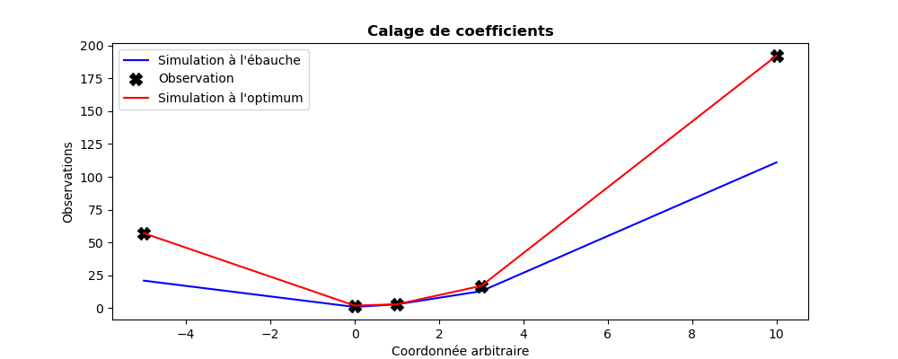

..
   Copyright (C) 2008-2024 EDF R&D

   This file is part of SALOME ADAO module.

   This library is free software; you can redistribute it and/or
   modify it under the terms of the GNU Lesser General Public
   License as published by the Free Software Foundation; either
   version 2.1 of the License, or (at your option) any later version.

   This library is distributed in the hope that it will be useful,
   but WITHOUT ANY WARRANTY; without even the implied warranty of
   MERCHANTABILITY or FITNESS FOR A PARTICULAR PURPOSE.  See the GNU
   Lesser General Public License for more details.

   You should have received a copy of the GNU Lesser General Public
   License along with this library; if not, write to the Free Software
   Foundation, Inc., 59 Temple Place, Suite 330, Boston, MA  02111-1307 USA

   See http://www.salome-platform.org/ or email : webmaster.salome@opencascade.com

   Author: Jean-Philippe Argaud, jean-philippe.argaud@edf.fr, EDF R&D

.. index:: single: ParticleSwarmOptimization
.. index:: single: Essaim particulaire (Optimisation par)
.. _section_ref_algorithm_ParticleSwarmOptimization:

Algorithme de calcul "*ParticleSwarmOptimization*"
--------------------------------------------------

.. ------------------------------------ ..
.. include:: snippets/Header2Algo01.rst

Cet algorithme réalise une estimation de l'état d'un système par minimisation
sans gradient d'une fonctionnelle d'écart :math:`J`, en utilisant une méthode
évolutionnaire d'essaim particulaire. C'est une méthode qui n'utilise pas les
dérivées de la fonctionnelle d'écart. Elle entre dans la même catégorie que les
:ref:`section_ref_algorithm_DerivativeFreeOptimization`,
:ref:`section_ref_algorithm_DifferentialEvolution` ou
:ref:`section_ref_algorithm_TabuSearch`.

C'est une méthode d'optimisation mono-objectif, permettant la recherche du
minimum global d'une fonctionnelle d'erreur :math:`J` quelconque de type
:math:`L^1`, :math:`L^2` ou :math:`L^{\infty}`, avec ou sans pondérations,
comme décrit dans la section pour :ref:`section_theory_optimization`. La
fonctionnelle d'erreur par défaut est celle de moindres carrés pondérés
augmentés, classiquement utilisée en assimilation de données.

Elle est basée sur l'évolution d'une population (appelée "essaim") d'états
(chaque individu étant appelé une "particule" ou un "insecte"). Il existe
diverses variantes de cet algorithme. On propose ici les formulations stables
et robustes suivantes :

.. index::
    pair: Variant ; CanonicalPSO
    pair: Variant ; OGCR
    pair: Variant ; SPSO-2011
    pair: Variant ; AIS PSO
    pair: Variant ; APSO

- "CanonicalPSO" (Canonical Particule Swarm Optimisation, voir
  [ZambranoBigiarini13]_), algorithme classique dit "canonique" d'essaim
  particulaire, robuste et définissant une référence des algorithmes d'essaims
  particulaires,
- "OGCR" (Simple Particule Swarm Optimisation), algorithme simplifié d'essaim
  particulaire sans bornes sur les insectes ou les vitesses, déconseillé car
  peu robuste, mais parfois beaucoup plus rapide,
- "SPSO-2011" ou "SPSO-2011-AIS" (Standard Particle Swarm Optimisation 2011,
  voir [ZambranoBigiarini13]_), algorithme de référence 2011 d'essaim
  particulaire, robuste, performant et défini comme une référence des
  algorithmes d'essaims particulaires. Cet algorithme est parfois appelé
  ":math:`\omega`-PSO" ou "Inertia PSO" car il intègre une contribution dite
  d'inertie, ou encore appelé "AIS" (pour "Asynchronous Iteration Strategy") ou
  "APSO" (pour "Advanced Particle Swarm Optimisation") car il intègre la mise à
  jour évolutive des meilleurs éléments, conduisant à une convergence
  intrinsèquement améliorée de l'algorithme.
- "SPSO-2011-SIS" (Standard Particle Swarm Optimisation 2011 with Synchronous
  Iteration Strategy), très similaire à l'algorithme de référence 2011 et avec
  une mise à jour synchrone, appelée "SIS", des particules.
- "SPSO-2011-PSIS" (Standard Particle Swarm Optimisation 2011 with Parallel
  Synchronous Iteration Strategy), similaire à l'algorithme "SPSO-2011-SIS"
  avec mise à jour synchrone et parallélisation, appelée "PSIS", des
  particules.

Voici quelques suggestions pratiques pour une utilisation efficace de ces
algorithmes :

- La variante recommandée de cet algorithme est le "SPSO-2011" même si
  l'algorithme "CanonicalPSO" reste par défaut le plus robuste. Dans le cas où
  l'évaluation de l'état peut être réalisé en parallèle, on peut utiliser
  l'algorithme "SPSO-2011-PSIS" même si sa convergence est parfois un peu moins
  performante.
- Le nombre de particules ou d'insectes usuellement recommandé varie entre 40
  et 100 selon l'algorithme, à peu près indépendamment de la dimension de
  l'espace des états. En général, les meilleurs performances sont obtenues pour
  des populations de 70 à 500 particules. Même si la valeur par défaut de ce
  paramètre de base provient d'une expérience étendue sur ces algorithmes, il
  est recommandé de l'adapter à la difficulté des problèmes traités.
- Le nombre recommandé de générations, lors de l'évolution de la population,
  est souvent de l'ordre de 50, mais il peut facilement varier entre 25 et 500.
- Le nombre maximal d'évaluation de la fonction de simulation doit usuellement
  être limité entre quelques milliers et quelques dizaines de milliers de fois
  la dimension de l'espace des états.
- La fonctionnelle d'erreur décroît usuellement par pallier (donc avec une
  progression nulle de la valeur de fonctionnelle à chaque génération lorsque
  l'on reste dans le palier), rendant *non recommandé* un arrêt sur critère de
  décroissance de la fonction-coût. Il est normalement plus judicieux d'adapter
  le nombre d'itérations ou de générations pour accélérer la convergence des
  algorithmes.
- Si le problème est contraint, il faut définir les bornes des variables (par
  la variable "*Bounds*"). Si le problème est totalement non contraint, il est
  indispensable de définir des bornes d'incrément (par la variable
  "*BoxBounds*") pour circonscrire la recherche optimale de manière utile. De
  manière similaire, si le problème est partiellement contraint, il est
  recommandé (mais pas indispensable) de définir des bornes d'incrément. Dans
  le cas où ces bornes d'incréments ne sont pas définies, ce sont les bornes
  des variables qui seront utilisées comme bornes d'incréments.

Ces conseils sont à utiliser comme des indications expérimentales, et pas comme
des prescriptions, car ils sont à apprécier ou à adapter selon la physique de
chaque problème que l'on traite.

Le décompte du nombre d'évaluations de la fonction à simuler lors de cet
algorithme est déterministe, à savoir le "*nombre d'itérations ou de
générations*" multiplié par le "*nombre d'individus de la population*". Avec
les valeurs par défaut, il faut entre `40x50=2000` et `100*50=5000` évaluations
par défaut. C'est pour cette raison que cet algorithme est usuellement
intéressant lorsque la dimension de l'espace des états est grande, ou que les
non-linéarités de la simulation rendent compliqué, ou invalide, l'évaluation du
gradient de la fonctionnelle par approximation numérique. Mais il est aussi
nécessaire que le calcul de la fonction à simuler ne soit pas trop coûteux
pour éviter une durée d'optimisation rédhibitoire.

.. ------------------------------------ ..
.. include:: snippets/Header2Algo02.rst

.. include:: snippets/Background.rst

.. include:: snippets/BackgroundError.rst

.. include:: snippets/Observation.rst

.. include:: snippets/ObservationError.rst

.. include:: snippets/ObservationOperator.rst

.. ------------------------------------ ..
.. include:: snippets/Header2Algo03AdOp.rst

.. include:: snippets/BoundsWithNone.rst

.. include:: snippets/BoxBounds.rst

.. include:: snippets/CognitiveAcceleration.rst

.. include:: snippets/InertiaWeight.rst

.. include:: snippets/InitializationPoint.rst

.. include:: snippets/MaximumNumberOfFunctionEvaluations.rst

.. include:: snippets/MaximumNumberOfIterations_50.rst

.. include:: snippets/NumberOfInsects.rst

.. include:: snippets/QualityCriterion.rst

.. include:: snippets/SetSeed.rst

.. include:: snippets/SocialAcceleration.rst

StoreSupplementaryCalculations
  .. index:: single: StoreSupplementaryCalculations

  *Liste de noms*. Cette liste indique les noms des variables supplémentaires,
  qui peuvent être disponibles au cours du déroulement ou à la fin de
  l'algorithme, si elles sont initialement demandées par l'utilisateur. Leur
  disponibilité implique, potentiellement, des calculs ou du stockage coûteux.
  La valeur par défaut est donc une liste vide, aucune de ces variables n'étant
  calculée et stockée par défaut (sauf les variables inconditionnelles). Les
  noms possibles pour les variables supplémentaires sont dans la liste suivante
  (la description détaillée de chaque variable nommée est donnée dans la suite
  de cette documentation par algorithme spécifique, dans la sous-partie
  "*Informations et variables disponibles à la fin de l'algorithme*") : [
  "Analysis",
  "BMA",
  "CostFunctionJ",
  "CostFunctionJb",
  "CostFunctionJo",
  "CurrentIterationNumber",
  "CurrentState",
  "Innovation",
  "InternalCostFunctionJ",
  "InternalCostFunctionJb",
  "InternalCostFunctionJo",
  "InternalStates",
  "OMA",
  "OMB",
  "SimulatedObservationAtBackground",
  "SimulatedObservationAtCurrentState",
  "SimulatedObservationAtOptimum",
  ].

  Exemple :
  ``{"StoreSupplementaryCalculations":["CurrentState", "Residu"]}``

.. include:: snippets/SwarmTopology.rst

.. include:: snippets/Variant_PSO.rst

.. include:: snippets/VelocityClampingFactor.rst

.. ------------------------------------ ..
.. include:: snippets/Header2Algo04.rst

.. include:: snippets/Analysis.rst

.. include:: snippets/CostFunctionJ.rst

.. include:: snippets/CostFunctionJb.rst

.. include:: snippets/CostFunctionJo.rst

.. ------------------------------------ ..
.. include:: snippets/Header2Algo05.rst

.. include:: snippets/Analysis.rst

.. include:: snippets/BMA.rst

.. include:: snippets/CostFunctionJ.rst

.. include:: snippets/CostFunctionJb.rst

.. include:: snippets/CostFunctionJo.rst

.. include:: snippets/CurrentIterationNumber.rst

.. include:: snippets/CurrentState.rst

.. include:: snippets/Innovation.rst

.. include:: snippets/InternalCostFunctionJ.rst

.. include:: snippets/InternalCostFunctionJb.rst

.. include:: snippets/InternalCostFunctionJo.rst

.. include:: snippets/InternalStates.rst

.. include:: snippets/OMA.rst

.. include:: snippets/OMB.rst

.. include:: snippets/SimulatedObservationAtBackground.rst

.. include:: snippets/SimulatedObservationAtCurrentState.rst

.. include:: snippets/SimulatedObservationAtOptimum.rst

.. ------------------------------------ ..
.. _section_ref_algorithm_ParticleSwarmOptimization_examples:

.. include:: snippets/Header2Algo09.rst

.. include:: scripts/simple_ParticleSwarmOptimization1.rst

.. literalinclude:: scripts/simple_ParticleSwarmOptimization1.py

.. include:: snippets/Header2Algo10.rst

.. literalinclude:: scripts/simple_ParticleSwarmOptimization1.res
    :language: none

.. include:: snippets/Header2Algo11.rst

.. _simple_ParticleSwarmOptimization1:

.. ------------------------------------ ..
.. include:: snippets/Header2Algo06.rst

- :ref:`section_ref_algorithm_DerivativeFreeOptimization`
- :ref:`section_ref_algorithm_DifferentialEvolution`
- :ref:`section_ref_algorithm_TabuSearch`

.. ------------------------------------ ..
.. include:: snippets/Header2Algo07.rst

- [WikipediaPSO]_
- [ZambranoBigiarini13]_
