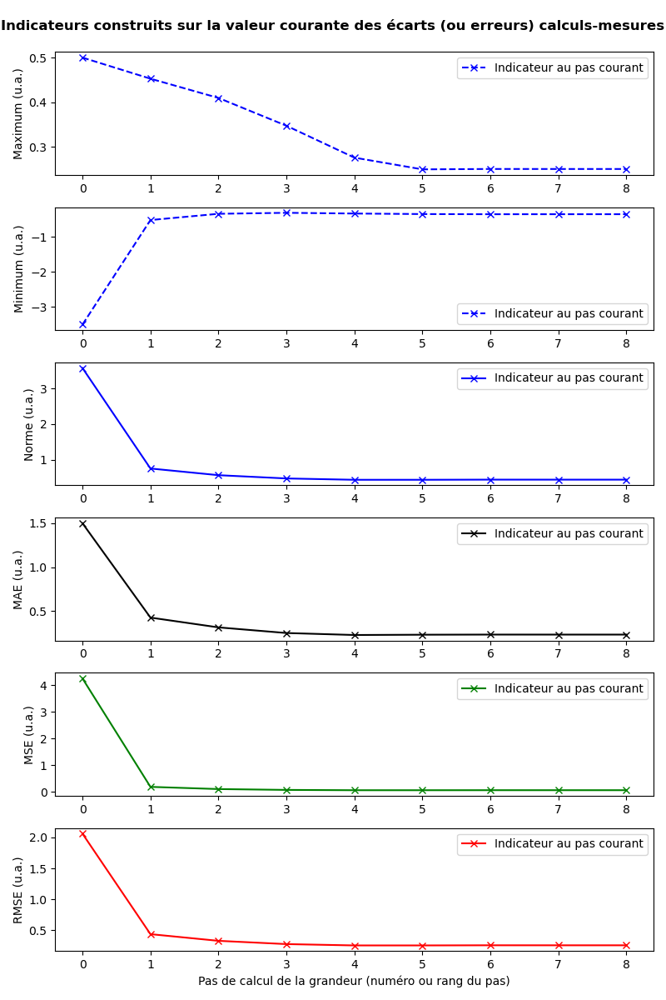

..
   Copyright (C) 2008-2024 EDF R&D

   This file is part of SALOME ADAO module.

   This library is free software; you can redistribute it and/or
   modify it under the terms of the GNU Lesser General Public
   License as published by the Free Software Foundation; either
   version 2.1 of the License, or (at your option) any later version.

   This library is distributed in the hope that it will be useful,
   but WITHOUT ANY WARRANTY; without even the implied warranty of
   MERCHANTABILITY or FITNESS FOR A PARTICULAR PURPOSE.  See the GNU
   Lesser General Public License for more details.

   You should have received a copy of the GNU Lesser General Public
   License along with this library; if not, write to the Free Software
   Foundation, Inc., 59 Temple Place, Suite 330, Boston, MA  02111-1307 USA

   See http://www.salome-platform.org/ or email : webmaster.salome@opencascade.com

   Author: Jean-Philippe Argaud, jean-philippe.argaud@edf.fr, EDF R&D

.. index:: single: TUI
.. index:: single: API/TUI
.. index:: single: adaoBuilder
.. _section_tui:

================================================================================
**[DocR]** Interface textuelle pour l'utilisateur (TUI/API)
================================================================================

.. |eficas_totui| image:: images/eficas_totui.png
   :align: middle
   :scale: 50%

Cette section présente des méthodes avancées d'usage du module ADAO à l'aide de
son interface de programmation textuelle (API/TUI). Cette interface permet à
l'utilisateur de créer un objet de calcul de manière similaire à la
construction d'un cas par l'interface graphique (GUI). On peut d'ailleurs
directement obtenir une forme scriptée d'un cas construit dans l'interface
graphique GUI à l'aide du bouton d'export TUI |eficas_totui| intégré dans
l'interface, mais des cas plus compliqués ou plus intégrés peuvent uniquement
être construits avec la démarche TUI. Dans le cas où l'on désire réaliser
directement le cas de calcul TUI, on recommande de bien s'appuyer sur
l'ensemble de la documentation du module ADAO, et de se reporter si nécessaire
à l'interface graphique (GUI), pour disposer de l'ensemble des éléments
permettant de renseigner correctement les commandes. Les notions générales et
termes utilisés ici sont définis dans :ref:`section_theory`. Comme dans
l'interface graphique, on note que la démarche en TUI est destinée à créer et
gérer un unique cas de calcul.

.. _subsection_tui_creating:

Création de cas de calcul TUI ADAO et exemples
----------------------------------------------

.. _subsection_tui_example:

Un exemple simple de création d'un cas de calcul TUI ADAO
+++++++++++++++++++++++++++++++++++++++++++++++++++++++++

Pour introduire l'interface TUI, on commence par un exemple simple mais complet
de cas de calcul ADAO. Toutes les données sont explicitement définies dans le
corps du script pour faciliter la lecture. L'ensemble des commandes est le
suivant :

.. literalinclude:: scripts/tui_example_01.py
    :language: python

Le résultat de l'exécution de ces commandes dans SALOME (que ce soit par la
commande "*shell*" de SALOME, dans une console Python SALOME de l'interface, ou
par le menu d'exécution d'un script) est le suivant :

.. literalinclude:: scripts/tui_example_01.res
    :language: none

Création détaillée d'un cas de calcul TUI ADAO
++++++++++++++++++++++++++++++++++++++++++++++

On décrit ici plus en détail les différentes étapes de création d'un cas de
calcul TUI ADAO. Les commandes elles-mêmes sont détaillées juste après dans
l':ref:`subsection_tui_commands`. On maintient l'indication ``[...]`` de lignes
précédentes ou suivantes pour insister sur le fait que ces commandes peuvent
être insérées au milieu d'un flot complet de scripting Python pour une étude
réelle.

La création et l'initialisation d'une étude se font par les commandes
suivantes, le nom ``case`` de l'objet du cas de calcul TUI ADAO étant
quelconque, au choix de l'utilisateur :

.. code-block:: python

    [...]
    from numpy import array
    from adao import adaoBuilder
    case = adaoBuilder.New()
    [...]

Il est recommandé d'importer par principe le module ``numpy`` ou ses
constructeurs particuliers comme celui d'``array``, pour faciliter ensuite son
usage dans les commandes elles-mêmes.

Ensuite, le cas doit être construit par une préparation et un enregistrement
des données définissant l'étude. L'ordre de ces commandes n'a pas d'importance,
il suffit que les concepts requis par l'algorithme utilisé soient présents. On
se reportera à :ref:`section_reference` et à ses sous-parties pour avoir le
détail des commandes par algorithme. Ici, on définit successivement
l'algorithme d'assimilation de données ou d'optimisation choisi et ses
paramètres, puis l'ébauche :math:`\mathbf{x}^b` (nommée ``Background``) et sa
covariance d'erreurs :math:`\mathbf{B}` (nommée ``BackgroundError``), et enfin
l'observation :math:`\mathbf{y}^o` (nommée ``Observation``) et sa covariance
d'erreurs :math:`\mathbf{R}` (nommée ``ObservationError``) :

.. code-block:: python

    [...]
    case.set( 'AlgorithmParameters', Algorithm='3DVAR' )
    #
    case.set( 'Background',          Vector=[0, 1, 2] )
    case.set( 'BackgroundError',     ScalarSparseMatrix=1.0 )
    #
    case.set( 'Observation',         Vector=array([0.5, 1.5, 2.5]) )
    case.set( 'ObservationError',    DiagonalSparseMatrix='1 1 1' )
    [...]

On remarque que l'on peut donner, en entrée des quantités vectorielles ou
matricielles, des objets de type ``str``, ``list`` ou ``tuple`` de Python, ou
de type ``array`` ou ``matrix`` de Numpy. Dans ces deux derniers cas, il faut
simplement importer le module Numpy avant.

On doit ensuite définir les opérateurs :math:`H` d'observation et
éventuellement :math:`M` d'évolution. Dans tous les cas, linéaire ou
non-linéaire, on peut les définir comme des fonctions. Dans le cas simple d'un
opérateur linéaire, on peut aussi le définir à l'aide de la matrice qui
correspond à l'opérateur linéaire. Dans le cas présent le plus simple
d'opérateur linéaire, on utilise la syntaxe suivante pour un opérateur de
:math:`\mathbf{R}^3` sur lui-même :

.. code-block:: python

    [...]
    case.set( 'ObservationOperator', Matrix = "1 0 0;0 2 0;0 0 3")
    [...]

Dans le cas beaucoup plus courant d'un opérateur non-linéaire de
:math:`\mathbf{R}^n` dans  :math:`\mathbf{R}^p`, il doit être préalablement
disponible sous la forme d'une fonction Python, connue dans l'espace de nommage
courant, qui prend en entrée un vecteur Numpy (ou une liste ordonnée) de taille
:math:`n` et qui restitue en sortie un vecteur Numpy de taille :math:`p`.
Lorsque seul l'opérateur non-linéaire est défini par l'argument
"*OneFunction*", son adjoint est directement établi de manière numérique et il
est paramétrable par l'argument "*Parameters*". L'exemple suivant montre une
fonction ``simulation`` (qui réalise ici le même opérateur linéaire que
ci-dessus) et l'enregistre dans le cas ADAO :

.. code-block:: python

    [...]
    import numpy
    def simulation(x):
        "Fonction de simulation H pour effectuer Y=H(X)"
        import numpy
        __x = numpy.ravel(x)
        __H = numpy.diag([1.,2.,3.])
        return numpy.dot(__H, __x)
    #
    case.set( 'ObservationOperator',
        OneFunction = simulation,
        Parameters  = {"DifferentialIncrement":0.01},
        )
    [...]

Pour connaître les résultats intermédiaire ou finaux du calcul du cas, on peut
ajouter des "*observer*", qui permettent d'associer l'exécution d'un script à
une variable intermédiaire ou finale du calcul. On se reportera à la
description de la manière d':ref:`section_advanced_observer`, et à la
:ref:`section_reference` pour savoir quelles sont les quantités observables.
Cette association d'"*observer*" avec une quantité existante se fait de manière
similaire à la définition des données du calcul :

.. code-block:: python

    [...]
    case.set( 'Observer', Variable="Analysis", Template="ValuePrinter" )
    [...]

Enfin, lorsque toutes les informations requises sont disponibles dans le cas
``case`` de calcul ADAO, on peut en demander l'exécution de manière très
simple dans l'environnement de l'interpréteur Python :

.. code-block:: python

    [...]
    case.execute()
    [...]

Au final, on obtient le script très compact proposé précédemment dans
:ref:`subsection_tui_example`.

Fournir des données ou informations de calcul plus complexes
++++++++++++++++++++++++++++++++++++++++++++++++++++++++++++

Une telle interface s'écrivant en Python, il est possible d'utiliser toute la
puissance du langage pour entrer des données plus complexes qu'une déclaration
explicite.

L'enregistrement des données d'entrées supporte différents types de variables,
mais surtout, ces entrées peuvent recevoir des variables courantes disponibles
dans l'espace de nommage du script. Il est donc aisé d'utiliser des variables
calculées préalablement ou obtenues par l'import de scripts "utilisateur". Si
par exemple les observations sont disponibles sous la forme d'une liste dans un
fichier Python externe nommé ``observations.py`` sous le nom ``someTable``, il
suffit de réaliser les opérations suivantes pour enregistrer les observations
dans le cas de calcul TUI ADAO :

.. code-block:: python

    [...]
    from observations import someTable
    case.set( 'Observation', Vector=someTable )
    [...]

La première ligne importe la variable ``someTable`` depuis le fichier externe,
et la seconde enregistre directement cette table comme la donnée
"*Observation*".

La simplicité de cet enregistrement montre bien la facilité d'obtenir les
données de calcul depuis des sources externes, fichiers ou flux informatiques
atteignables en Python. Comme d'habitude, il est recommandé à l'utilisateur de
vérifier ses données avant de les enregistrer dans le cas de calcul TUI ADAO
pour éviter les erreurs compliquées à corriger.

Obtenir et utiliser les résultats de calcul de manière plus riche
+++++++++++++++++++++++++++++++++++++++++++++++++++++++++++++++++

De la même manière, il est possible d'obtenir et traiter les résultats de
calcul de manière plus riche, pour enchaîner sur des post-traitements après le
calcul en TUI.

Les variables de résultats de calcul, ou les variables internes issues de
l'optimisation ou de l'assimilation de données, sont disponibles à travers la
méthode ``get`` du cas de calcul TUI ADAO, qui renvoie un objet de type liste
de la variable demandée. On se reportera aux
:ref:`section_ref_output_variables` pour une description détaillée sur ce
sujet.

A titre d'exemple, on donne quelques lignes de script qui permettent d'obtenir
le nombre d'itérations de l'optimisation et la valeur optimale ainsi que sa
taille :

.. code-block:: python

    [...]
    print("")
    print("    Nombre d'iterations : %i"%len(case.get("CostFunctionJ")))
    Xa = case.get("Analysis")
    print("    Analyse optimale    : %s"%(Xa[-1],))
    print("    Taille de l'analyse : %i"%len(Xa[-1]))
    print("")
    [...]

Ces lignes peuvent être très simplement additionnées à l'exemple initial de cas
de calcul TUI ADAO proposé dans :ref:`subsection_tui_example`.

De même que pour l'entrée des données, la simplicité de récupération des
résultats permet d'envisager aisément des post-traitements enchaînés dans
SALOME, pour utiliser par exemple de la visualisation avec MatPlotLib ou
PARAVIS [PARAVIS]_, de l'adaptation de maillage avec HOMARD [HOMARD]_, ou pour
d'autres calculs.

.. _subsection_tui_commands:

Ensemble des commandes disponibles en interface textuelle TUI
-------------------------------------------------------------

Dans l'interface TUI du module ADAO, on suit les conventions et recommandations
courantes en Python pour la distinction entre ce qui est public, et ce qui est
privé ou réservé car relevant des détails d'implémentation. De manière
pratique, tout nom d'objet ou de fonction commençant par au moins un signe "_"
est privé au sens courant de programmation ("*private*"). Néanmoins, l'absence
d'un tel signe au début d'un nom ne le désigne pas comme public. De manière
générale, en Python, et contrairement à d'autres langages, on peut accéder aux
objets ou aux fonctions privés. Cela peut parfois être utile, mais un tel usage
dans vos codes conduira à des plantages sans avertissement lors de futures
versions. Il est donc fortement recommandé de ne pas le faire.

Pour clarifier et faciliter l'utilisation du module pour du script, **cette
section définit donc l'interface de programmation (API) textuelle publique pour
l'utilisateur (TUI) de manière complète et limitative**. L'usage en script
d'objets ou fonctions ADAO autres que ceux qui sont définis ici est fortement
déconseillé, car cela conduira vraisemblablement à des plantages sans
avertissement lors de futures versions.

Syntaxes d'appel équivalentes pour les commandes TUI
++++++++++++++++++++++++++++++++++++++++++++++++++++

La définition des données lors de la création de cas de calcul TUI ADAO
supporte **deux syntaxes entièrement équivalentes**. On peut :

- soit utiliser la commande ``set`` et comme premier argument le concept
  ``XXXXX`` sur lequel appliquer la commande dont les arguments suivent,
- soit utiliser la commande ``setXXXXX`` contenant les arguments de la commande
  à appliquer.

Pour illustrer cette équivalence, on prend l'exemple des deux commandes
suivantes qui conduisent au même résultat::

    case.set( 'Background', Vector=[0, 1, 2] )

et::

    case.setBackground( Vector=[0, 1, 2] )

Le choix de l'une ou l'autre des syntaxes est librement laissé à l'utilisateur,
selon son contexte d'usage. Dans la suite, par souci de clarté, on définit les
commandes selon la seconde syntaxe.

Création d'un cas de calcul en interface textuelle TUI
++++++++++++++++++++++++++++++++++++++++++++++++++++++

La création et l'initialisation d'un cas de calcul en interface textuelle TUI
se font en important le module d'interface "*adaoBuilder*" et en invoquant sa
méthode "*New()*" comme illustré dans les quelques lignes suivantes (le nom
``case`` de l'objet étant quelconque, au choix de l'utilisateur) :

.. code-block:: python

    [...]
    from numpy import array
    from adao import adaoBuilder
    case = adaoBuilder.New()
    [...]

Il est recommandé par principe de toujours importer le module ``numpy`` (ou ses
constructeurs particuliers, comme celui d'``array``) pour faciliter ensuite son
usage dans les commandes elles-mêmes.

Définir les données de calcul
+++++++++++++++++++++++++++++

Les commandes qui suivent permettent de définir les données d'un cas de calcul
TUI ADAO. Le pseudo-type des arguments est similaire et compatible avec ceux
des entrées en interface GUI, décrits dans la section des
:ref:`section_reference_entry` et en particulier par la
:ref:`section_ref_entry_types`. La vérification de l'adéquation des grandeurs
se fait soit lors de leur définition, soit lors de l'exécution.

.. index:: single: Stored

Dans chaque commande, le mot-clé booléen "*Stored*" permet d'indiquer si l'on
veut éventuellement stocker la grandeur définie, pour en disposer en cours de
calcul ou en sortie. Le choix par défaut est de ne pas stocker, et il est
recommandé de conserver cette valeur par défaut. En effet, pour un cas de
calcul TUI, on dispose déjà souvent des grandeurs données en entrées qui sont
présentes dans l'espace de nommage courant du cas.

Les commandes disponibles sont les suivantes :

.. index:: single: set

**set** (*Concept,...*)
    Cette commande permet de disposer d'une syntaxe équivalente pour toutes les
    commandes de ce paragraphe. Son premier argument est le nom du concept à
    définir (par exemple "*Background*" ou "*ObservationOperator*"), sur lequel
    s'applique ensuite les arguments qui suivent, qui sont les mêmes que dans
    les commandes individuelles précédentes. Lors de l'usage de cette commande,
    il est indispensable de nommer les arguments (par exemple "*Vector=...*").

.. index:: single: Background
.. index:: single: setBackground

**setBackground** (*Vector, VectorSerie, Script, DataFile, ColNames, ColMajor, Stored*)
    Cette commande permet de définir l'ébauche :math:`\mathbf{x}^b`. Selon les
    algorithmes, on peut la définir comme un vecteur simple par "*Vector*", ou
    comme une liste de vecteurs par "*VectorSerie*". Si on la définit par un
    script dans "*Script*", le vecteur est de type "*Vector*" (par défaut) ou
    "*VectorSerie*" selon que l'une de ces variables est placée à "*True*". Si
    on utilise un fichier de données par "*DataFile*" (en sélectionnant, en
    colonne par défaut ou en ligne selon "*ColMajor*", toutes les variables par
    défaut ou celles de la liste "*ColNames*"), le vecteur est de type
    "*Vector*".

.. index:: single: BackgroundError
.. index:: single: setBackgroundError

**setBackgroundError** (*Matrix, ScalarSparseMatrix, DiagonalSparseMatrix, Script, Stored*)
    Cette commande permet de définir la matrice :math:`\mathbf{B}` de
    covariance des erreurs d'ébauche. La matrice peut être définie de manière
    complète par le mot-clé "*Matrix*", ou de manière parcimonieuse, comme une
    matrice diagonale dont on donne la variance unique sur la diagonale par
    "*ScalarSparseMatrix*", ou comme une matrice diagonale dont on donne le
    vecteur des variances situé sur la diagonale par "*DiagonalSparseMatrix*".
    Si on la définit par un script dans "*Script*", la matrice est de type
    "*Matrix*" (par défaut), "*ScalarSparseMatrix*" ou "*DiagonalSparseMatrix*"
    selon que l'une de ces variables est placée à "*True*".

.. index:: single: CheckingPoint
.. index:: single: setCheckingPoint

**setCheckingPoint** (*Vector, VectorSerie, Script, DataFile, ColNames, ColMajor, Stored*)
    Cette commande permet de définir un point courant :math:`\mathbf{x}`
    utilisé pour un algorithme de vérification. Selon les algorithmes, on peut
    le définir comme un vecteur simple par "*Vector*", ou comme une liste de
    vecteurs par "*VectorSerie*". Si on le définit par un script dans
    "*Script*", le vecteur est de type "*Vector*" (par défaut) ou
    "*VectorSerie*" selon que l'une de ces variables est placée à "*True*". Si
    on utilise un fichier de données par "*DataFile*" (en sélectionnant, en
    colonne par défaut ou en ligne selon "*ColMajor*", toutes les variables par
    défaut ou celles de la liste "*ColNames*"), le vecteur est de type
    "*Vector*".

.. index:: single: ControlModel
.. index:: single: setControlModel
.. index:: single: ExtraArguments

**setControlModel** (*Matrix, OneFunction, ThreeFunctions, Parameters, Script, ExtraArguments, Stored*)
    Cette commande permet de définir l'opérateur de contrôle :math:`O`, qui
    décrit un contrôle d'entrée linéaire externe de l'opérateur d'évolution ou
    d'observation. On se reportera :ref:`section_ref_operator_control`. Sa
    valeur est définie comme un objet de type fonction ou de type "*Matrix*".
    Dans le cas d'une fonction, différentes formes fonctionnelles peuvent être
    utilisées, comme décrit dans la section
    :ref:`section_ref_operator_requirements`, et entrées par les mots-clés
    "*OneFunction*" ou "*ThreeFunctions*". Dans le cas d'une définition par
    "*Script*", l'opérateur est de type "*Matrix*", "*OneFunction*" ou
    "*ThreeFunctions*" selon que l'une de ces variables est placée à "*True*".
    Les paramètres de contrôle de l'approximation numérique de l'opérateur
    adjoint, dans le cas "*OneFunction*", peuvent être renseignés par un
    dictionnaire à travers le mot-clé "*Parameters*". Les entrées potentielles
    de ce dictionnaire de paramètres sont "*DifferentialIncrement*",
    "*CenteredFiniteDifference*" (similaires à celles de l'interface
    graphique). Si l'opérateur nécessite des arguments fixes complémentaires,
    ils peuvent être fournis par la variable "*ExtraArguments*" sous la forme
    d'un dictionnaire de paramètres nommés.

.. index:: single: ControlInput
.. index:: single: setControlInput

**setControlInput** (*Vector, VectorSerie, Script, DataFile, ColNames, ColMajor, Stored*)
    Cette commande permet de définir le vecteur de contrôle :math:`\mathbf{u}`.
    Selon les algorithmes, on peut le définir comme un vecteur simple par
    "*Vector*", ou comme une liste de vecteurs par "*VectorSerie*". Si on le
    définit par un script dans "*Script*", le vecteur est de type "*Vector*"
    (par défaut) ou "*VectorSerie*" selon que l'une de ces variables est placée
    à "*True*". Si on utilise un fichier de données par "*DataFile*" (en
    sélectionnant, en colonne par défaut ou en ligne selon "*ColMajor*", toutes
    les variables par défaut ou celles de la liste "*ColNames*"), le vecteur
    est de type "*Vector*".

.. index:: single: EvolutionError
.. index:: single: setEvolutionError

**setEvolutionError** (*Matrix, ScalarSparseMatrix, DiagonalSparseMatrix, Script, Stored*)
    Cette commande permet de définir la matrice :math:`\mathbf{Q}` de
    covariance des erreurs d'évolution. La matrice peut être définie de manière
    complète par le mot-clé "*Matrix*", ou de manière parcimonieuse, comme une
    matrice diagonale dont on donne la variance unique sur la diagonale par
    "*ScalarSparseMatrix*", ou comme une matrice diagonale dont on donne le
    vecteur des variances situé sur la diagonale par "*DiagonalSparseMatrix*".
    Si on la définit par un script dans "*Script*", la matrice est de type
    "*Matrix*" (par défaut), "*ScalarSparseMatrix*" ou "*DiagonalSparseMatrix*"
    selon que l'une de ces variables est placée à "*True*".

.. index:: single: EvolutionModel
.. index:: single: setEvolutionModel
.. index:: single: ExtraArguments

**setEvolutionModel** (*Matrix, OneFunction, ThreeFunctions, Parameters, Script, ExtraArguments, Stored*)
    Cette commande permet de définir l'opérateur d'evolution :math:`M`, qui
    décrit un pas élémentaire d'évolution de l'état :math:`\mathbf{x}`. Sa
    valeur est définie comme un objet de type fonction ou de type "*Matrix*".
    Dans le cas d'une fonction, différentes formes fonctionnelles peuvent être
    utilisées, comme décrit dans la section
    :ref:`section_ref_operator_requirements`, et entrées par les mots-clés
    "*OneFunction*" ou "*ThreeFunctions*". Dans le cas d'une définition par
    "*Script*", l'opérateur est de type "*Matrix*", "*OneFunction*" ou
    "*ThreeFunctions*" selon que l'une de ces variables est placée à "*True*".
    Les paramètres de contrôle de l'approximation numérique de l'opérateur
    adjoint, dans le cas "*OneFunction*", peuvent être renseignés par un
    dictionnaire dans "*Parameters*". Les entrées potentielles de ce
    dictionnaire de paramètres sont "*DifferentialIncrement*",
    "*CenteredFiniteDifference*", "*EnableWiseParallelism*",
    "*NumberOfProcesses*" (similaires à celles de l'interface graphique). Si
    l'opérateur nécessite des paramètres fixes complémentaires en plus de
    l'état :math:`\mathbf{x}`, ils peuvent être fournis par la variable
    "*ExtraArguments*" sous la forme d'un dictionnaire de paramètres nommés.

.. index:: single: Observation
.. index:: single: setObservation

**setObservation** (*Vector, VectorSerie, Script, DataFile, ColNames, ColMajor, Stored*)
    Cette commande permet de définir le vecteur d'observation
    :math:`\mathbf{y}^o`. Selon les algorithmes, on peut le définir comme un
    vecteur simple par "*Vector*", ou comme une liste de vecteurs par
    "*VectorSerie*". Si on le définit par un script dans "*Script*", le vecteur
    est de type "*Vector*" (par défaut) ou "*VectorSerie*" selon que l'une de
    ces variables est placée à "*True*". Si on utilise un fichier de données
    par "*DataFile*" (en sélectionnant, en colonne par défaut ou en ligne selon
    "*ColMajor*", toutes les variables par défaut ou celles de la liste
    "*ColNames*"), le vecteur est de type "*Vector*".

.. index:: single: ObservationError
.. index:: single: setObservationError

**setObservationError** (*Matrix, ScalarSparseMatrix, DiagonalSparseMatrix, Script, Stored*)
    Cette commande permet de définir la matrice :math:`\mathbf{R}` de
    covariance des erreurs d'observation. La matrice peut être définie de
    manière complète par le mot-clé "*Matrix*", ou de manière parcimonieuse,
    comme une matrice diagonale dont on donne la variance unique sur la
    diagonale par "*ScalarSparseMatrix*", ou comme une matrice diagonale dont
    on donne le vecteur des variances situé sur la diagonale par
    "*DiagonalSparseMatrix*". Si on la définit par un script dans "*Script*",
    la matrice est de type "*Matrix*" (par défaut), "*ScalarSparseMatrix*" ou
    "*DiagonalSparseMatrix*" selon que l'une de ces variables est placée à
    "*True*".

.. index:: single: ObservationOperator
.. index:: single: setObservationOperator
.. index:: single: ExtraArguments

**setObservationOperator** (*Matrix, OneFunction, ThreeFunctions, AppliedInXb, Parameters, Script, ExtraArguments, Stored*)
    Cette commande permet de définir l'opérateur d'observation :math:`H`, qui
    transforme les paramètres d'entrée :math:`\mathbf{x}` en résultats
    :math:`\mathbf{y}` qui sont à comparer aux observations
    :math:`\mathbf{y}^o`. Sa valeur est définie comme un objet de type fonction
    ou de type "*Matrix*". Dans le cas d'une fonction, différentes formes
    fonctionnelles peuvent être utilisées, comme décrit dans la section
    :ref:`section_ref_operator_requirements`, et entrées par les mots-clés
    "*OneFunction*" ou "*ThreeFunctions*". Dans le cas d'une définition par
    "*Script*", l'opérateur est de type "*Matrix*", "*OneFunction*" ou
    "*ThreeFunctions*" selon que l'une de ces variables est placée à "*True*".
    Dans le cas où l'opérateur :math:`H` évalué en :math:`\mathbf{x}^b` est
    disponible, il peut être donné en utilisant "*AppliedInXb*" et sera
    considéré comme un vecteur. Les paramètres de contrôle de l'approximation
    numérique de l'opérateur adjoint, dans le cas "*OneFunction*", peuvent être
    renseignés par un dictionnaire dans "*Parameters*". Les entrées
    potentielles de ce dictionnaire de paramètres sont
    "*DifferentialIncrement*", "*CenteredFiniteDifference*",
    "*EnableWiseParallelism*", "*NumberOfProcesses*" (similaires à celles de
    l'interface graphique). Si l'opérateur nécessite des paramètres fixes
    complémentaires en plus de l'état :math:`\mathbf{x}`, ils peuvent être
    fournis par la variable "*ExtraArguments*" sous la forme d'un dictionnaire
    de paramètres nommés.

Paramétrer le calcul, les sorties, etc.
+++++++++++++++++++++++++++++++++++++++

.. index:: single: AlgorithmParameters
.. index:: single: setAlgorithmParameters

**setAlgorithmParameters** (*Algorithm, Parameters, Script*)
    Cette commande permet de choisir l'algorithme de calcul ou de vérification
    par l'argument "*Algorithm*" sous la forme d'un nom d'algorithme (on se
    reportera utilement aux listes des :ref:`section_reference_assimilation` et
    des :ref:`section_reference_checking`), et de définir les paramètres de
    calcul par l'argument "*Parameters*". Dans le cas d'une définition par
    "*Script*", le fichier indiqué doit contenir les deux variables
    "*Algorithm*" et "*Parameters*" (ou "*AlgorithmParameters*" de manière
    équivalente).

.. index:: single: setName

**setName** (*String*)
    Cette commande permet de donner un titre court au cas de calcul.

.. index:: single: setDirectory

**setDirectory** (*String*)
    Cette commande permet d'indiquer le répertoire courant d'exécution.

.. index:: single: setDebug

**setDebug** ()
    Cette commande permet d'activer le mode d'information détaillé lors de
    l'exécution.

.. index:: single: setNoDebug

**setNoDebug** ()
    Cette commande permet de désactiver le mode d'information détaillé lors de
    l'exécution.

.. index:: single: Observer
.. index:: single: Observer Template
.. index:: single: setObserver
.. index:: single: setObserver Template

**setObserver** (*Variable, Template, String, Script, Info*)
    Cette commande permet de définir un *observer* sur une variable courante ou
    finale du calcul. On se reportera à la description des
    :ref:`section_ref_observers_requirements` pour avoir leur liste et leur
    format, et à la :ref:`section_reference` pour savoir quelles sont les
    quantités observables. On définit comme un "*String*" le corps de la
    fonction d'un *observer*, en utilisant une chaîne de caractères incluant si
    nécessaire des sauts de lignes. On recommande d'utiliser les patrons
    disponibles par l'argument "*Template*". Dans le cas d'une définition par
    "*Script*", le fichier indiqué doit contenir uniquement le corps de la
    fonction, comme décrit dans les :ref:`section_ref_observers_requirements`.
    La variable "*Info*" contient une chaîne de caractère d'information ou une
    chaine vide.

.. index:: single: UserPostAnalysis
.. index:: single: UserPostAnalysis Template
.. index:: single: setUserPostAnalysis
.. index:: single: setUserPostAnalysis Template

**setUserPostAnalysis** (*Template, String, Script*)
    Cette commande permet de définir le traitement des paramètres ou des
    résultats après le déroulement de l'algorithme de calcul. Sa valeur est
    définie soit par un nom de patron prédéfini, soit par un nom de fichier
    script, soit par une chaîne de caractères. Cela permet de produire
    directement du code de post-processing dans un cas ADAO. On peut d'utiliser
    les patrons disponibles par l'argument "*Template*" (qui peut valoir
    "*AnalysisPrinter*", "*AnalysisSaver*" et "*AnalysisPrinterAndSaver*").
    Dans le cas d'une définition par "*Script*", le fichier indiqué doit
    contenir uniquement les commandes que l'on aurait pu mettre à la suite de
    l'exécution du calcul. On se reportera à la description des
    :ref:`section_ref_userpostanalysis_requirements` pour avoir la liste des
    modèles et leur format. Remarque importante : ce traitement n'est exécuté
    que lorsque le cas est exécuté en TUI ou exporté en YACS.

Effectuer le calcul
+++++++++++++++++++

.. index:: single: execute
.. index:: single: Executor
.. index:: single: SaveCaseInFile
.. index:: single: nextStep

**execute** (*Executor, SaveCaseInFile, nextStep*)
    Cette commande lance le calcul complet dans l'environnement d'exécution
    choisi par le mot-clé *Executor*, qui est défini par défaut selon
    l'environnement de lancement. Cet environnement peut être celui de
    l'interpréteur Python, sans interaction avec YACS (demandé par la valeur
    "*Python*"), ou celui de YACS (demandé par la valeur "*YACS*" [YACS]_). Si
    un fichier est indiqué dans le mot-clé *SaveCaseInFile*, il sera utilisé
    pour enregistrer la version associée du fichier de commande pour
    l'environnement d'exécution requis. Le mot-clé booléen "*nextStep*" indique
    que l'exécution repart du résultat de la précédente exécution sans la
    stocker (valeur "*True*") ou non (valeur "*False*", par défaut). Lors de
    l'exécution, les sorties courantes (standard et d'erreur) sont celles de
    l'environnement choisi. On dispose si nécessaire (ou si possible) du
    parallélisme interne des algorithmes dans ADAO, du parallélisme de YACS, et
    du parallélisme interne du ou des codes de simulation utilisés.

Obtenir séparément les résultats de calcul
++++++++++++++++++++++++++++++++++++++++++

.. index:: single: get

**get** (*Concept*)
    Cette commande permet d'extraire explicitement les variables disponibles en
    sortie du cas de calcul TUI ADAO pour les utiliser dans la suite du
    scripting, par exemple en visualisation. Elle a pour argument le nom d'un
    variable dans "*Concept*", et renvoie en retour la grandeur sous la forme
    d'une liste (même s'il n'y en a qu'un exemplaire) de cette variable de
    base. Pour connaître la liste des variables et les utiliser, on se
    reportera à un :ref:`subsection_r_o_v_Inventaire`, et plus généralement à
    la fois aux :ref:`section_ref_output_variables` et aux documentations
    individuelles des algorithmes.

Enregistrer, charger ou convertir les commandes de cas de calcul
++++++++++++++++++++++++++++++++++++++++++++++++++++++++++++++++

L'enregistrement ou le chargement d'un cas de calcul concernent les quantités
et les actions qui lui sont liées par les commandes précédentes, à l'exclusion
d'opérations externes au cas (comme par exemple le post-processing qui peut
être développé après le cas de calcul). Les commandes enregistrées ou chargées
restent néanmoins parfaitement compatibles avec ces opérations en Python
externes au cas.

.. index:: single: load
.. index:: single: FileName
.. index:: single: Content
.. index:: single: Object
.. index:: single: Formater

**load** (*FileName, Content, Object, Formater*)
    Cette commande permet de lire ou charger un cas d'étude, à partir d'un
    fichier "*FileName*" ou d'un contenu en mémoire par "*Content*" ou
    "*Object*". Le mot-clé "*Formater*" peut désigner le format "*TUI*" pour
    les commandes du type interface de programmation textuelle (défaut), et le
    format "*COM*" pour les commandes du type COMM provenant de l'interface
    ADAO de type EFICAS.

.. index:: single: dump

**dump** (*FileName, Formater*)
    Cette commande permet d'enregistrer, dans un fichier "*FileName*", les
    commandes du cas d'étude en cours. Le mot-clé "*Formater*" peut désigner
    les formats "*TUI*" pour les commandes du type interface de programmation
    textuelle (défaut), et "*YACS*" pour les commandes du type YACS.

.. index:: single: convert
.. index:: single: FileNameFrom
.. index:: single: ContentFrom
.. index:: single: ObjectFrom
.. index:: single: FormaterFrom
.. index:: single: FileNameTo
.. index:: single: FormaterTo

**convert** (*FileNameFrom, ContentFrom, ObjectFrom, FormaterFrom, FileNameTo, FormaterTo*)
    Cette commande permet de convertir directement d'un format reconnu à un
    autre les commandes établissant le cas de calcul en cours. Certains
    formats ne sont disponibles qu'en entrée ou qu'en sortie.

Obtenir des informations sur le cas, le calcul ou le système
++++++++++++++++++++++++++++++++++++++++++++++++++++++++++++

Il existe plusieurs manières d'obtenir des informations globales relatives
au cas de calcul, à l'exécution ou au système sur lequel est exécuté un cas.

*print* (*cas*)
    On peut obtenir de manière simple une **information agrégée sur le cas
    d'étude** tel que défini par l'utilisateur, en utilisant directement la
    commande "*print*" de Python sur le cas, à n'importe quelle étape lors de sa
    construction. Par exemple :

    .. literalinclude:: scripts/tui_example_07.py
        :language: python

    dont le résultat est ici :

    .. literalinclude:: scripts/tui_example_07.res
        :language: none

.. index:: single: callinfo

**callinfo** ()
    Une **information synthétique sur le nombre d'appels aux calculs
    d'opérateurs** peut être dynamiquement obtenue par la commande
    "*callinfo()*". Ces calculs d'opérateurs sont ceux définis par
    l'utilisateur dans un cas ADAO, pour les opérateurs d'observation et
    d'évolution. Elle s'utilise après l'exécution du calcul du cas, sachant que
    le résultat de cette commande est simplement vide lorsqu'aucun calcul n'a
    été effectué :
    ::

        from adao import adaoBuilder
        case = adaoBuilder.New()
        ...
        case.execute()
        print(case.callinfo())

.. index:: single: sysinfo

**sysinfo** ()
    Une **information synthétique sur le système** peut être obtenue par la
    commande "*sysinfo()*", présente dans chaque cas de calcul ADAO. Elle
    retourne dynamiquement des informations système et des détails sur les
    modules Python utiles pour ADAO. Elle s'utilise de la manière suivante :
    ::

        from adao import adaoBuilder
        case = adaoBuilder.New()
        print(case.sysinfo())

.. _subsection_tui_advanced:

Exemples plus avancés de cas de calcul TUI ADAO
-----------------------------------------------

On propose ici des exemples plus complets de cas de calcul TUI ADAO, en donnant
l'objectif de l'exemple et un jeu de commandes qui permet de parvenir à cet
objectif.

.. _subsection_tui_advanced_ex11:

Exploitation indépendante des résultats d'un cas de calcul
++++++++++++++++++++++++++++++++++++++++++++++++++++++++++

L'objectif est d'effectuer en TUI la mise en données d'un cas de calcul ADAO,
son exécution, puis la récupération des résultats pour ensuite enchaîner sur
une exploitation indépendante de ces résultats (cette dernière n'étant pas
décrite ici, puisque dépendante de l'utilisateur).

Les hypothèses du cas utilisateur sont les suivantes. On suppose :

#. que l'on veut recaler 3 paramètres ``alpha``, ``beta`` et ``gamma`` dans un domaine borné,
#. que l'on dispose d'observations nommées ``observations``,
#. que l'utilisateur dispose en Python d'une fonction de simulation physique appelée ``simulation``, préalablement (bien) testée, qui transforme les 3 paramètres en résultats similaires aux observations,
#. que l'exploitation indépendante, que l'utilisateur veut faire, est représentée ici par l'affichage simple de l'état initial, de l'état optimal, de la simulation en ce point, des états intermédiaires et du nombre d'itérations d'optimisation.

Pour effectuer de manière simple cet essai de cas de calcul TUI, on se place
dans un cas d'expériences jumelles (pour mémoire, voir la démarche
:ref:`section_methodology_twin`). Pour cela, on se donne par exemple les
entrées suivantes, parfaitement arbitraires, en construisant les observations
par simulation. Puis on résout le problème de recalage par le jeu de commandes
qui vient ensuite. Au final, l'ensemble du problème est posé et résolu par le
script suivant :

.. literalinclude:: scripts/tui_example_11.py
    :language: python

L'exécution de jeu de commandes donne les résultats suivants :

.. literalinclude:: scripts/tui_example_11.res
    :language: none

Comme il se doit en expériences jumelles, avec une confiance majoritairement
placée dans les observations, on constate que l'on retrouve bien les paramètres
qui ont servi à construire artificiellement les observations.

.. _subsection_tui_advanced_ex12:

Quelques indicateurs numériques particuliers : norme, RMS, MSE et RMSE...
+++++++++++++++++++++++++++++++++++++++++++++++++++++++++++++++++++++++++

Les grandeurs numériques obtenues à l'issue d'un calcul ADAO sont souvent des
vecteurs (comme l'analyse :math:`\mathbf{x}^a`) ou des matrices (comme la
covariance d'analyse :math:`\mathbf{A}`). Elles sont requises par l'utilisateur
à travers la variable standard "*StoreSupplementaryCalculations*" de
l'algorithme du cas ADAO. Ces grandeurs sont disponible à chaque étape d'un
algorithme itératif, et se présentent donc sous la forme d'une série de
vecteurs, ou d'une série de matrices.

Les objets portant ces grandeurs supportent des méthodes particulières pour
calculer des indicateurs courants. Les méthodes sont nommées par le nom de
l'indicateur suivi de "*s*" pour noter qu'elle s'appliquent à une série d'objets
élémentaires, et qu'elles renvoient elles-mêmes une série de valeurs.

Remarque : certains indicateurs sont destinés à qualifier par exemple un
"*incrément de valeur*", un "*écart de valeur*" ou une "*différence de
valeur*", plutôt qu'une "*valeur*" elle-même. Informatiquement, il n'y a
néanmoins pas d'impossibilité à calculer les indicateurs quelle que soit la
grandeur considérée, c'est donc à l'utilisateur de bien vérifier que
l'indicateur dont il demande le calcul est utilisé de manière licite.

.. index:: single: means

**means** ()
    Moyenne des valeurs de la grandeur, disponible à chaque pas.

.. index:: single: stds

**stds** ()
    Écart-type des valeurs de la grandeur, disponible à chaque pas.

.. index:: single: sums

**sums** ()
    Somme des valeurs de la grandeur, disponible à chaque pas.

.. index:: single: mins

**mins** ()
    Minimum des valeurs de la grandeur, disponible à chaque pas.

.. index:: single: maxs

**maxs** ()
    Maximum des valeurs de la grandeur, disponible à chaque pas.

.. index:: single: norms

**norms** (*_ord=None*)
    Norme de la grandeur, disponible à chaque pas (*_ord* : voir
    *numpy.linalg.norm*).

.. index:: single: traces

**traces** (*offset=0*)
    Trace de la grandeur, disponible à chaque pas (*offset* : voir
    *numpy.trace*).

.. index:: single: maes
.. index:: single: Mean Absolute Error (MAE)

**maes** (*predictor=None*)
    Erreur ou écart moyen absolu (*Mean Absolute Error* (**MAE**)). Cet
    indicateur est de la même unité que la grandeur à laquelle il s'applique.
    Il est calculé comme la moyenne des écarts en valeur absolue de la grandeur
    par rapport au prédicteur, et l'indicateur est disponible à chaque pas. Si
    le prédicteur est non renseigné, cet indicateur ne s'applique théoriquement
    qu'à un incrément ou une différence.

.. index:: single: mses
.. index:: single: msds
.. index:: single: Mean-Square Error (MSE)
.. index:: single: Mean-Square Deviation (MSD)

**mses** (*predictor=None*) ou **msds** (*predictor=None*)
    Erreur ou écart quadratique moyen (*Mean-Square Error* (**MSE**) ou
    *Mean-Square Deviation* (**MSD**)). Cet indicateur a pour unité le carré de
    celle de la grandeur à laquelle il s'applique. Il est calculé comme la
    moyenne quadratique des écarts de la grandeur par rapport au prédicteur, et
    l'indicateur est disponible à chaque pas. Si le prédicteur est non
    renseigné, cet indicateur ne s'applique théoriquement qu'à un incrément ou
    une différence.

.. index:: single: rmses
.. index:: single: rmsds
.. index:: single: Root-Mean-Square Error (RMSE)
.. index:: single: Root-Mean-Square Deviation (RMSD)
.. index:: single: Root-Mean-Square (RMS)
.. index:: single: Racine de l'erreur quadratique moyenne (REQM)

**rmses** (*predictor=None*) ou **rmsds** (*predictor=None*)
    Racine de l'erreur ou de l'écart quadratique moyen (en français **REQM**,
    en anglais *Root-Mean-Square Error* (**RMSE**) ou *Root-Mean-Square
    Deviation* (**RMSD**)). Cet indicateur est de la même unité que la grandeur
    à laquelle il s'applique. Il est calculé comme la racine de la moyenne
    quadratique des écarts de la grandeur par rapport au prédicteur, et
    l'indicateur est disponible à chaque pas. Si le prédicteur est non
    renseigné, cet indicateur ne s'applique théoriquement qu'à un incrément ou
    une différence. Dans ce dernier cas, c'est une **RMS** de la grandeur.

À titre d'exemple simple, on peut reprendre le cas de calcul déjà présenté plus
haut :

.. literalinclude:: scripts/tui_example_12.py
    :language: python

L'exécution de jeu de commandes donne les résultats suivants, qui illustrent la
structure en série des indicateurs, associés à la série de valeurs de la
grandeur incrémentale "*InnovationAtCurrentState*" requise :

.. literalinclude:: scripts/tui_example_12.res
    :language: none

Sous forme graphique, on observe les indicateurs sur l'ensemble des pas :

.. _tui_example_12:

.. Réconciliation de courbes à l'aide de MedCoupling
.. +++++++++++++++++++++++++++++++++++++++++++++++++

.. Utilisation de fonctions de surveillance de type "observer"
.. +++++++++++++++++++++++++++++++++++++++++++++++++++++++++++

.. Equivalences entre l'interface graphique (GUI) et l'interface textuelle (TUI)
.. -----------------------------------------------------------------------------

.. [HOMARD] Pour de plus amples informations sur HOMARD, voir le *module HOMARD* et son aide intégrée disponible dans le menu principal *Aide* de l'environnement SALOME.

.. [PARAVIS] Pour de plus amples informations sur PARAVIS, voir le *module PARAVIS* et son aide intégrée disponible dans le menu principal *Aide* de l'environnement SALOME.

.. [YACS] Pour de plus amples informations sur YACS, voir le *module YACS* et son aide intégrée disponible dans le menu principal *Aide* de l'environnement SALOME.
